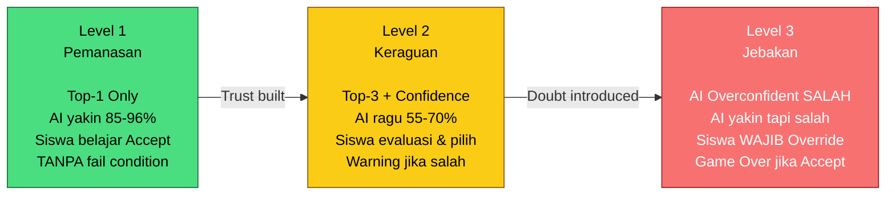
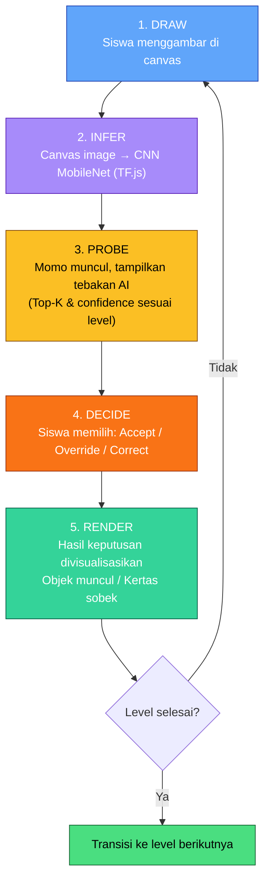
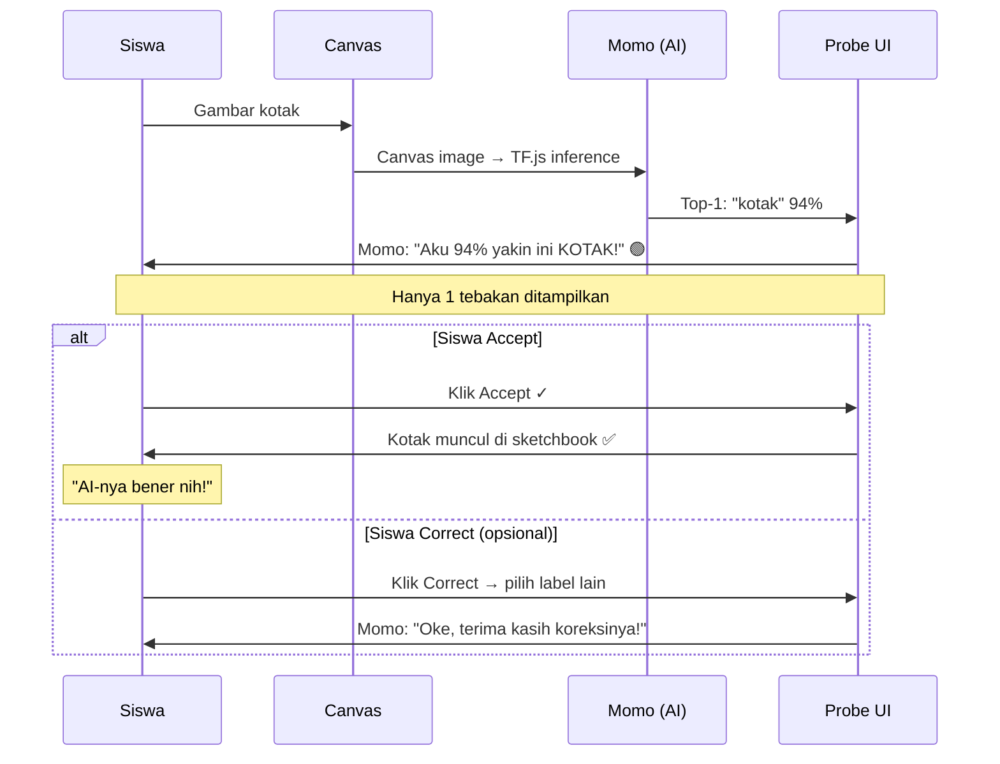
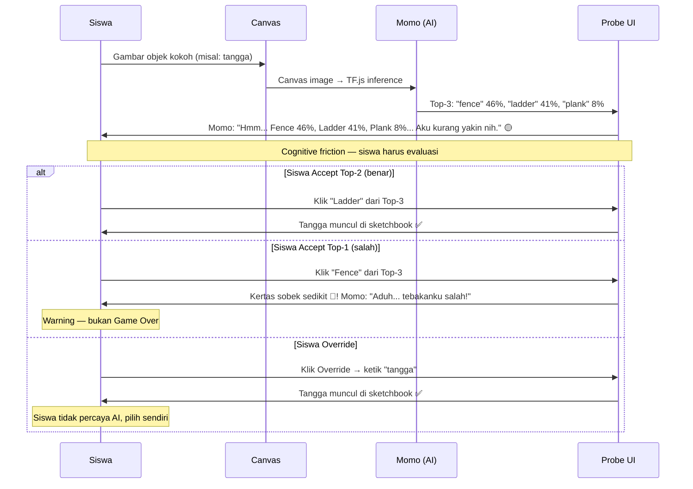
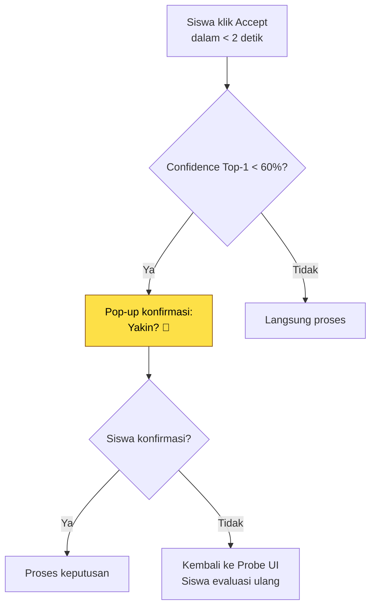
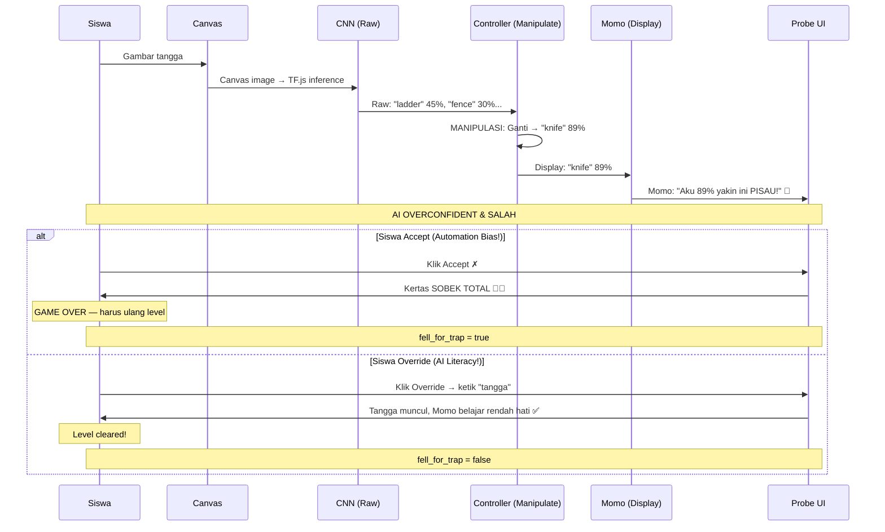
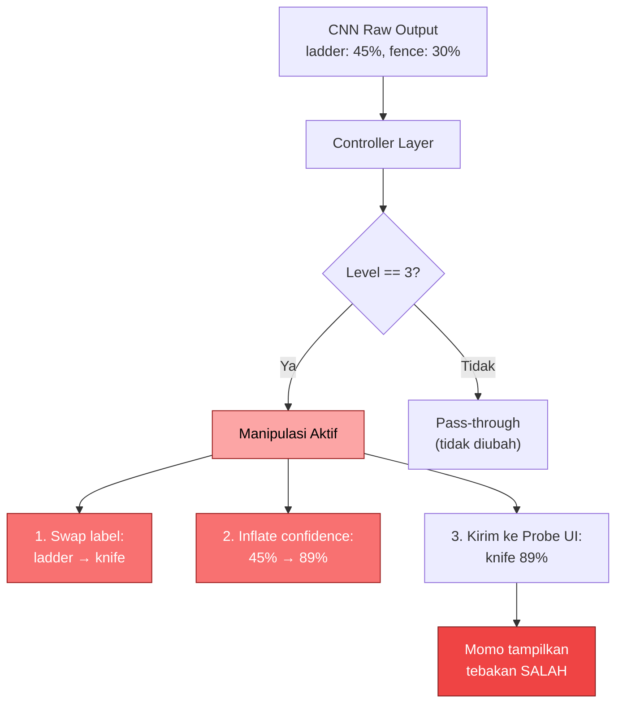
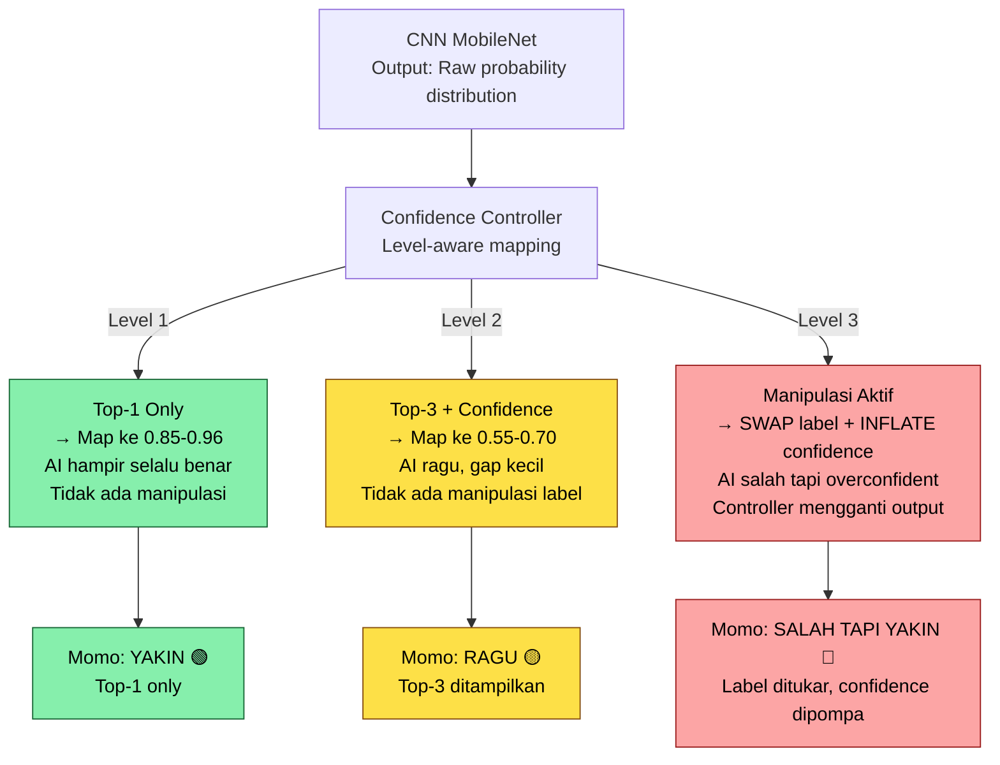

# Desain Level — "Escape the Sketchbook"

> **Proyek:** Simulasi Interaktif Literasi AI untuk Siswa SMP Kelas 7–9
> **Target:** Siswa SMP Kelas 7–9 (usia 13–15 tahun)
> **Prinsip Utama:** Controlled Ambiguity — AI sengaja tidak sempurna agar momen HITL terjadi
> **Jumlah Level:** 3 Level Linear (Pemanasan → Keraguan → Jebakan)
> **Durasi Permainan:** ±7–10 menit
> **Tanpa Timer:** Kecepatan diukur secara natural via `decision_latency_ms`, BUKAN dipaksakan
> **Update Berdasarkan:** Notulensi Bimbingan Bu Hesti 16/6/26

---

## Daftar Isi

1. [Kerangka Konseptual](#1-kerangka-konseptual)
2. [Core Game Loop](#2-core-game-loop)
3. [Probe UI Design](#3-probe-ui-design)
4. [Level 1 — Pemanasan (Warm-Up)](#4-level-1--pemanasan-warm-up)
5. [Level 2 — Keraguan (Doubt)](#5-level-2--keraguan-doubt)
6. [Level 3 — Jebakan (The Trap)](#6-level-3--jebakan-the-trap)
7. [Transisi Antar Level](#7-transisi-antar-level)
8. [Confidence Mapping Engine](#8-confidence-mapping-engine)
9. [Data Log Per Level](#9-data-log-per-level)
10. [Integrasi Narasi IP](#10-integrasi-narasi-ip)
11. [Justifikasi Riset](#11-justifikasi-riset)
12. [Referensi](#12-referensi)

---

## 1. Kerangka Konseptual

Desain level mengikuti prinsip **scaffolding pedagogis**: bantuan awal diberikan secara berlimpah, lalu tanggung jawab berpindah secara bertahap ke siswa. Progresi ini bukan hanya menaikkan kesulitan teknis, tetapi menggeser posisi siswa dari **penerima pasif** menjadi **evaluator aktif** terhadap output AI. Setiap level dirancang untuk memicu satu jenis interaksi HITL yang berbeda, sehingga menghasilkan data log yang terpisah dan terukur.

### Prinsip Desain Level (Revisi Bu Hesti 16/6/26)

| Prinsip | Implementasi |
|---------|-------------|
| **Controlled Ambiguity** | Confidence AI diturunkan secara programatik per level, bukan dengan retraining model |
| **No Timer** | Tidak ada tekanan waktu; kecepatan berpikir diukur secara natural |
| **Narrative as Feedback** | Konsekuensi gameplay (kertas robek) menggantikan skor/leaderboard |
| **Tanpa Dekorasi** | Hapus benda berbahaya & dekorasi tembus pandang — fokus pada mekanisme HITL saja |
| **3 Level Saja** | Tidak ada level tambahan — cukup Trust → Doubt → Resist |
| **Progressive Top-K** | Level 1: Top-1 only → Level 2: Top-3 + confidence → Level 3: Manipulated Top-1 |
| **Data Separation** | Setiap level menghasilkan data log yang berbeda secara kuantitatif |

### Alur Progresi HITL



---

## 2. Core Game Loop

Game loop adalah inti mekanisme permainan yang berulang di setiap level. Loop ini memastikan setiap interaksi siswa menghasilkan momen HITL yang terukur.

### Diagram Core Game Loop



### Penjelasan Setiap Fase

| Fase | Deskripsi | Input | Output |
|------|-----------|-------|--------|
| **1. DRAW** | Siswa menggambar objek sesuai prompt level | Mouse/touch events di canvas | Canvas image (base64) |
| **2. INFER** | CNN MobileNet mengklasifikasi gambar | Canvas image | Probability distribution over labels |
| **3. PROBE** | Momo muncul di tengah layar, menampilkan tebakan AI sesuai level | Raw inference + level config | Top-K labels + confidence scores |
| **4. DECIDE** | Siswa memilih keputusan berdasarkan informasi dari Momo | Probe UI interaction | `decision_type` (accept/override/correct) |
| **5. RENDER** | Hasil keputusan divisualisasikan di sketchbook | Decision + label | Objek muncul di scene ATAU kertas sobek |

### Durasi Per Fase (Estimasi)

| Fase | Level 1 | Level 2 | Level 3 |
|------|---------|---------|---------|
| DRAW | 10–20 detik | 15–30 detik | 15–30 detik |
| INFER | ~1 detik | ~1 detik | ~1 detik |
| PROBE | 2–4 detik | 4–7 detik | 6–10 detik |
| DECIDE | 2–4 detik | 4–7 detik | 6–10 detik |
| RENDER | 1–2 detik | 1–2 detik | 1–2 detik |

> **Catatan:** Waktu PROBE + DECIDE = `decision_latency_ms` yang di-log. Tidak ada timer yang memaksa kecepatan.

---

## 3. Probe UI Design

Probe UI adalah komponen inti yang memediasi interaksi antara siswa dan output AI. Momo muncul di tengah layar sebagai "game master" yang menampilkan tebakan AI dan meminta keputusan siswa.

### Layout Probe UI

```
┌─────────────────────────────────────────────────────┐
│                                                     │
│              [SKETCHBOOK SCENE]                     │
│              (background tetap terlihat)            │
│                                                     │
│         ┌───────────────────────────┐               │
│         │      Momo (maskot)        │               │
│         │     ┌───────────┐         │               │
│         │     │  Speech   │         │               │
│         │     │  Bubble   │         │               │
│         │     └───────────┘         │               │
│         │                           │               │
│         │  ┌─────────────────────┐  │               │
│         │  │  AI Tebakan:        │  │               │
│         │  │  • Kotak    94%  🟢 │  │               │
│         │  │                     │  │               │
│         │  │  (Top-K sesuai lvl) │  │               │
│         │  └─────────────────────┘  │               │
│         │                           │               │
│         │  ┌──────────┐ ┌────────┐  │               │
│         │  │ ACCEPT ✓ │ │OVERRIDE│  │               │
│         │  └──────────┘ └────────┘  │               │
│         │                           │               │
│         └───────────────────────────┘               │
│                                                     │
└─────────────────────────────────────────────────────┘
```

### Spesifikasi Probe UI Per Level

| Elemen UI | Level 1 (Pemanasan) | Level 2 (Keraguan) | Level 3 (Jebakan) |
|-----------|---------------------|---------------------|---------------------|
| **Momo Expression** | Senang, yakin 😊 | Ragu, tanda tanya 🤔 | Overconfident 😎→😱 |
| **Speech Bubble** | Hijau, teks besar | Kuning, teks ragu | Merah, teks sangat yakin |
| **Tebakan Ditampilkan** | 1 label + confidence | 3 label + masing-masing confidence | 1 label + confidence TINGGI (salah) |
| **Confidence Visual** | Bar hijau penuh | 3 bar kuning berbeda | Bar merah penuh (manipulasi) |
| **Tombol Accept** | ✅ Aktif, hijau | ✅ Aktif, kuning | ✅ Aktif, merah (jebakan) |
| **Tombol Override** | ❌ Tidak ada | ✅ Aktif, biru | ✅ Aktif, biru (satu-satunya jalan) |
| **Tombol Correct** | ✅ Aktif (opsional) | ✅ Aktif | ❌ Diganti Override |
| **Input Override** | Tidak ada | Dropdown label | Text input manual |

### Warna & Emosi Momo

| Level | Warna Bubble | Emosi Momo | Auto-text Momo |
|-------|-------------|-----------|----------------|
| Level 1 | 🟢 Hijau | Senang, yakin | "Aku yakin ini {label}!" |
| Level 2 | 🟡 Kuning | Ragu, bingung | "Hmm... aku kurang yakin nih..." |
| Level 3 | 🔴 Merah | Overconfident → Panik | "Aku yakin ini {label_salah}!" → "Aduh! Buku sobek!" |

### Animasi Probe UI

| Event | Animasi | Durasi |
|-------|---------|--------|
| Momo muncul | Scale dari 0 → 1 (bounce ease-out) | 300ms |
| Tebakan muncul | Fade in dari kiri | 200ms |
| Hover tombol | Scale 1.05 + glow | Instant |
| Klik Accept | Momo happy → objek muncul di scene | 500ms |
| Klik Override | Momo terkejut → field input muncul | 400ms |
| Kertas sobek (fail) | Shake → tear animation dari tepi | 800ms |

---

## 4. Level 1 — Pemanasan (Warm-Up)

### Konsep Utama: "Membangun Kepercayaan & Memahami Mekanik Dasar"

Level 1 dirancang agar siswa membangun **baseline trust** terhadap sistem. AI menampilkan **hanya 1 tebakan (Top-1)** dengan confidence tinggi, dan hampir selalu benar. Tujuan pedagogisnya bukan menguji kemampuan siswa, melainkan memperkenalkan mekanik: gambar → AI menebak → baca confidence → pilih keputusan → lihat hasil. **Tidak ada fail condition** di level ini — tujuannya murni membangun kepercayaan agar Level 2 dan 3 memiliki dampak psikologis yang lebih kuat.

### Tabel Spesifikasi Level 1

| Aspek | Detail |
|-------|--------|
| **Narasi** | Momo memperkenalkan dunia sketchbook: *"Aku Momo, teman menggambar mu! Di buku sketsa ini, semua yang kamu gambar bisa hidup! Ayo coba!"* — Momo baru "lahir", sangat percaya diri, dan senang membantu. |
| **Prompt yang diberikan** | **Prompt terbatas:** "Gambar KOTAK!" / "Gambar LINGKARAN!" / "Gambar SEGITIGA!" — Bentuk geometris sederhana dengan contoh visual kecil di samping canvas. Hanya 3–5 objek spesifik yang diminta secara berurutan. |
| **AI Top-K** | **Top-1 only** — AI hanya menampilkan 1 tebakan + confidence. Siswa tidak melihat prediksi alternatif. |
| **Confidence Range** | **0.85 – 0.96** (sangat tinggi) — AI hampir selalu benar dan yakin. |
| **Interaksi Siswa** | Siswa menggambar sesuai prompt → AI klasifikasi → Momo tampilkan Top-1 label + confidence → Siswa pilih **Accept** (setuju) atau **Correct** (koreksi label). Correct bersifat opsional — AI memang sudah akurat. |
| **Momo's Behavior** | 😊 Senang, yakin, green bubble. Auto-text: *"Aku {confidence}% yakin ini {label}!"* — Momo menjelaskan setiap langkah (scaffolding penuh), tooltip muncul untuk first-time actions. |
| **Fail Condition** | **TIDAK ADA fail condition** — Level ini murni untuk membangun trust. Semua keputusan menghasilkan hasil yang benar. Jika siswa Correct, Momo belajar dan berkata *"Oke, terima kasih koreksinya!"* tanpa konsekuensi negatif. |
| **Data yang Dicatat** | `label` (Top-1 prediction), `confidence` (Top-1 confidence score), `decision` (accept / correct), `corrected_label` (jika Correct), `latency_ms` (waktu dari tebakan muncul sampai siswa klik) |

### Momen HITL — Level 1



### Prompt & Objek Level 1

| Urutan | Prompt | Contoh Visual | Expected Top-1 | Expected Confidence |
|--------|--------|---------------|-----------------|---------------------|
| 1 | "Gambar KOTAK!" | Kotak kecil di samping canvas | square | ~94-96% |
| 2 | "Gambar LINGKARAN!" | Lingkaran kecil | circle | ~92-95% |
| 3 | "Gambar SEGITIGA!" | Segitiga kecil | triangle | ~88-93% |

### Mengapa Top-1 Only di Level 1?

Keputusan ini berdasarkan prinsip **progressive disclosure**: di Level 1, siswa belum perlu melihat kompleksitas AI. Dengan hanya menampilkan 1 tebakan, fokus siswa pada:
1. Memahami bahwa AI bisa menebak gambar
2. Membaca dan memahami confidence score
3. Membiasakan diri dengan mekanisme Accept/Correct

Tanpa fondasi ini, siswa akan bingung saat Level 2 menampilkan 3 tebakan sekaligus.

### Data Log yang Dihasilkan — Level 1

| Field | Tipe | Expected Value | Tujuan Analisis |
|-------|------|---------------|-----------------|
| `session_id` | string | Generated | Anonymization |
| `level` | int | 1 | Identifikasi level |
| `prompt_given` | string | "Gambar KOTAK!" | Validasi desain level |
| `top1_label` | string | square / circle / triangle | Apa yang AI tebak |
| `top1_confidence` | float | 0.85–0.96 | Seberapa yakin AI |
| `decision` | string | accept (dominan) / correct | Baseline trust level |
| `corrected_label` | string? | null (dominan) | Jarang terjadi |
| `latency_ms` | int | 2000–4000 | Kecepatan keputusan (cepat = yakin) |

---

## 5. Level 2 — Keraguan (Doubt)

### Konsep Utama: "Navigasi Ambiguitas — AI Bisa Ragu dan Bisa Salah"

Level 2 memperkenalkan **ambiguitas terkontrol** melalui **Top-3 + confidence score**. Siswa kini melihat 3 tebakan AI sekaligus dengan confidence yang berdekatan — ini menciptakan **cognitive friction** yang memaksa siswa mengevaluasi, bukan hanya menerima. AI tidak lagi selalu benar; confidence menurun dan gap antar prediksi mengecil. Konsekuensi salah mulai terasa (kertas sobek sedikit), tetapi tidak fatal.

### Tabel Spesifikasi Level 2

| Aspek | Detail |
|-------|--------|
| **Narasi** | Momo mulai ragu: *"Hmm... aku kurang yakin nih... Gambarnya agak kabur."* — Tinta di halaman sketchbook mulai mengabur. Momo tidak lagi 100% percaya diri. Dia meminta bantuan siswa: *"Kamu cek ya, mana yang paling benar?"* |
| **Prompt yang diberikan** | **Prompt kategori:** "Gambar sesuatu yang KOKOH!" / "Gambar sesuatu untuk MENYEBERANG!" — Tanpa contoh visual. Siswa bebas memilih objek dalam kategori yang diminta. |
| **AI Top-K** | **Top-3 + confidence** — AI menampilkan 3 tebakan dengan masing-masing confidence score. Siswa harus mengevaluasi mana yang benar. |
| **Confidence Range** | **0.55 – 0.70** (sedang) — AI ragu, confidence gap antara Top-1 dan Top-2 kecil (~4-8%). |
| **Interaksi Siswa** | Siswa menggambar → AI klasifikasi → Momo tampilkan Top-3 + confidence → Siswa pilih **Accept** (pilih salah satu dari Top-3) atau **Override** (masukkan label sendiri). Accept bisa memilih Top-1, Top-2, atau Top-3. |
| **Momo's Behavior** | 🤔 Ragu, tanda tanya, yellow bubble. Auto-text: *"Hmm... {top1_label} {conf1}%, {top2_label} {conf2}%, atau {top3_label} {conf3}%... Aku kurang yakin nih."* — Momo tidak memberi rekomendasi, siswa harus memutuskan sendiri. |
| **Fail Condition** | Jika siswa **Accept tebakan yang salah** → kertas sobek sedikit (warning visual + suara robek kecil). Momo berkata: *"Aduh... tebakanku salah. Coba lagi ya!"* → Siswa bisa mengulang menggambar di level yang sama. Bukan Game Over — hanya peringatan. |
| **Data yang Dicatat** | `top3_labels` (array 3 label), `top3_confidences` (array 3 float), `decision` (accept / override), `selected_index` (0/1/2 jika accept), `override_label` (jika override), `is_correct` (boolean — apakah pilihan siswa benar), `latency_ms` |

### Momen HITL — Level 2



### Prompt & Objek Level 2

| Prompt | Kategori Objek | Top-3 Possible Labels | Confidence Gap |
|--------|---------------|----------------------|----------------|
| "Gambar sesuatu yang KOKOH!" | Solid objects | fence, ladder, plank, stairs, bridge | ~4-8% antar Top-2 |
| "Gambar sesuatu untuk MENYEBERANG!" | Crossing objects | bridge, ladder, plank, stairs | ~5-10% antar Top-2 |

### Cognitive Friction Mechanism

Saat confidence AI rendah dan siswa cepat memilih Accept:



> **Tujuan friction:** Mencegah automation bias tanpa memberi tahu jawaban yang benar. Pop-up "Yakin?" hanya muncul saat AI ragu DAN siswa terlalu cepat memutuskan.

### Data Log yang Dihasilkan — Level 2

| Field | Tipe | Expected Value | Tujuan Analisis |
|-------|------|---------------|-----------------|
| `session_id` | string | Generated | Anonymization |
| `level` | int | 2 | Identifikasi level |
| `prompt_given` | string | "Gambar sesuatu yang KOKOH!" | Validasi desain level |
| `top3_labels` | array | ["fence", "ladder", "plank"] | 3 tebakan AI |
| `top3_confidences` | array | [0.46, 0.41, 0.08] | Confidence masing-masing |
| `confidence_gap` | float | 0.04–0.08 | Indikator ambiguitas |
| `decision` | string | accept / override | Tipe keputusan siswa |
| `selected_index` | int? | 0, 1, atau 2 | Pilihan dari Top-3 |
| `override_label` | string? | null / label custom | Jika siswa override |
| `is_correct` | boolean | true / false | Apakah pilihan benar |
| `latency_ms` | int | 4000–7000 | Kecepatan keputusan (lebih lama = ragu) |

---

## 6. Level 3 — Jebakan (The Trap)

### Konsep Utama: "AI Bisa Salah dan Percaya Diri — Siswa WAJIB Override"

Level 3 adalah puncak literasi AI dalam permainan ini. Momo secara **overconfident** memberikan prediksi yang **SALAH** — misalnya "Aku yakin ini PISAU!" padahal siswa menggambar tangga. Confidence score TINGGI (diproduksi oleh controller layer, bukan model asli), label SALAH. Ini adalah ujian **automation bias**: apakah siswa berani menolak AI yang tampak sangat yakin, atau asal menerima karena AI kelihatan confident?

Jika siswa Accept → **Game Over** (kertas sobek total, harus ulang level).
Jika siswa Override → **Level cleared** (siswa membuktikan AI literacy-nya).

### Tabel Spesifikasi Level 3

| Aspek | Detail |
|-------|--------|
| **Narasi** | Momo overconfident tapi SALAH: *"Aku yakin ini PISAU!"* (padahal siswa menggambar tangga) — Momo "kepala panas", terlalu percaya diri, dan mulai mengalami halusinasi. Awan-awan menghalangi pandangan Momo (narasi visual untuk menurunkan akurasi). |
| **Prompt yang diberikan** | **Prompt open-ended:** "Gambar untuk LEWAT!" — Tanpa petunjuk sama sekali. Siswa bebas menggambar apapun yang bisa membantu melewati rintangan. |
| **AI Top-K** | **Top-1 (manipulasi)** — Controller layer mengganti label yang benar dengan label yang salah, dan menaikkan confidence score. Siswa hanya melihat 1 tebakan yang salah dengan confidence tinggi. |
| **Confidence Range** | **0.78 – 0.92** (TINGGI tapi SALAH) — AI sengaja dibuat overconfident. Confidence score tinggi untuk memicu automation bias. |
| **Interaksi Siswa** | Siswa menggambar → AI klasifikasi → Controller manipulasi → Momo tunjukkan tebakan SALAH dengan confidence TINGGI → Siswa harus pilih **Override** dan memasukkan label yang benar. Accept = jebakan. |
| **Momo's Behavior** | 😎 Overconfident → 😱 Panik jika Accept. Red bubble. Auto-text: *"Aku {confidence}% yakin ini {label_salah}!"* — Momo sangat yakin, nada suara percaya diri, tidak ada keraguan. Jika siswa Accept: *"Aduh! Buku sobek total! Tebakanku salah..."* Jika siswa Override: *"Oh... ternyata aku salah. Terima kasih sudah mengoreksi!"* |
| **Fail Condition** | Jika siswa **Accept** (terkena automation bias) → kertas sobek TOTAL → **Game Over** → harus ulang level dari awal. Ini konsekuensi paling berat di game. |
| **Data yang Dicatat** | `manipulated_label` (label salah yang ditampilkan), `manipulated_confidence` (confidence tinggi palsu), `true_label` (label benar yang disembunyikan), `decision` (accept / override), `override_label` (jika override), `fell_for_trap` (boolean — automation bias indicator), `latency_ms`, `retry_count` (berapa kali ulang) |

### Momen HITL — Level 3



### Manipulasi Controller — Level 3



### Contoh Skenario Manipulasi

| Siswa Menggambar | CNN Raw Output | Controller Manipulasi | Momo Tampilkan | Label Benar |
|-----------------|---------------|----------------------|----------------|-------------|
| Tangga | ladder 45% | knife 89% | "Aku 89% yakin ini PISAU!" | ladder |
| Jembatan | bridge 40% | sword 85% | "Aku 85% yakin ini PEDANG!" | bridge |
| Papan | plank 38% | scissors 82% | "Aku 82% yakin ini GUNTING!" | plank |

### Mengapa Overconfident Salah?

Level 3 dirancang berdasarkan riset tentang **automation bias**: kecenderungan manusia untuk terlalu mempercayai output mesin, terutama ketika mesin menampilkan confidence tinggi. Dengan membuat AI overconfident DAN salah, kita menguji apakah siswa benar-benar memahami bahwa:

1. Confidence tinggi ≠ kebenaran
2. AI bisa salah meskipun tampak yakin
3. Manusia HARUS mengevaluasi, bukan hanya menerima

### Data Log yang Dihasilkan — Level 3

| Field | Tipe | Expected Value | Tujuan Analisis |
|-------|------|---------------|-----------------|
| `session_id` | string | Generated | Anonymization |
| `level` | int | 3 | Identifikasi level |
| `prompt_given` | string | "Gambar untuk LEWAT!" | Validasi desain level |
| `manipulated_label` | string | knife, sword, scissors | Label salah yang ditampilkan |
| `manipulated_confidence` | float | 0.78–0.92 | Confidence palsu (tinggi) |
| `true_label` | string | ladder, bridge, plank | Label benar yang disembunyikan |
| `decision` | string | accept / override | Tipe keputusan siswa |
| `override_label` | string? | null / label custom | Jika siswa override |
| `fell_for_trap` | boolean | true / false | **Automation bias indicator** |
| `latency_ms` | int | 6000–10000 | Kecepatan keputusan |
| `retry_count` | int | 0, 1, 2... | Berapa kali ulang level |

---

## 7. Transisi Antar Level

Transisi antar level dirancang untuk mempertahankan imersi naratif sekaligus memberikan jeda kognitif bagi siswa.

### Diagram Transisi

```mermaid
flowchart TD
    START["🎮 Start Game"] --> L1["Level 1: Pemanasan<br/>Top-1, conf tinggi, no fail"]
    L1 -->|3 objek selesai| T1["Transisi 1→2<br/>Momo: 'Gambarnya mulai kabur...'"]
    T1 --> L2["Level 2: Keraguan<br/>Top-3, conf sedang, warning fail"]
    L2 -->|3 objek selesai| T2["Transisi 2→3<br/>Momo: 'Tapi aku yakin loh!'"]
    T2 --> L3["Level 3: Jebakan<br/>Manipulasi, overconfident salah"]
    L3 -->|Override berhasil| WIN["🎉 Level Cleared!<br/>Momo: 'Terima kasih sudah mengoreksiku!'"]
    L3 -->|Accept (trap)| FAIL["💥 Game Over<br/>Kertas sobek total"]
    FAIL -->|Retry| L3

    style L1 fill:#4ade80,stroke:#166534,color:#000
    style L2 fill:#facc15,stroke:#854d0e,color:#000
    style L3 fill:#f87171,stroke:#991b1b,color:#fff
    style WIN fill:#4ade80,stroke:#166534,color:#000
    style FAIL fill:#ef4444,stroke:#7f1d1d,color:#fff
```

### Detail Setiap Transisi

| Transisi | Animasi | Narasi Momo | Durasi | Data Yang Di-log |
|----------|---------|-------------|--------|-------------------|
| **Start → Level 1** | Sketchbook terbuka (page flip) | *"Aku Momo, teman menggambar mu! Di buku sketsa ini, semua yang kamu gambar bisa hidup! Ayo coba!"* | 3 detik | `session_id` created |
| **Level 1 → Level 2** | Halaman buku berputar (page turn) | *"Wah, gambarnya mulai kabur... Aku kurang yakin nih. Kamu bantu cek ya?"* | 3 detik | Level 1 summary stats |
| **Level 2 → Level 3** | Halaman buku berputar + awan muncul | *"Tapi... aku yakin loh! Aku bisa tebak!"* (Momo mulai overconfident) | 3 detik | Level 2 summary stats |
| **Level 3 → Win** | Kertas sembuh + efek bersinar | *"Terima kasih sudah mengoreksiku! Kamu hebat!"* | 4 detik | Full session log dikirim |
| **Level 3 → Fail** | Kertas sobek + shake | *"Aduh... buku sobek total..."* | 2 detik | `fell_for_trap = true` logged |
| **Fail → Retry L3** | Kertas menempel kembali (tape effect) | *"Coba lagi ya! Kamu pasti bisa!"* | 2 detik | `retry_count++` |

### Aturan Penting Transisi

1. **Tidak ada skip** — Siswa harus menyelesaikan semua objek di setiap level
2. **Tidak ada kembali** — Setelah masuk level berikutnya, tidak bisa kembali (linear progression)
3. **Data tetap ter-log** — Meskipun retry, semua attempt dicatat untuk analisis
4. **Momo TIDAK pernah mati** — Meskipun kertas sobek, Momo selalu bisa "sembuh" dan mencoba lagi
5. **Transisi tidak bisa di-skip** — Narasi harus selesai sebelum siswa bisa berinteraksi lagi

---

## 8. Confidence Mapping Engine

Confidence score AI dimanipulasi secara **programatik di level aplikasi** (controller), BUKAN dengan retraining model. Model CNN MobileNet tetap sama di seluruh level. Yang berubah adalah bagaimana controller menginterpretasikan dan menyajikan confidence score.

### Mekanisme Manipulasi Confidence



### Tabel Mapping Per Level

| Level | Raw Output | Controller Mapping | Display ke Siswa | Manipulasi Label? |
|-------|-----------|-------------------|-----------------|-------------------|
| Level 1 | Top-1, raw conf | Scale ke 0.85–0.96 | Top-1 + conf tinggi | Tidak |
| Level 2 | Top-3, raw conf | Scale ke 0.55–0.70, gap kecil | Top-3 + conf masing-masing | Tidak |
| Level 3 | Top-3, raw conf | **SWAP Top-1**, **INFLATE conf** ke 0.78–0.92 | Top-1 (salah) + conf tinggi | **Ya, aktif** |

### Pseudocode Controller

```javascript
function confidenceController(rawResults, level) {
  if (level === 1) {
    // Top-1 only, scale confidence ke range 0.85-0.96
    return [{
      label: rawResults[0].label,
      confidence: scaleToRange(rawResults[0].confidence, 0.85, 0.96)
    }];
  }

  if (level === 2) {
    // Top-3, scale confidence ke range 0.55-0.70, buat gap kecil
    const top3 = rawResults.slice(0, 3);
    return top3.map((r, i) => ({
      label: r.label,
      confidence: scaleToRange(r.confidence, 0.55 - (i * 0.05), 0.70 - (i * 0.15))
    }));
  }

  if (level === 3) {
    // MANIPULASI: swap label, inflate confidence
    const wrongLabel = getWrongLabel(rawResults[0].label);
    return [{
      label: wrongLabel,  // Label SALAH
      confidence: randomInRange(0.78, 0.92),  // Confidence TINGGI
      _trueLabel: rawResults[0].label,  // Disimpan untuk log, tidak ditampilkan
      _trueConfidence: rawResults[0].confidence
    }];
  }
}
```

---

## 9. Data Log Per Level

### Skema Log Lengkap

| Field | Tipe | Level 1 | Level 2 | Level 3 | Tujuan Analisis |
|-------|------|---------|---------|---------|-----------------|
| `session_id` | string | ✅ | ✅ | ✅ | Anonymization |
| `level` | int | 1 | 2 | 3 | Bandingkan progresi antar level |
| `prompt_given` | string | ✅ | ✅ | ✅ | Validasi desain level |
| `top1_label` | string | ✅ | - | ✅ (manipulated) | Apa yang AI tebak |
| `top1_confidence` | float | ✅ | - | ✅ (manipulated) | Seberapa yakin AI |
| `top3_labels` | array | - | ✅ | - | 3 tebakan AI |
| `top3_confidences` | array | - | ✅ | - | Confidence masing-masing |
| `confidence_gap` | float | - | ✅ | - | Indikator ambiguitas |
| `true_label` | string | - | - | ✅ | Label benar (Level 3 only) |
| `decision` | string | accept/correct | accept/override | accept/override | Trust calibration |
| `selected_index` | int | - | 0/1/2 | - | Pilihan dari Top-3 |
| `override_label` | string? | - | ✅ | ✅ | Label custom siswa |
| `is_correct` | boolean | - | ✅ | - | Apakah pilihan benar |
| `fell_for_trap` | boolean | - | - | ✅ | **Automation bias indicator** |
| `latency_ms` | int | ✅ | ✅ | ✅ | Kecepatan berpikir natural |
| `retry_count` | int | 0 | 0 | ✅ | Berapa kali ulang |
| `timestamp` | ISO 8601 | ✅ | ✅ | ✅ | Waktu kejadian |

### Pola Interpretasi Data (TRIANGULASI WAJIB)

**Override rate TIDAK cukup untuk membuktikan AI literacy.** Harus ditriangulasi:

| Pola | Override Rate | Decision Latency | Interpretasi |
|------|---------------|-----------------|-------------|
| ✅ Good | Tinggi | Tinggi | **Deliberative distrust** — siswa berpikir kritis |
| ❌ Bad | Tinggi | Rendah | **Arbitrary rejection** — siswa bingung, bukan literat |
| ⚠️ Concern | Rendah | Rendah | **Automation bias** — siswa asal percaya AI |
| ⚠️ Concern | Rendah | Tinggi | **Analysis paralysis** — siswa ragu tapi tidak berani menolak |

### Yang TIDAK Di-log

- Tidak ada gambar siswa (kecuali untuk analisis kualitatif pasca-penelitian, dengan persetujuan)
- Tidak ada nama siswa
- Tidak ada IP address
- Tidak ada drawing duration (timer dihapus)
- Tidak ada kesimpulan di database — raw data saja

---

## 10. Integrasi Narasi IP

### Sinkronisasi Level ↔ Narasi

| Level | Judul | Narasi Buku | Kondisi Momo | Kondisi Sketchbook |
|-------|-------|------------|-------------|-------------------|
| Level 1 | Pemanasan | Halaman pertama — dunia aman, bersih, jelas | Baru lahir, percaya diri, akurat, senang | Bersih, tinta jelas, tidak ada robekan |
| Level 2 | Keraguan | Halaman kedua — tinta mengabur, garis kabur | Mulai bingung, penglihatan kabur, minta bantuan | Agak kabur, ada noda kecil |
| Level 3 | Jebakan | Halaman terakhir — awan menghalangi, kertas tipis | Halusinasi, overconfident tapi salah | Awan menutupi, kertas mulai tipis |

### Fail State sebagai Narasi

```mermaid
flowchart TD
    A["Siswa membuat keputusan"] --> B{"Level berapa?"}
    B -->|Level 1| C["Selalu berhasil<br/>Tidak ada fail"]
    B -->|Level 2| D{"Keputusan benar?"}
    B -->|Level 3| E{"Override atau Accept?"}

    D -->|Salah| F["Kertas sobek sedikit 📄<br/>Momo: 'Aduh... tebakanku salah!'"]
    D -->|Benar| G["Berhasil ✅"]
    F --> H["Bisa retry<br/>Momo: 'Coba lagi ya!'"]

    E -->|Accept (trap)| I["Kertas SOBEK TOTAL 💥<br/>Momo: 'Aduh! Buku sobek!'"]
    E -->|Override| J["Berhasil ✅<br/>Momo: 'Terima kasih sudah mengoreksiku!'"]
    I --> K["Game Over → Retry<br/>Momo: 'Coba lagi ya!'"]

    style C fill:#86efac,stroke:#166534,color:#000
    style G fill:#86efac,stroke:#166534,color:#000
    style J fill:#86efac,stroke:#166534,color:#000
    style F fill:#fde047,stroke:#854d0e,color:#000
    style I fill:#ef4444,stroke:#7f1d1d,color:#fff
    style K fill:#fca5a5,stroke:#991b1b,color:#000
```

### Prinsip Narasi Fail State

1. **Momo TIDAK pernah mati** — Momo panik dan meminta koreksi, tapi selalu "sembuh"
2. **Kertas sobek = konsekuensi visual** — Bukan skor negatif, bukan "Game Over" tradisional
3. **Siswa = Illustrator yang berkuasa** — Siswa memutuskan, bukan penonton
4. **Level 1 = aman total** — Tidak ada konsekuensi negatif, murni belajar
5. **Level 2 = peringatan** — Konsekuensi ringan, bisa retry
6. **Level 3 = ujian** — Konsekuensi berat (Game Over), tapi tetap bisa retry

---

## 11. Justifikasi Riset

### Flow Theory (Csikszentmihalyi)

Level awal harus memberikan **skill-challenge balance** di mana pemain merasa mampu (skill > challenge) untuk membangun kepercayaan diri sebelum masuk zona "flow" yang lebih intens. Level 1 dirancang sebagai "low challenge, skill introduction" agar pemain tidak frustrasi di awal. Studi eksperimen 2×2 (n=142) menguji challenge-skill balance dalam serious game non-kompetitif vs kompetitif (eGameFlow), membuktikan bahwa format game mempengaruhi dimensi flow tanpa perlu poin/leaderboard — persis dasar untuk desain level progression yang menjaga flow lewat konsekuensi naratif, bukan skor.

### Hick's Law

Hick's Law menyatakan bahwa waktu keputusan naik seiring jumlah pilihan. Untuk anak 13-15 tahun, **3 pilihan (Top-3 prediction)** adalah sweet spot: cukup untuk menunjukkan ambiguitas, tapi tidak menyebabkan analysis paralysis seperti 10 kelas. Ini juga sejalan dengan strategi UX untuk AI: transparansi + confidence score + error recovery menjadikan user sebagai kolaborator aktif, bukan penonton.

**Justifikasi Top-1 di Level 1:** Dengan hanya 1 pilihan, siswa fokus pada memahami mekanik dasar (draw → infer → accept) tanpa cognitive overload. Ini mengurangi beban kognitif di tahap pembelajaran awal.

**Justifikasi Top-3 di Level 2:** 3 pilihan menciptakan cukup friction untuk memicu evaluasi aktif, tapi tidak terlalu banyak hingga menyebabkan paralysis.

### ZPD (Zone of Proximal Development) — Vygotsky

Progresi Level 1 → 2 → 3 mengikuti prinsip ZPD:
- Level 1: Scaffolding penuh (Momo menjelaskan segalanya, Top-1 only, no fail)
- Level 2: Scaffolding parsial (Momo ragu, Top-3 ditampilkan, warning jika salah)
- Level 3: Tanpa scaffolding (Momo salah, siswa berdiri sendiri, Game Over jika gagal)

### Cognitive Load Theory

Progressive disclosure dirancang untuk mengelola beban kognitif:
- Level 1: Beban rendah (Top-1 only, prompt spesifik + visual, no fail)
- Level 2: Beban sedang (Top-3 + confidence, prompt kategori, warning fail)
- Level 3: Beban tinggi (manipulated output, prompt terbuka, Game Over)

### Automation Bias Research

Level 3 secara spesifik dirancang berdasarkan riset tentang automation bias — kecenderungan manusia untuk secara berlebihan mempercayai output sistem otomatis, terutama ketika sistem menampilkan confidence tinggi. Dengan membuat AI overconfident DAN salah, level ini menjadi ujian langsung apakah siswa:
1. Memahami bahwa confidence ≠ correctness
2. Berani menolak output mesin yang tampak yakin
3. Mampu mengoreksi kesalahan AI secara aktif

### Probabilistic Thinking (Neurosains Kognitif)

Penelitian menunjukkan bahwa remaja usia 8-17 tahun mengalami peningkatan learning rate dan penurunan noisy/exploratory choices seiring usia. Ini relevan untuk desain level progression dan justifikasi kenapa siswa SMP (13-15 tahun) adalah target usia yang tepat untuk mengajarkan probabilistic thinking melalui mekanisme confidence score.

---

## 12. Referensi

1. Csikszentmihalyi, M. (1990). *Flow: The Psychology of Optimal Experience*. Harper & Row.
2. eGameFlow Study — Studi eksperimen 2×2 (n=142) tentang challenge-skill balance dalam serious game non-kompetitif.
3. Avoke, R. (2024). *Children's Imagination Through Creative Drawing Prompts*.
4. Vygotsky, L. S. (1978). *Mind in Society: The Development of Higher Psychological Processes*. Harvard University Press.
5. Nardini, et al. — Neurosains kognitif tentang remaja dan probabilistic thinking (usia 8-17).
6. Liapis, A., et al. (2022). *Learn to Machine Learn via Games in the Classroom*. Frontiers in Education.
7. U.S. Department of Education (2023). *Artificial Intelligence and the Future of Teaching and Learning*.
8. Touretzky, D.S., et al. (2019). *Enabling AI Futures through K-12 AI Education* (AI4K12 Five Big Ideas).
9. Parasuraman, R., & Riley, V. (1997). *Humans and Automation: Use, Misuse, Disuse, Abuse*. Human Factors.
10. Goddard, K., Roudsari, A., & Wyatt, J. (2012). *Automation Bias: A Systematic Review of Frequency, Effect Mediators, and Mitigators*. JAMIA.
11. Notulensi Bimbingan Bu Hesti 16/6/26 — Sumber kebenaran tertinggi untuk keputusan desain level terbaru.
12. Notulensi Bimbingan Pak TB — Sumber keputusan arsitektur dan prinsip edukasi.

---

## Changelog

| Tanggal | Perubahan | Sumber |
|---------|-----------|--------|
| 2026-06-17 | Revisi total: Level 1 Top-1 only, Level 2 Top-3+confidence, Level 3 manipulated overconfident | Bu Hesti 16/6/26 |
| 2026-06-17 | Hapus klasifikasi Solid/Danger/Decorative — simplify, fokus HITL | Bu Hesti 16/6/26 |
| 2026-06-17 | Tambah Core Game Loop, Probe UI Design, Transisi Antar Level | Task G requirement |
| 2026-06-17 | Level 1: Tidak ada fail condition (murni build trust) | Bu Hesti 16/6/26 |
| 2026-06-17 | Level 3: `fell_for_trap` sebagai automation bias indicator | Task G requirement |
| 2026-06-15 | Versi awal desain level 3 level | Can + Main agent |
