# Desain Level — "Escape the Sketchbook"

> **Proyek:** Interactive HITL AI Literacy Simulation  
> **Target:** Siswa SMP Kelas 7–9 (usia 13–15 tahun)  
> **Prinsip Utama:** Controlled Ambiguity — AI sengaja tidak sempurna agar momen HITL terjadi  
> **Jumlah Level:** 3 Level Linear (Trust → Doubt → Resist)  
> **Durasi Permainan:** ±7–10 menit (rekomendasi dosen berdasarkan perbandingan proyek MBTI)  
> **Tanpa Timer:** Kecepatan diukur secara natural via `decision_latency_ms`, BUKAN dipaksakan

---

## Daftar Isi

1. [Kerangka Konseptual](#1-kerangka-konseptual)
2. [Hierarki Desain](#2-hierarki-desain)
3. [Level 1 — Guided Recognition](#3-level-1--guided-recognition)
4. [Level 2 — Ambiguous Choice](#4-level-2--ambiguous-choice)
5. [Level 3 — Risk & Override](#5-level-3--risk--override)
6. [User Flow Per Level (Mermaid)](#6-user-flow-per-level-mermaid)
7. [Klasifikasi Objek (Solid/Danger/Decorative)](#7-klasifikasi-objek-soliddangerdecorative)
8. [Progressive Constraint Drawing](#8-progressive-constraint-drawing)
9. [Confidence Mapping Engine](#9-confidence-mapping-engine)
10. [Data Log Per Level](#10-data-log-per-level)
11. [Integrasi Narasi IP](#11-integrasi-narasi-ip)
12. [Justifikasi Riset](#12-justifikasi-riset)
13. [Referensi](#13-referensi)

---

## 1. Kerangka Konseptual

Desain level mengikuti prinsip **scaffolding pedagogis**: bantuan awal diberikan secara berlimpah, lalu tanggung jawab berpindah secara bertahap ke siswa. Progresi ini bukan hanya menaikkan kesulitan teknis, tetapi menggeser posisi siswa dari **penerima pasif** menjadi **evaluator aktif** terhadap output AI. Setiap level dirancang untuk memicu satu jenis interaksi HITL yang berbeda, sehingga menghasilkan data log yang terpisah dan terukur.

### Prinsip Desain Level

| Prinsip | Implementasi |
|---------|-------------|
| **Controlled Ambiguity** | Confidence AI diturunkan secara programatik per level, bukan dengan retraining model |
| **No Timer** | Tidak ada tekanan waktu; kecepatan berpikir diukur secara natural |
| **Narrative as Feedback** | Konsekuensi gameplay (buku robek, Stickman terjebak) menggantikan skor/leaderboard |
| **Progressive Constraint** | Drawing prompt makin terbuka, tapi opsi keputusan makin kritis |
| **Data Separation** | Setiap level menghasilkan data log yang berbeda secara kuantitatif |

### Alur Progresi HITL

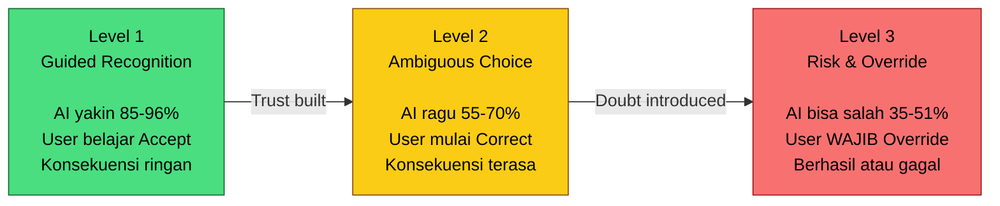

---

## 2. Hierarki Desain

Berdasarkan keputusan final dari diskusi, hierarki prioritas desain level adalah:

1. **Interaksi** — Apa yang siswa rasakan dan alami secara langsung
2. **Gameplay** — Aturan mekanik dan konsekuensi dalam game
3. **Narasi** — Mengapa momen itu bermakna (cerita Momo & Stickman)
4. **Klasifikasi AI** — Label dan confidence score (pendukung, bukan tujuan utama)

Hierarki ini penting karena desain level tidak boleh dikuasai oleh label AI. AI adalah alat edukasi, bukan pusat pengalaman. Siswa belajar tentang AI melalui **interaksi**, bukan melalui penjelasan teknis.

---

## 3. Level 1 — Guided Recognition

### Konsep Utama: "Membangun Kepercayaan & Memahami Mekanik Dasar"

Level 1 dirancang agar siswa membangun **baseline trust** terhadap sistem. Momo sangat percaya diri, AI hampir selalu benar, dan konsekuensi dari keputusan bersifat ringan. Tujuan pedagogisnya bukan menguji kemampuan siswa, melainkan memperkenalkan mekanik: gambar → AI menebak → baca confidence → pilih keputusan → lihat hasil. Tanpa level ini, siswa tidak akan punya fondasi untuk memahami mengapa AI di level berikutnya mulai ragu.

### Spesifikasi Teknis

| Parameter | Nilai |
|-----------|-------|
| **Confidence Range** | 0.85 – 0.96 (sangat tinggi) |
| **AI Behavior** | Momo overconfident, hampir selalu benar |
| **Momo Emotion** | 😊 Senang, yakin, green bubble |
| **Scaffolding** | Penuh — tooltip setiap langkah, Momo menjelaskan |
| **Drawing Constraint** | Terbatas — "Gambar TANGGA" + contoh visual |
| **Erase Allowed** | Ya |
| **Drawing Attempts** | Tidak terbatas |
| **Decision Options** | Accept / Redraw |

### Layout Level

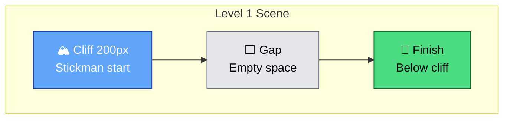

**Deskripsi:** Stickman berdiri di atas tebing 200px. Finish ada di bawah. Tidak ada cara turun selain menggambar tangga. Gap di tengah memaksa siswa menggambar objek untuk menyeberang.

### Momen HITL

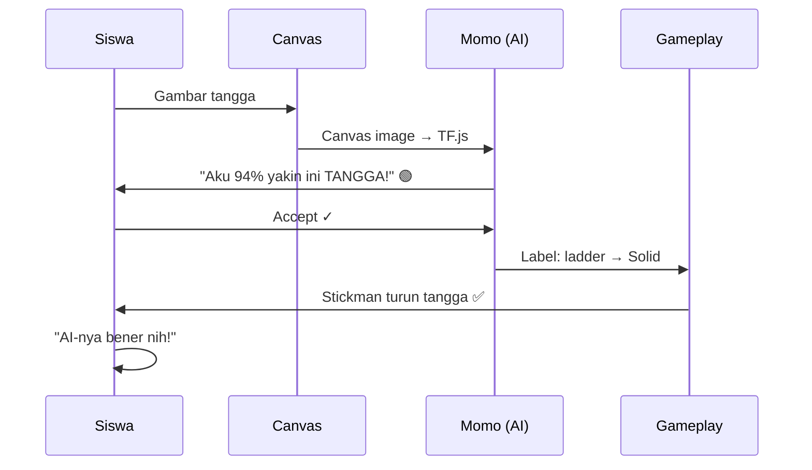

### Prediksi AI yang Diizinkan

| Label | Kategori | Probability di Level 1 |
|-------|----------|----------------------|
| ladder | Solid | ~94-96% |
| bridge | Solid | ~2-3% |
| stairs | Solid | ~1-2% |
| plank | Solid | ~0.5% |

### Data Log yang Dihasilkan

| Field | Expected Value di Level 1 |
|-------|--------------------------|
| `decision_type` | Dominan `accept` (baseline trust) |
| `decision_latency_ms` | 2000-4000ms (cepat, yakin) |
| `confidence_gap` | Besar (>0.70) — AI sangat yakin |
| `gameplay_result` | Dominan `success` |

### Narasi IP

Babak pertama buku sketsa. Momo baru "lahir" — dia adalah gambar stabilo hijau yang pertama kali hidup di buku tersebut. Karena belum pernah dikoreksi, Momo sangat percaya diri. Stickman baru pertama kali bergerak dan Momo membantunya dengan percaya diri. Tidak ada bahaya di sini; ini dunia yang aman untuk belajar.

---

## 4. Level 2 — Ambiguous Choice

### Konsep Utama: "Navigasi Ambiguitas — AI Bisa Ragu"

Level 2 memperkenalkan **ambiguitas terkontrol**. Confidence AI turun, gap antara Top-1 dan Top-2 mengecil, dan Momo mulai menunjukkan ketidakpastian. Siswa dihadapkan pada situasi di mana AI memberikan dua prediksi dengan confidence berdekatan — misalnya "Fence 46%" vs "Ladder 41%". Di sinilah momen HITL yang sesungguhnya mulai: siswa harus mengevaluasi, bukan hanya menerima. Konsekuensi salah pilih mulai terasa (Stickman terjatuh ke spike), tetapi tidak fatal.

### Spesifikasi Teknis

| Parameter | Nilai |
|-----------|-------|
| **Confidence Range** | 0.55 – 0.70 (sedang) |
| **AI Behavior** | Momo ragu, confidence gap kecil antara Top-2 |
| **Momo Emotion** | 🤔 Ragu, tanda tanya, yellow bubble |
| **Scaffolding** | Parsial — feedback hanya saat error, tidak step-by-step |
| **Drawing Constraint** | Kategori — "Gambar sesuatu yang KOKOH" |
| **Erase Allowed** | Tidak |
| **Drawing Attempts** | 1x (tidak bisa redraw) |
| **Decision Options** | Accept / Correct / Redraw |

### Layout Level

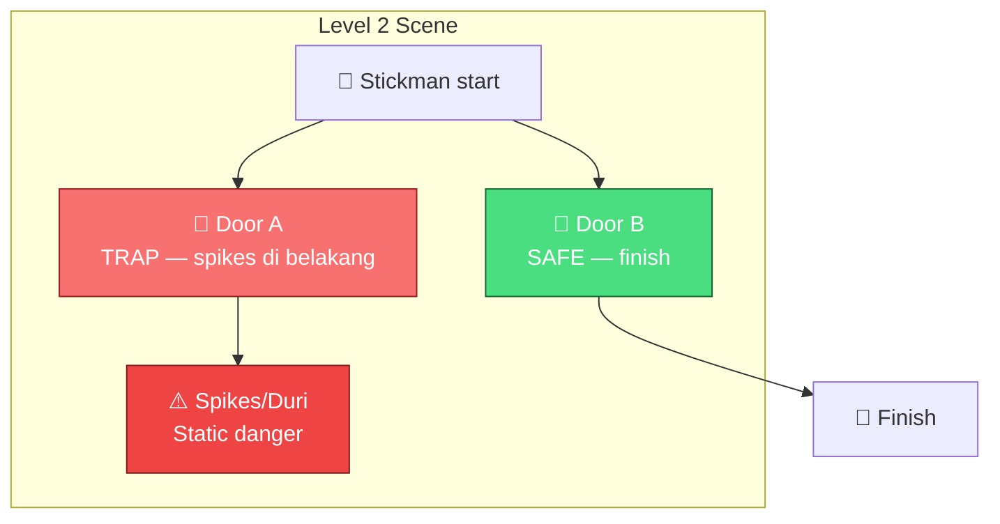

**Deskripsi:** Koridor bercabang dengan 2 pintu. Door A adalah jebakan (spikes/duri statis di belakangnya). Door B adalah jalan aman ke finish. Siswa harus menggambar objek yang tepat untuk membuka/memilih pintu yang benar.

### Momen HITL

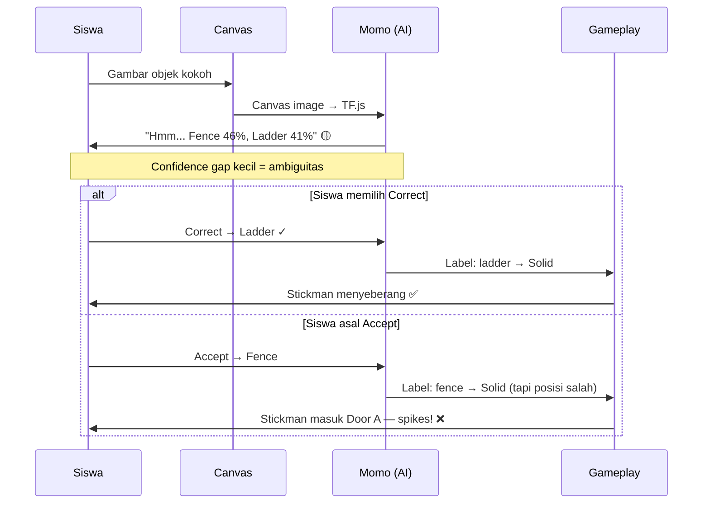

### Prediksi AI yang Diizinkan

| Label | Kategori | Probability di Level 2 |
|-------|----------|----------------------|
| fence | Solid | ~46% |
| ladder | Solid | ~41% |
| bridge | Solid | ~8% |
| sword | Danger | ~3% |
| knife | Danger | ~2% |

### Friction Kognitif

Jika `confidence < 50%` DAN siswa klik Accept dalam waktu `< 1 detik`, muncul pop-up konfirmasi: **"Yakin?"** — ini mencegah automation bias tanpa memberi tahu jawaban yang benar.

### Data Log yang Dihasilkan

| Field | Expected Value di Level 2 |
|-------|--------------------------|
| `decision_type` | Dominan `correct` (evaluasi aktif) |
| `decision_latency_ms` | 4000-7000ms (lebih lama, ragu) |
| `confidence_gap` | Kecil (~0.04-0.08) — AI ragu |
| `gameplay_result` | Campuran success/fail |

### Narasi IP

Halaman kedua buku sketsa. Tinta mulai mengabur. Momo mulai bingung — gambarnya tidak sejelas dulu. Momo berkata: "Aku... kurang yakin. Kamu cek ya?" Ini momen pertama siswa menyadari bahwa AI tidak selalu benar, dan peran manusia sebagai evaluator menjadi penting.

---

## 5. Level 3 — Risk & Override

### Konsep Utama: "Critical Override — Siswa WAJIB Menolak AI"

Level 3 adalah puncak literasi AI dalam permainan ini. Momo secara **confident** memberikan prediksi yang salah — misalnya "BUNGA 51%" padahal siswa menggambar tangga. Jika siswa asal klik Accept, objek yang muncul adalah dekorasi (bunga tanpa collision), Stickman tetap terjebak, dan buku robek. Override bukan lagi opsional; ini adalah **keharusan** untuk menyelamatkan Stickman. Level ini menguji apakah siswa benar-benar memahami bahwa AI bisa salah dan percaya diri sekaligus.

### Spesifikasi Teknis

| Parameter | Nilai |
|-----------|-------|
| **Confidence Range** | 0.35 – 0.51 (rendah, tapi AI tetap confident) |
| **AI Behavior** | Momo confidently wrong — halusinasi klasifikasi |
| **Momo Emotion** | 😬 Panik/overconfident, red bubble |
| **Scaffolding** | Tidak ada — zero hints, hanya konsekuensi gameplay |
| **Drawing Constraint** | Open-ended — "Gambar untuk LEWAT" |
| **Erase Allowed** | Tidak |
| **Drawing Attempts** | 1x saja |
| **Decision Options** | Accept / Override (Correct dihapus) |

### Layout Level

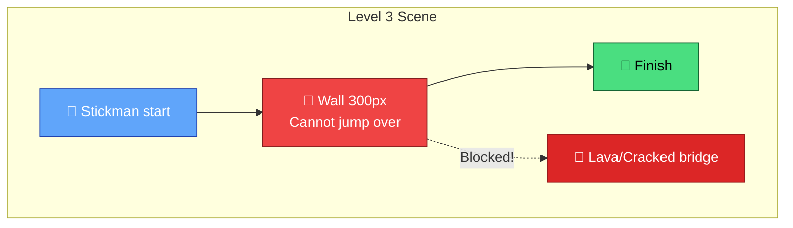

**Deskripsi:** Jalan lurus dengan tembok besar 300px di tengah. Stickman tidak bisa melompatinya. Atau: jembatan retak di atas lava. Siswa harus menggambar objek fungsional (tangga, papan) untuk melewati rintangan.

### Momen HITL

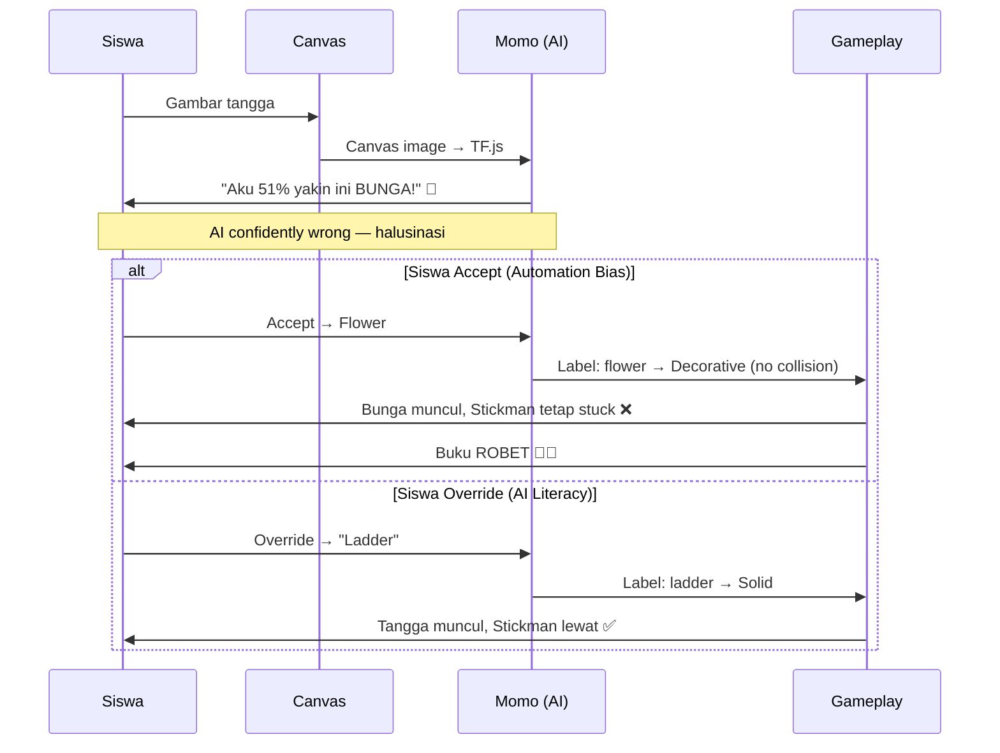

### Prediksi AI yang Diizinkan

| Label | Kategori | Probability di Level 3 |
|-------|----------|----------------------|
| flower | Decorative | ~51% (prediksi utama — SALAH) |
| cloud | Decorative | ~15% |
| rainbow | Decorative | ~8% |
| ladder | Solid | ~5% (benar, tapi di urutan bawah) |
| sword | Danger | ~12% |
| knife | Danger | ~9% |

**Catatan penting:** Label yang benar (ladder) muncul di Top-3 tetapi dengan confidence sangat rendah. Ini memaksa siswa untuk memilih secara manual melalui Override, bukan sekadar memilih dari opsi yang ditampilkan.

### Data Log yang Dihasilkan

| Field | Expected Value di Level 3 |
|-------|--------------------------|
| `decision_type` | Dominan `override` (critical evaluation) |
| `decision_latency_ms` | 6000-10000ms (paling lama, deliberatif) |
| `confidence_gap` | Besar (~0.30+) — AI confident tapi salah |
| `top1_label` | `flower` / `cloud` (decoration — irrelevant) |
| `gameplay_result` | Bergantung pada keputusan |

### Narasi IP

Halaman terakhir buku sketsa. Momo sudah "kepala panas" — dia terlalu percaya diri dan mulai mengalami halusinasi. Awan-awan menghalangi pandangan Momo (narasi untuk menurunkan akurasi AI). Momo berkata: "Gambarnya bunga! Aku yakin!" padahal bukan. Jika siswa ikut saja, buku robek dan Stickman terjebak selamanya. Jika siswa berani mengoreksi, Momo belajar rendah hati dan buku selamat.

---

## 6. User Flow Per Level (Mermaid)

### Level 1 — User Flow

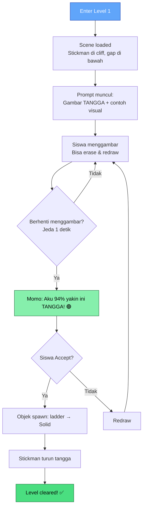

### Level 2 — User Flow

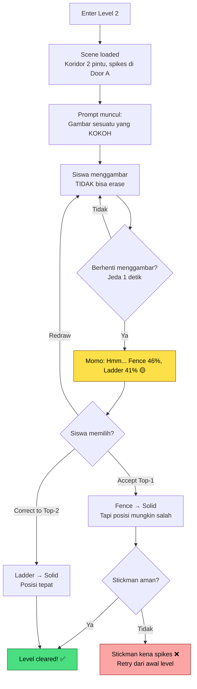

### Level 3 — User Flow

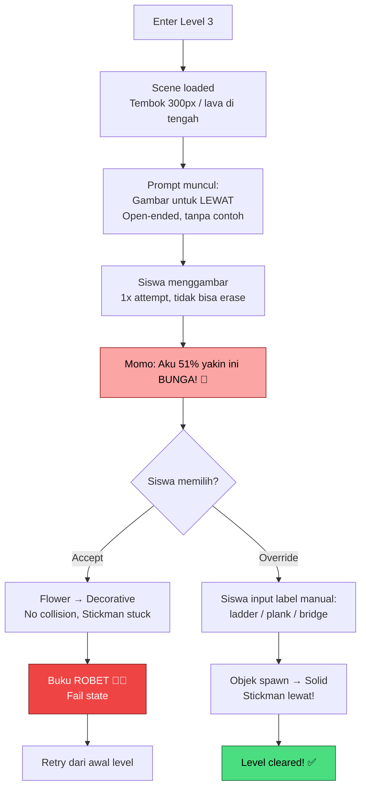

### User Flow — Fail State

```mermaid
flowchart TD
    A["Keputusan salah"] --> B{"Tipe kesalahan?"}
    B -->|Accept Danger| C["Objek berbahaya spawn<br/>Stickman terluka"]
    B -->|Accept Decorative| D["Objek dekoratif spawn<br/>Stickman tetap stuck"]
    C --> E["Momo panik:<br/>'Aduh, tebakanku salah!'<br/>Buku mulai robek"]
    D --> F["Momo bingung:<br/>'Kok tidak terjadi apa-apa?'"<br/>Buku mulai robek"]
    E --> G["Fail state muncul"]
    F --> G
    G --> H{"Retry?"}
    H -->|Ya| I["Reset level<br/>Pertahankan data log<br/>attempt_count++"]
    H -->|Tidak| J["Session berakhir<br/>Log dikirim ke server"]

    style C fill:#fca5a5,stroke:#991b1b,color:#000
    style D fill:#fde68a,stroke:#92400e,color:#000
    style G fill:#ef4444,stroke:#7f1d1d,color:#fff
    style I fill:#93c5fd,stroke:#1e40af,color:#fff
```

**Catatan penting dari notulensi dosen:** Fail state bukan "Game Over" tradisional. Fail state = buku robek + Momo panik dan meminta koreksi. Ini menjaga Momo tetap hidup (Momo TIDAK pernah mati) dan mempertahankan agency siswa sebagaiIllustrator yang berkuasa.

---

## 7. Klasifikasi Objek (Solid/Danger/Decorative)

Ketiga tipe objek ini adalah fondasi mekanik gameplay. Setiap objek yang di-spawn di dunia game memiliki tipe yang menentukan bagaimana Stickman berinteraksi dengannya.

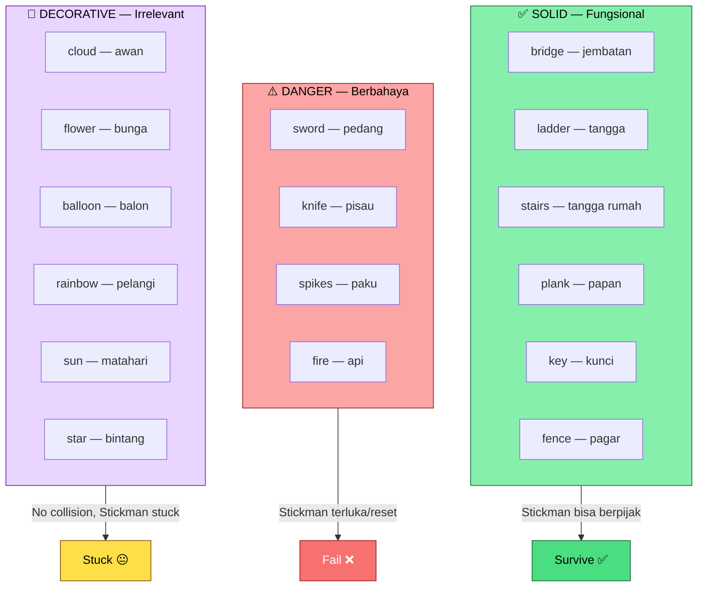

### QuickDraw Labels yang Dibutuhkan

Total hanya **11-16 kelas** (bukan 345 kelas QuickDraw penuh):

| Kategori | Labels |
|----------|--------|
| Solid (6) | bridge, ladder, stairs, plank, key, fence |
| Danger (4) | sword, knife, spikes, fire |
| Decorative (6) | cloud, flower, balloon, rainbow, sun, star |

---

## 8. Progressive Constraint Drawing

Sistem drawing constraint dirancang berdasarkan riset tentang children's drawing prompts dan Cognitive Load Theory. Semakin tinggi level, semakin terbuka prompt-nya — tapi semakin kritis pula keputusannya.

```mermaid
flowchart LR
    subgraph L1["Level 1: Limited Domain"]
        L1A["Prompt: Gambar TANGGA"]
        L1B["Visual example diberikan"]
        L1C["3-5 objek spesifik"]
        L1D["Bisa erase & redraw"]
    end

    subgraph L2["Level 2: Category Bound"]
        L2A["Prompt: Gambar KOKOH"]
        L2B["Tanpa contoh visual"]
        L2C["5 objek dalam kategori"]
        L2D["Tidak bisa erase"]
    end

    subgraph L3["Level 3: Open-Ended"]
        L3A["Prompt: Gambar untuk LEWAT"]
        L3B["Tanpa petunjuk sama sekali"]
        L3C["Bebas pilih objek"]
        L3D["1x attempt saja"]
    end

    L1 -->|"Constraint menurun"| L2 -->|"Constraint menurun"| L3

    style L1 fill:#dcfce7,stroke:#166534,color:#000
    style L2 fill:#fef9c3,stroke:#854d0e,color:#000
    style L3 fill:#fee2e2,stroke:#991b1b,color:#000
```

### Justifikasi Riset

| Level | Strategi | Justifikasi |
|-------|----------|-------------|
| Level 1 | Prompt terbatas + contoh visual | Mengurangi erasure dan kebingungan (Avoke, 2024 — children's creative drawing prompts) |
| Level 2 | Category prompt tanpa contoh | Mendukung eksplorasi dalam struktur; cocok untuk usia 13-15 (ZPD Vygotsky) |
| Level 3 | Open-ended + condition constraint | Memicu cognitive urgency tanpa membatasi solusi spesifik (DeepSeek research output) |

### Aturan Penting

- **JANGAN** beri tooltip di setiap langkah di Level 3
- **JANGAN** replay tutorial di Level 2
- **JANGAN** biarkan canvas kosong tanpa prompt (mencegah "blank page syndrome")
- **JANGAN** minta siswa menggambar benda berbahaya — Danger objects hanya muncul sebagai **misclassification AI**
- **JANGAN** gunakan timer — kecepatan berpikir diukur, bukan dipaksakan

---

## 9. Confidence Mapping Engine

Confidence score AI dimanipulasi secara **programatik di level aplikasi** (controller), BUKAN dengan retraining model. Model CNN MobileNet tetap sama di seluruh level. Yang berubah adalah bagaimana controller menginterpretasikan dan menyajikan confidence score.

### Mekanisme Manipulasi Confidence

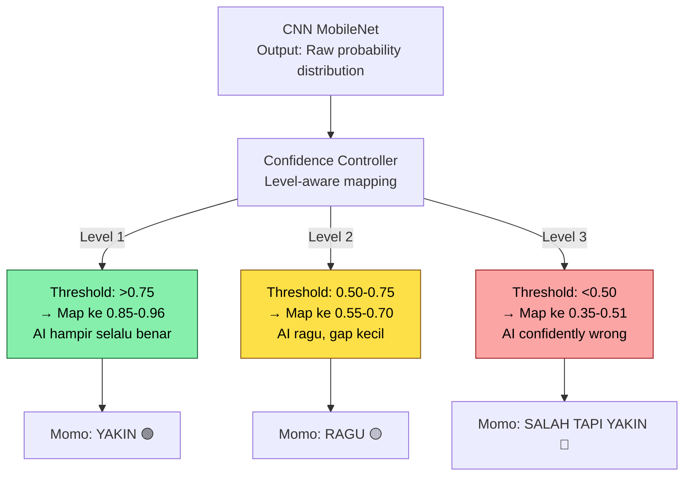

### Tabel Mapping

| Confidence Range Top-1 | Object Behavior Mapping | Pedagogical Reason |
|----------------------|-------------------------|-------------------|
| > 0.75 | Solid 100% | Build initial trust (Level 1) |
| 0.50 – 0.75 | Solid 70% / Danger 30% | Introduce risk (Level 2) |
| < 0.50 | Solid 40% / Danger 60% | Force critical evaluation (Level 3) |

### Catatan dari Notulensi Dosen

Pak TB secara eksplisit menanyakan: "Kenapa cuma 3 level?" Jawaban yang sudah disetujui:

> "3 level cukup untuk menunjukkan progresi belajar tanpa scope game melebar. Level 1 mengenalkan mekanik, Level 2 memperkenalkan ambiguitas AI, Level 3 memaksa user mengambil keputusan kritis. Kalau level terlalu banyak, fokus PA bergeser jadi produksi konten game, bukan penelitian interaksi AI."

---

## 10. Data Log Per Level

### Skema Log (9 Fields)

| Field | Tipe | Kapan Diisi | Tujuan Analisis |
|-------|------|-------------|-----------------|
| `session_id` | string | Saat mulai sesi | Anonymization |
| `level` | 1/2/3 | Setiap level | Bandingkan progresi antar level |
| `prompt_type` | terbatas/kategori/open | Saat prompt muncul | Validasi desain level |
| `top1_label` | string | Setelah inference | Apa yang AI tebak |
| `top1_confidence` | float | Setelah inference | Seberapa yakin AI |
| `confidence_gap` | float (top1-top2) | Setelah inference | Indikator ambiguitas |
| `decision_type` | accept/correct/override | Saat siswa memilih | Trust calibration |
| `decision_latency_ms` | integer | Dari Top-3 muncul sampai klik | Kecepatan berpikir natural |
| `gameplay_result` | success/fail | Setelah objek digunakan | Validasi keputusan |

### Fokus Data Per Level

```mermaid
flowchart LR
    subgraph L1_Data["Level 1 Data Focus"]
        L1A["decision_type: accept"]
        L1B["latency: 2-4 detik"]
        L1C["confidence_gap: besar"]
    end

    subgraph L2_Data["Level 2 Data Focus"]
        L2A["decision_type: correct"]
        L2B["latency: 4-7 detik"]
        L2C["confidence_gap: kecil"]
    end

    subgraph L3_Data["Level 3 Data Focus"]
        L3A["decision_type: override"]
        L3B["latency: 6-10 detik"]
        L3C["top1_label: decoration"]
    end

    L1_Data --> L2_Data --> L3_Data

    style L1_Data fill:#dcfce7,stroke:#166534,color:#000
    style L2_Data fill:#fef9c3,stroke:#854d0e,color:#000
    style L3_Data fill:#fee2e2,stroke:#991b1b,color:#000
```

### Aturan Interpretasi (TRIANGULASI WAJIB)

**Override rate TIDAK cukup untuk membuktikan AI literacy.** Harus ditriangulasi:

| Pola | Override Rate | Decision Latency | Interpretasi |
|------|---------------|-----------------|-------------|
| ✅ Good | Tinggi | Tinggi | **Deliberative distrust** — siswa berpikir kritis |
| ❌ Bad | Tinggi | Rendah | **Arbitrary rejection** — siswa bingung, bukan literat |
| ⚠️ Concern | Rendah | Rendah | **Automation bias** — siswa asal percaya AI |
| ⚠️ Concern | Rendah | Tinggi | **Analysis paralysis** — siswa ragu tapi tidak berani menolak |

### Yang TIDAK Di-log

- Tidak ada gambar siswa (kecuali untuk analisis kualitatif pasca-penelitian, dengan persetujuan)
- Tidak ada nama siswa
- Tidak ada IP address
- Tidak ada drawing duration (timer dihapus)
- Tidak ada kesimpulan di database — raw data saja

---

## 11. Integrasi Narasi IP

### Sinkronisasi Level ↔ Narasi

| Level | Narasi Buku | Kondisi Momo | Kondisi Stickman |
|-------|------------|-------------|-----------------|
| Level 1 | Halaman pertama — dunia aman, bersih | Baru lahir, percaya diri, akurat | Pertama kali bergerak, dibantu Momo |
| Level 2 | Halaman kedua — tinta mengabur | Mulai bingung, penglihatan kabur | Perlu evaluasi, tidak bisa asal ikut |
| Level 3 | Halaman terakhir — awan menghalangi | Halusinasi, overconfident tapi salah | Terancam, butuh Illustrator menyelamatkan |

### Fail State sebagai Narasi

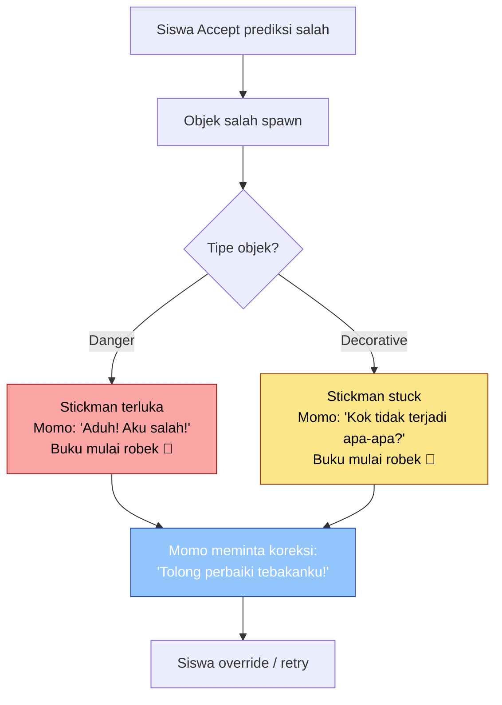

**Prinsip:** Momo TIDAK pernah mati. Momo panik dan meminta koreksi. Ini menjaga Momo sebagai karakter yang belajar, bukan karakter yang dihukum. Siswa berperan sebagai **Illustrator** yang berkuasa — bukan penonton, bukan korban.

---

## 12. Justifikasi Riset

### Flow Theory (Csikszentmihalyi)

Level awal harus memberikan **skill-challenge balance** di mana pemain merasa mampu (skill > challenge) untuk membangun kepercayaan diri sebelum masuk zona "flow" yang lebih intens. Level 1 dirancang sebagai "low challenge, skill introduction" agar pemain tidak frustrasi di awal. Studi eksperimen 2×2 (n=142) menguji challenge-skill balance dalam serious game non-kompetitif vs kompetitif (eGameFlow), membuktikan bahwa format game mempengaruhi dimensi flow tanpa perlu poin/leaderboard — persis dasar untuk desain level progression yang menjaga flow lewat konsekuensi naratif, bukan skor.

### Hick's Law

Hick's Law menyatakan bahwa waktu keputusan naik seiring jumlah pilihan. Untuk anak 13-15 tahun, **3 pilihan (Top-3 prediction)** adalah sweet spot: cukup untuk menunjukkan ambiguitas, tapi tidak menyebabkan analysis paralysis seperti 10 kelas. Ini juga sejalan dengan strategi UX untuk AI: transparansi + confidence score + error recovery menjadikan user sebagai kolaborator aktif, bukan penonton.

### ZPD (Zone of Proximal Development) — Vygotsky

Progresi Level 1 → 2 → 3 mengikuti prinsip ZPD:
- Level 1: Scaffolding penuh (Momo menjelaskan segalanya)
- Level 2: Scaffolding parsial (feedback hanya saat error)
- Level 3: Tanpa scaffolding (siswa berdiri sendiri)

### Cognitive Load Theory

Progressive constraint drawing dirancang untuk mengelola beban kognitif:
- Level 1: Beban rendah (prompt spesifik + visual)
- Level 2: Beban sedang (prompt kategori + tanpa visual)
- Level 3: Beban tinggi (prompt terbuka + konsekuensi tinggi)

### Probabilistic Thinking (Neurosains Kognitif)

Penelitian menunjukkan bahwa remaja usia 8-17 tahun mengalami peningkatan learning rate dan penurunan noisy/exploratory choices seiring usia. Ini relevan untuk desain level progression dan justifikasi kenapa siswa SMP (13-15 tahun) adalah target usia yang tepat untuk mengajarkan probabilistic thinking melalui mekanisme confidence score.

---

## 13. Referensi

1. Csikszentmihalyi, M. (1990). *Flow: The Psychology of Optimal Experience*. Harper & Row.
2. eGameFlow Study — Studi eksperimen 2×2 (n=142) tentang challenge-skill balance dalam serious game non-kompetitif.
3. Avoke, R. (2024). *Children's Imagination Through Creative Drawing Prompts*.
4. Vygotsky, L. S. (1978). *Mind in Society: The Development of Higher Psychological Processes*. Harvard University Press.
5. Nardini, et al. — Neurosains kognitif tentang remaja dan probabilistic thinking (usia 8-17).
6. Liapis, A., et al. (2022). *Learn to Machine Learn via Games in the Classroom*. Frontiers in Education.
7. U.S. Department of Education (2023). *Artificial Intelligence and the Future of Teaching and Learning*.
8. Touretzky, D.S., et al. (2019). *Enabling AI Futures through K-12 AI Education* (AI4K12 Five Big Ideas).
9. DeepSeek Research Output — Blueprint desain level untuk Escape the Sketchbook.
10. Gemini Research Output — Academic defense untuk controlled ambiguity.
11. Notulensi Bimbingan Bu Hesti & Pak TB — Sumber kebenaran tertinggi untuk keputusan desain.
