# Desain Sistem — "Escape the Sketchbook"

> **Proyek:** Interactive HITL AI Literacy Simulation  
> **Arsitektur:** Browser-Based Inference + Server-Side Services (Hybrid)  
> **Pattern:** Web AI / Client-Side Inference untuk Klasifikasi + Server-Side untuk Layanan Pendukung  
> **Prinsip:** Inferensi CNN berjalan di browser siswa via TensorFlow.js. Server menyediakan layanan REST API, penyimpanan log, autentikasi, analisis K-Means, dan dashboard guru.

---

## Daftar Isi

1. [Arsitektur Global](#1-arsitektur-global)
2. [Desain Sistem Global (IPO)](#2-desain-sistem-global-ipo)
3. [Desain Sistem Scope Can (IPO)](#3-desain-sistem-scope-can-ipo)
4. [Desain Sistem Scope Dias (IPO)](#4-desain-sistem-scope-dias-ipo)
5. [Arsitektur Data Flow](#5-arsitektur-data-flow)
6. [Arsitektur Hybrid: Browser-Based Inference + Server-Side Services](#6-arsitektur-hybrid-browser-based-inference--server-side-services)
7. [Technology Stack](#7-technology-stack)
8. [Arsitektur Deployment](#8-arsitektur-deployment)
9. [Kontrak Data Can–Dias](#9-kontrak-data-can--dias)
10. [Struktur JSON Log](#10-struktur-json-log)
11. [Justifikasi Arsitektur](#11-justifikasi-arsitektur)
12. [Referensi](#12-referensi)

---

## 1. Arsitektur Global

### Pola Arsitektur

Proyek ini mengadopsi pola **Hybrid Architecture** yang menggabungkan **Browser-Based Inference** untuk klasifikasi AI dan **Server-Side Services** untuk layanan pendukung. Inferensi CNN MobileNet berjalan sepenuhnya di browser siswa menggunakan TensorFlow.js, sehingga data gambar dan kamera siswa tidak pernah keluar dari perangkat mereka. Di sisi lain, server backend (Node.js/Express + SQLite) menangani layanan yang memerlukan persistensi, autentikasi, analisis, dan visualisasi — termasuk REST API logging, JWT authentication untuk dashboard guru, K-Means clustering, dan ekspor data.

Pemisahan ini bukan arbitrer. **Inferensi dikategorikan client-side** karena dua alasan defensibel: (1) privasi data siswa (gambar tidak keluar device, sesuai COPPA/GDPR-K), dan (2) latensi rendah (15-100ms vs 200-500ms jika lewat server). **Layanan pendukung dikategorikan server-side** karena memerlukan persistensi data lintas sesi, akses terpusat oleh guru, dan komputasi analisis yang tidak perlu real-time di browser siswa.

```mermaid
flowchart LR
    subgraph Client["CLIENT (Browser)"]
        direction TB
        C1["📱 MediaPipe<br/>Hand Tracking"]
        C2["🎨 Canvas<br/>Drawing Input"]
        C3["🧠 TensorFlow.js<br/>CNN MobileNet Inference"]
        C4["🎮 Kaplay.js<br/>Game Engine + Physics"]
        C5["💬 Probe UI<br/>HITL Decision Interface"]
        C6["🎭 Momo<br/>Pedagogical Agent"]
    end

    subgraph Server["SERVER (Backend Services)"]
        direction TB
        S1["📥 REST API<br/>POST /api/logs/session"]
        S2["🔑 JWT Auth<br/>Dashboard guru"]
        S3["💾 SQLite<br/>Database"]
        S4["📊 K-Means<br/>Clustering Analysis"]
        S5["📈 Dashboard<br/>Visualisasi & Export"]
        S6["📦 Model File Serving<br/>TF.js assets (statis)"]
    end

    Client -->|"JSON log (async)"| Server
    Server -->|"Model files (statis)"| Client

    style Client fill:#dbeafe,stroke:#1e40af,color:#000
    style Server fill:#fef3c7,stroke:#92400e,color:#000
```

### Alur Data Fundamental

```mermaid
flowchart LR
    A["Siswa menggambar"] --> B["AI menebak<br/>(browser-side)"]
    B --> C["Siswa memutuskan<br/>(HITL)"]
    C --> D["Keputusan berdampak<br/>(gameplay)"]
    D --> E["Data dicatat<br/>(log event)"]
    E --> F["Log dikirim ke server<br/>(REST API async)"]
    F --> G["Pola dianalisis<br/>(K-Means clustering)"]

    style A fill:#bfdbfe,stroke:#1e40af,color:#000
    style B fill:#c7d2fe,stroke:#4338ca,color:#000
    style C fill:#fef08a,stroke:#854d0e,color:#000
    style D fill:#bbf7d0,stroke:#166534,color:#000
    style E fill:#fed7aa,stroke:#9a3412,color:#000
    style F fill:#fde68a,stroke:#92400e,color:#000
    style G fill:#e9d5ff,stroke:#6b21a8,color:#000
```

### Pernyataan Kunci

> "Inferensi AI tetap berjalan client-side. Server tidak dipakai untuk menebak gambar, tapi untuk menyediakan layanan pendukung: penyimpanan log, autentikasi dashboard guru, analisis clustering, dan serving aset model."  
> — Merged Context, keputusan final

> "Pendekatan client-side inference dipilih untuk mengurangi beban server dan menjaga respons sistem tetap cepat. Server tetap dapat digunakan untuk menyimpan log interaksi, tetapi tidak digunakan untuk menjalankan prediksi AI."  
> — Merged Context, SAD v2.0

---

## 2. Desain Sistem Global (IPO)

Diagram ini dipakai **bersama** oleh Can dan Dias di proposal masing-masing. Fungsinya menunjukkan bahwa proyek adalah **satu sistem utuh**, bukan dua PA yang terpisah.

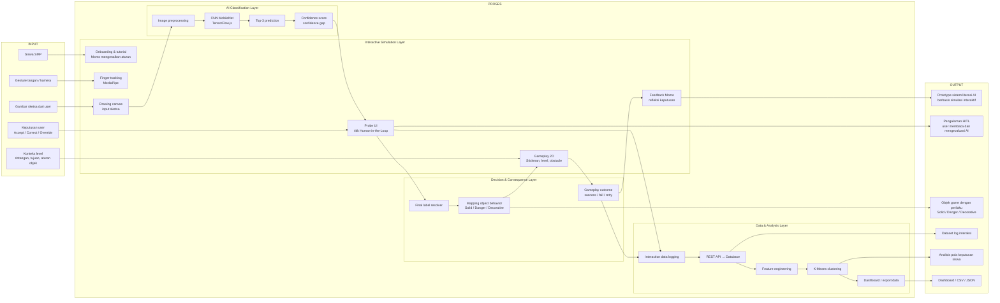

### Penjelasan Desain Global

Diagram global sengaja dibagi jadi **4 layer proses**, bukan langsung dijadikan satu flow panjang. Desain sistem harus memperlihatkan blok fungsi utama dari sistem, bukan detail layar satu per satu.

**Input** berisi semua hal yang masuk ke sistem dari sisi user dan konteks permainan. Siswa memberi gesture tangan, menggambar objek, mengambil keputusan terhadap prediksi AI, dan bermain di level tertentu. Jadi input global tidak cuma "gambar", karena sistem kalian bukan classifier gambar biasa.

**Interactive Simulation Layer** adalah bagian yang membuat siswa masuk ke pengalaman sistem. Di sini ada onboarding, MediaPipe, drawing canvas, Probe UI, gameplay 2D, dan feedback Momo. Ini dominan scope Can karena menyangkut interaksi, UI, gameplay, dan pengalaman user.

**AI Classification Layer** adalah bagian yang membaca gambar user. Gambar dari canvas masuk ke preprocessing, lalu diprediksi oleh CNN MobileNet/TensorFlow.js, kemudian menghasilkan Top-3 prediction dan confidence score. Inferensi berjalan di browser (client-side) — model diload dari aset statis yang disediakan server, tetapi proses prediksi sendiri tidak melibatkan round-trip ke server.

**Decision & Consequence Layer** adalah jembatan antara AI dan game. Setelah AI memberi prediksi, sistem tidak langsung menjalankan hasil AI. User masuk lewat Probe UI, lalu keputusan akhirnya menjadi final label. Final label itu baru dipetakan menjadi Solid, Danger, atau Decorative.

**Data & Analysis Layer** adalah scope Dias yang menerima log dari proses interaksi dan gameplay. Data dikirim via REST API ke backend, disimpan di SQLite, lalu diproses untuk analisis pola keputusan. K-Means clustering dijalankan di server menggunakan Python (scikit-learn). Dashboard guru memvisualisasikan hasil analisis. Layer ini bukan sekadar "data sink" — server melakukan feature engineering, clustering, dan menyediakan akses terautentikasi ke hasil analisis.

### Kalimat Pembuka sebelum Diagram (untuk Proposal)

> "Desain sistem dibagi menjadi desain sistem global dan desain sistem berdasarkan scope pengembangan. Desain sistem global menunjukkan alur keseluruhan sistem dari input pengguna, proses klasifikasi AI, mekanisme Human-in-the-Loop, simulasi interaktif, hingga pencatatan dan analisis data. Selanjutnya, desain sistem scope masing-masing digunakan untuk menjelaskan batas kontribusi pengembangan pada bagian interaksi-simulasi dan bagian AI-data."

### Kalimat setelah Diagram Global (untuk Proposal)

> "Pada desain global, sistem tidak hanya menerima gambar sebagai input, tetapi juga menerima keputusan user dan konteks gameplay. Hal ini diperlukan karena fokus sistem bukan sekadar klasifikasi sketsa, melainkan bagaimana siswa merespons keluaran AI dan melihat konsekuensi keputusan tersebut dalam simulasi. Inferensi AI berjalan di browser siswa menggunakan TensorFlow.js, sementara server menangani penyimpanan log, analisis data, dan dashboard guru."

---

## 3. Desain Sistem Scope Can (IPO)

Diagram ini masuk di **proposal Can**. Fokusnya adalah interaksi, UI, MediaPipe, drawing, Probe UI, gameplay, Momo, level, dan feedback.

```mermaid
flowchart LR
    subgraph INPUT["INPUT"]
        I1["Siswa SMP"]
        I2["Kamera / webcam"]
        I3["Gerakan tangan dan jari"]
        I4["Gambar sketsa user"]
        I5["Hasil prediksi dari Dias<br/>Top-3 + confidence score"]
        I6["Keputusan user<br/>Accept / Correct / Override"]
    end

    subgraph PROCESS["PROSES SCOPE CAN"]
        subgraph C1["Interaction Entry"]
            C1A["Onboarding screen"]
            C1B["Momo introduction"]
            C1C["Tutorial aturan<br/>Solid / Danger / Decorative"]
        end

        subgraph C2["Finger Tracking & Drawing"]
            C2A["MediaPipe hand detection"]
            C2B["Finger pointer mapping"]
            C2C["Deadzone / stabilisasi gesture"]
            C2D["Drawing canvas"]
            C2E["Clear / redraw control"]
        end

        subgraph C3["HITL Interface"]
            C3A["Probe UI muncul"]
            C3B["Momo reaction<br/>confident / unsure / warning"]
            C3C["Prediction panel<br/>Top-3 + confidence"]
            C3D["Decision button<br/>Accept / Correct / Override"]
        end

        subgraph C4["Decision to Gameplay"]
            C4A["Final label resolver"]
            C4B["Object behavior mapper"]
            C4C["Spawn object ke world"]
        end

        subgraph C5["2D Gameplay Simulation"]
            C5A["Level manager<br/>Level 1-3"]
            C5B["Stickman control"]
            C5C["Collision detection"]
            C5D["Success / fail / retry state"]
            C5E["Momo feedback & level summary"]
        end

        subgraph C6["Event Packaging"]
            C6A["Membentuk interaction event"]
            C6B["Mengirim data ke server<br/>via REST API"]
        end
    end

    subgraph OUTPUT["OUTPUT"]
        O1["Playable prototype<br/>simulasi interaktif berlevel"]
        O2["Alur HITL yang terlihat<br/>di Probe UI"]
        O3["Objek game final<br/>Solid / Danger / Decorative"]
        O4["Feedback edukatif dari Momo"]
        O5["Interaction event<br/>terkirim ke backend"]
    end

    I1 --> C1A
    I2 --> C2A
    I3 --> C2B
    C2B --> C2C
    C2C --> C2D
    I4 --> C2D

    C1A --> C1B
    C1B --> C1C
    C1C --> C2A

    C2D --> C2E
    C2D --> C3A
    I5 --> C3C
    C3A --> C3B
    C3A --> C3C
    C3C --> C3D
    I6 --> C3D

    C3D --> C4A
    C4A --> C4B
    C4B --> C4C
    C4C --> C5A
    C5A --> C5B
    C5B --> C5C
    C5C --> C5D
    C5D --> C5E

    C3D --> C6A
    C5D --> C6A
    C6A --> C6B

    C5E --> O1
    C3A --> O2
    C4B --> O3
    C5E --> O4
    C6B --> O5
```

### Penjelasan Desain Scope Can

Diagram scope Can dibuat lebih rinci karena bagian Can bukan cuma "membuat tampilan". Scope Can adalah **mendesain pengalaman interaktif** yang membuat HITL bisa dialami oleh siswa.

**Input scope Can** berasal dari user dan dari output Dias. Dari user, Can menerima gesture tangan, gambar, dan keputusan. Dari Dias, Can menerima Top-3 prediction dan confidence score. Ini penting karena di sistem ini, Can dan Dias bertemu di UI. Dias menghasilkan prediksi, tapi prediksi itu baru bermakna ketika Can menampilkannya di Probe UI.

**Interaction Entry** ada karena siswa SMP perlu konteks sebelum main. Onboarding bukan formalitas. Di situ Momo menjelaskan siapa dirinya, apa tujuan Stickman, dan aturan dasar objek. Tanpa onboarding, siswa bisa asal gambar dan asal klik, sehingga data interaksi jadi kurang valid.

**Finger Tracking & Drawing** adalah alasan teknis kenapa judul Can menyebut finger tracking. MediaPipe dipakai untuk mendeteksi tangan/jari dari kamera. MediaPipe Hands dirancang sebagai pipeline real-time hand tracking dari kamera RGB, sehingga cocok untuk input gesture. Dari sisi Can, MediaPipe bukan classifier AI, tapi **interaction layer**.

**HITL Interface** adalah bagian paling penting dalam scope Can. Probe UI dibuat supaya user berhenti dulu, membaca prediksi AI, melihat confidence score, lalu mengambil keputusan. Momo juga ditempatkan di sini karena Momo menyambungkan tiga inti aplikasi: interaksi, gameplay, dan edukasi.

**Decision to Gameplay** dipakai untuk menjembatani keputusan user dengan konsekuensi game. Misalnya AI menebak "knife", tapi user memilih "ladder". Maka final label harus menjadi "ladder", lalu sistem memetakan ladder sebagai Solid. Ini harus jelas karena kalau tidak, dosen bisa bingung: yang dipakai itu prediksi AI atau keputusan user?

**2D Gameplay Simulation** menjadi ruang konsekuensi. Stickman, level, collision, success/fail, dan retry ada supaya keputusan user terhadap AI punya akibat yang bisa dilihat. Ini alasan kenapa sistem bukan sekadar panel klasifikasi gambar.

**Event Packaging** penting karena output Can tidak berhenti di UI. Can harus menghasilkan data event yang dikirim ke backend server via REST API. Misalnya: user melihat confidence 52%, memilih Correct, butuh 4 detik, objek menjadi Solid, level berhasil. Pengiriman dilakukan secara asinkron (non-blocking) agar tidak mengganggu gameplay.

### Kalimat setelah Diagram Can (untuk Proposal)

> "Pada scope Can, proses berfokus pada pembentukan pengalaman interaktif, mulai dari onboarding, finger tracking, drawing canvas, Probe UI, decision resolver, hingga gameplay feedback. Output utama dari scope ini adalah prototype simulasi interaktif berlevel dan event interaksi yang dikirim ke backend untuk pencatatan data."

### Kalimat untuk Dosen

> "Scope saya berfokus pada rancangan pengalaman interaktif, mulai dari gesture input, drawing canvas, penyajian prediksi AI pada Probe UI, keputusan user, hingga konsekuensi keputusan tersebut dalam simulasi 2D. Event interaksi dikirim ke backend secara asinkron untuk keperluan pencatatan dan analisis data."

---

## 4. Desain Sistem Scope Dias (IPO)

Diagram ini masuk di **proposal Dias**. Fokusnya adalah dataset, preprocessing, model CNN MobileNet, TensorFlow.js, confidence score, logging, feature engineering, clustering, dan dashboard/export.

```mermaid
flowchart LR
    subgraph INPUT["INPUT"]
        I1["Dataset sketsa<br/>QuickDraw subset"]
        I2["Daftar kelas objek<br/>15-20 kelas"]
        I3["Mapping kategori<br/>Solid / Danger / Decorative"]
        I4["Canvas image dari Can"]
        I5["Interaction event dari Can<br/>decision, duration, outcome"]
    end

    subgraph PROCESS["PROSES SCOPE DIAS"]
        subgraph D1["Dataset & Model Preparation"]
            D1A["Seleksi kelas dataset"]
            D1B["Data cleaning"]
            D1C["Resize / grayscale / normalisasi"]
            D1D["Train-test split"]
        end

        subgraph D2["AI Model Development"]
            D2A["Training CNN MobileNet<br/>(campus server / Colab)"]
            D2B["Model evaluation<br/>accuracy / loss"]
            D2C["Model optimization<br/>quantization / compression"]
            D2D["Export ke TensorFlow.js<br/>model.json + weights (<5MB)"]
        end

        subgraph D3["Runtime Inference Contract"]
            D3A["Load model.json + weights<br/>(di browser, via server static serving)"]
            D3B["Runtime preprocessing<br/>canvas image → 28×28 grayscale"]
            D3C["Predict sketch class"]
            D3D["Generate Top-3 prediction"]
            D3E["Calculate confidence score<br/>and confidence gap"]
        end

        subgraph D4["Data Contract to Can"]
            D4A["Prediction response format"]
            D4B["Label map"]
            D4C["Category map<br/>Solid / Danger / Decorative"]
        end

        subgraph D5["Backend Services"]
            D5A["REST API endpoint<br/>POST /api/logs/session"]
            D5B["Payload validation"]
            D5C["SQLite database storage"]
            D5D["Session-based log grouping"]
            D5E["JWT authentication<br/>(dashboard guru)"]
        end

        subgraph D6["Analysis Pipeline"]
            D6A["Data cleaning log"]
            D6B["Feature engineering"]
            D6C["Descriptive statistics"]
            D6D["K-Means clustering<br/>(scikit-learn, server-side)"]
            D6E["Cluster interpretation"]
        end
    end

    subgraph OUTPUT["OUTPUT"]
        O1["Model TensorFlow.js<br/>model.json + weights"]
        O2["Top-3 prediction<br/>confidence score"]
        O3["Structured interaction log<br/>(SQLite)"]
        O4["Fitur analisis<br/>accept rate, override rate, avg decision time"]
        O5["Cluster pola keputusan"]
        O6["Dashboard / export CSV JSON"]
    end

    I1 --> D1A
    I2 --> D1A
    I3 --> D4C

    D1A --> D1B
    D1B --> D1C
    D1C --> D1D
    D1D --> D2A
    D2A --> D2B
    D2B --> D2C
    D2C --> D2D
    D2D --> O1

    I4 --> D3B
    O1 --> D3A
    D3A --> D3B
    D3B --> D3C
    D3C --> D3D
    D3D --> D3E
    D3E --> D4A
    D4A --> D4B
    D4B --> D4C
    D4A --> O2

    I5 --> D5A
    D5A --> D5B
    D5B --> D5C
    D5C --> D5D
    D5D --> D5E
    D5D --> O3

    D5D --> D6A
    D6A --> D6B
    D6B --> D6C
    D6C --> D6D
    D6D --> D6E
    D6B --> O4
    D6E --> O5
    D6E --> O6
```

### Penjelasan Desain Scope Dias

Diagram Dias dibuat lebih teknis karena tanggung jawab Dias adalah memastikan AI dan data penelitian berjalan dari awal sampai akhir.

**Input pertama Dias** adalah dataset sketsa. Dataset perlu dibatasi 15–20 kelas supaya model, UI, dan mapping gameplay tetap realistis. Kalau kelas terlalu banyak, model lebih susah dilatih, UI Top-3 makin sulit dikontrol, dan mapping Solid/Danger/Decorative makin melebar.

**Dataset & Model Preparation** penting karena model tidak bisa langsung dilatih dari data mentah. Data perlu dibersihkan, disamakan ukurannya, diubah ke grayscale/normalisasi jika training memakai format itu, lalu dibagi train-test. Bagian ini menjadi dasar agar inference runtime tidak kacau.

**AI Model Development** adalah kontribusi inti Dias di sisi AI. CNN MobileNet dipakai untuk klasifikasi sketsa sebagai gambar. Training dilakukan di campus server (Proxmox VM) atau Google Colab, memanfaatkan GPU/CPU server untuk eksperimen model yang lebih efisien. Model kemudian dievaluasi dan diexport ke TensorFlow.js supaya bisa berjalan di browser. TensorFlow.js relevan karena mendukung eksekusi machine learning di browser dan porting model dari ekosistem Python/TensorFlow ke JavaScript.

**Runtime Inference Contract** adalah proses ketika gambar dari canvas Can diproses oleh model di browser. Model diload dari aset statis yang disediakan server (model.json + weights), lalu inference berjalan sepenuhnya di client-side. Ini menghasilkan Top-3 prediction, confidence score, dan confidence gap. Output ini harus dipakai oleh Can di Probe UI, jadi formatnya harus stabil.

**Data Contract to Can** sengaja dibuat sebagai blok sendiri karena ini titik rawan integrasi. Dias tidak cukup hanya menghasilkan model. Dias harus memberi format output yang jelas: label, score, category, dan confidence gap. Tanpa kontrak data ini, Can akan kesulitan menampilkan AI output secara konsisten.

**Backend Services** menerima interaction event dari Can via REST API, menyimpan di SQLite, dan mengelola session. Dias juga menambahkan JWT authentication untuk akses dashboard guru. Backend ini bukan server AI — AI tetap berjalan di browser. Backend menangani layanan pendukung: penyimpanan, autentikasi, dan penyediaan aset model.

**Analysis Pipeline** mengubah log mentah menjadi fitur analisis. Contoh fitur: accept rate, correct rate, override rate, average decision time, danger acceptance, success rate. Fitur ini baru bisa dipakai untuk statistik dan K-Means clustering. K-Means dijalankan di server menggunakan Python (scikit-learn), dipanggil sebagai child process dari Node.js. Clustering dipakai untuk membaca pola keputusan, bukan menilai siswa pintar atau bodoh.

### Kalimat setelah Diagram Dias (untuk Proposal)

> "Pada scope Dias, proses berfokus pada pengolahan dataset, pengembangan model klasifikasi sketsa, konversi model ke TensorFlow.js, penyediaan output prediksi, layanan backend untuk pencatatan log interaksi dan autentikasi, serta analisis pola keputusan. Output utama dari scope ini adalah model klasifikasi, Top-3 prediction, confidence score, data log terstruktur, dan hasil analisis pola keputusan."

### Kalimat untuk Dosen

> "Scope saya berfokus pada pipeline AI dan data, mulai dari persiapan dataset sketsa, pelatihan model CNN MobileNet di campus server, konversi ke TensorFlow.js untuk client-side inference, penyediaan Top-3 prediction dan confidence score, pengembangan backend untuk pencatatan interaction log, hingga analisis pola keputusan menggunakan K-Means clustering."

---

## 5. Arsitektur Data Flow

Diagram ini menunjukkan bagaimana data mengalir antara komponen sistem. Inferensi CNN berjalan di browser siswa, sementara server menerima log dan menyediakan layanan pendukung.

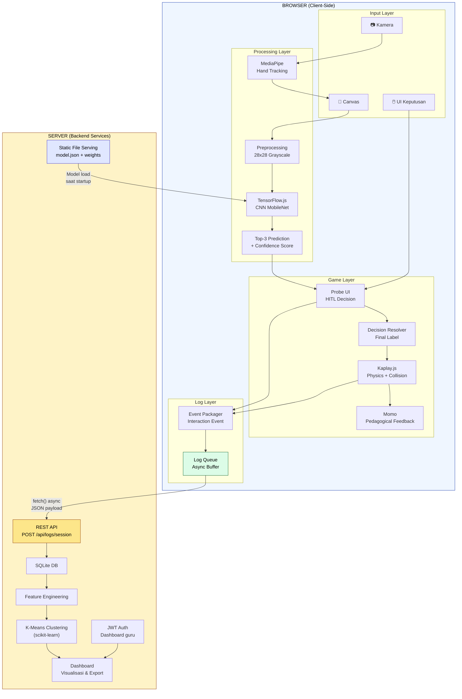

### Titik Temu Can–Dias

```mermaid
flowchart LR
    subgraph CanLayer["Can Layer"]
        C1["Gesture Drawing UI"]
        C2["Prediction Panel"]
        C3["Gameplay Consequence"]
        C4["Momo Feedback"]
    end

    subgraph SharedContract["Shared Contract"]
        S1["Canvas Image<br/>Can → Dias (via browser TF.js)"]
        S2["Top-3 + Confidence<br/>Dias model → Can UI"]
        S3["Decision Log JSON<br/>Can → Server REST API"]
        S4["Gameplay Outcome<br/>Can → Server REST API"]
    end

    subgraph DiasLayer["Dias Layer"]
        D1["Sketch Dataset"]
        D2["CNN MobileNet"]
        D3["TF.js Export"]
        D4["Backend Services<br/>(REST API, SQLite, K-Means, Dashboard)"]
    end

    CanLayer --> SharedContract --> DiasLayer

    style CanLayer fill:#dbeafe,stroke:#1e40af,color:#000
    style SharedContract fill:#dcfce7,stroke:#166534,color:#000
    style DiasLayer fill:#fef3c7,stroke:#92400e,color:#000
```

> "Can designs the decision moment. Dias provides the model, backend services, and reads the decision data."

---

## 6. Arsitektur Hybrid: Browser-Based Inference + Server-Side Services

### Kenapa Inferensi di Browser, Bukan di Server?

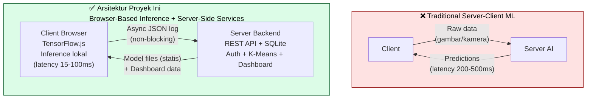

### Pembagian Tanggung Jawab: Client vs Server

| Aspek | Browser (Client) | Server (Backend) |
|-------|------------------|-------------------|
| **Inferensi AI** | CNN MobileNet via TensorFlow.js (15-100ms) | Tidak ada — server tidak menjalankan prediksi |
| **Input Gambar** | Canvas + MediaPipe hand tracking | Tidak menerima gambar siswa |
| **Game Engine** | Kaplay.js — physics, collision, level | Tidak terlibat |
| **Momo/Probe UI** | Rendering dan interaksi | Tidak terlibat |
| **Confidence Score** | Dihasilkan di browser | Tidak terlibat |
| **Logging** | Event dikemas dan dikirim async | Menerima, memvalidasi, menyimpan |
| **Database** | Tidak ada (stateless per sesi) | SQLite — persistensi data lintas sesi |
| **Autentikasi** | Tidak ada | JWT untuk dashboard guru |
| **Analisis** | Tidak ada | Feature engineering + K-Means (scikit-learn) |
| **Dashboard** | Tidak ada | Visualisasi dan export CSV/JSON |
| **Model Files** | Load dari server saat startup | Serving static assets (model.json + weights) |
| **Training Model** | Tidak ada | Dias melakukan training di campus server (development) |

### Perbandingan dengan Arsitektur Server-Side Inference

| Aspek | Server-Side Inference | Browser-Based Inference (Proyek Ini) |
|-------|----------------------|--------------------------------------|
| **Latensi Inferensi** | 200-500ms (network round-trip) | 15-100ms (lokal, tanpa round-trip) |
| **Privasi Data Visual** | Raw image dikirim ke server | Gambar tidak pernah keluar browser |
| **Beban Server saat Inferensi** | Berat (inferensi untuk setiap siswa) | Ringan (server tidak menjalankan inferensi) |
| **COPPA/GDPR-K** | Perlu persetujuan orang tua untuk data visual | Lebih mudah comply (data visual minimization) |
| **Skalabilitas Inferensi** | Terbatas oleh kapasitas server | Linear (setiap client memproses sendiri) |
| **Ketergantungan Internet** | Mutlak (tidak bisa tanpa internet) | Diperlukan untuk logging dan model serving |

### Alur Data: Apa yang Mengalir ke Server?

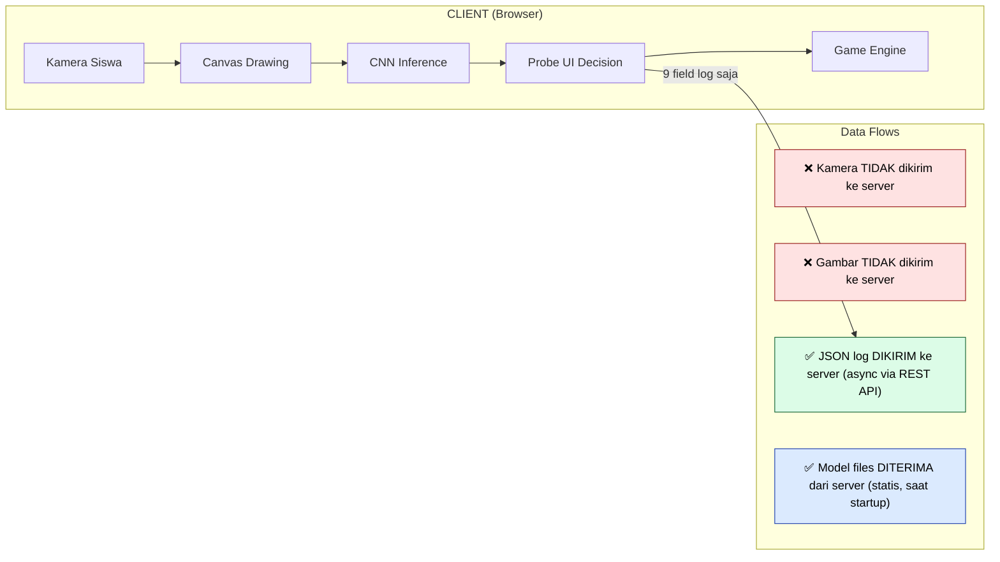

### Apa yang Mengalir dari Server ke Client?

1. **Model files (statis):** Saat startup, browser mengunduh model.json dan weight files dari server. Ini adalah aset statis yang tidak berubah selama runtime.
2. **Frontend assets (statis):** HTML, JS, CSS, gambar, dan sprite game disajikan dari server.
3. **Tidak ada data inferensi dari server ke client.** Setelah model diload, semua prediksi berjalan lokal di browser. Server tidak mengirimkan prediksi, update model, atau data real-time yang mempengaruhi gameplay.

---

## 7. Technology Stack

### Stack Teknis Lengkap

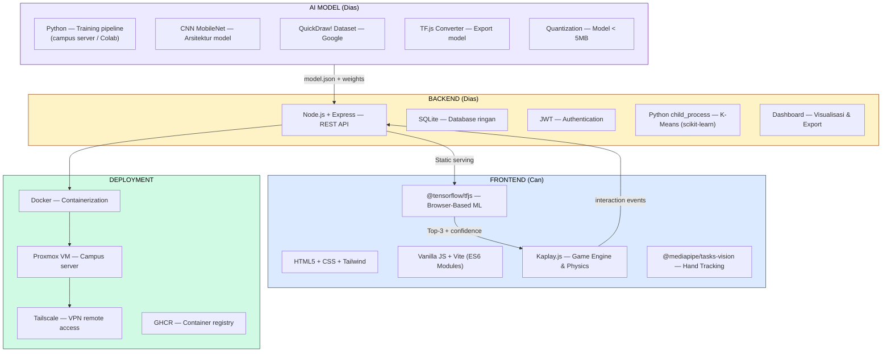

### Detail Komponen

| Komponen | Teknologi | Tanggung Jawab | Scope |
|----------|-----------|---------------|-------|
| Game Engine | Kaplay.js | Physics, collision, level management | Can |
| Finger Tracking | @mediapipe/tasks-vision | Hand detection, finger pointer | Can |
| Drawing Input | HTML5 Canvas | Stroke capture, resize to 28x28 | Can |
| ML Runtime | @tensorflow/tfjs | Browser-based inference | Dias (model) + Can (runtime) |
| AI Model | CNN MobileNet | Sketch classification | Dias |
| Confidence Controller | JS (app-level) | Threshold manipulation per level | Can |
| Probe UI | HTML/CSS/JS | HITL decision interface | Can |
| Momo Agent | Kaplay.js + DOM | Pedagogical feedback, expressions | Can |
| REST API | Node.js + Express | Log endpoint, auth, model serving | Dias |
| Database | SQLite | Log storage, session data | Dias |
| Authentication | JWT | Dashboard guru access | Dias |
| Feature Engineering | Python/JS | Log → analysis features | Dias |
| Clustering | K-Means (scikit-learn) | Decision pattern analysis (server-side) | Dias |
| Dashboard | HTML/JS (Chart.js/ECharts) | Visualization & export | Dias |
| Containerization | Docker | FE + BE packaging | Can + Dias |
| Server | Proxmox VM | Campus deployment | Can + Dias |
| VPN | Tailscale | Remote access | Can + Dias |

---

## 8. Arsitektur Deployment

### Infrastruktur Server

Sistem di-deploy pada campus server menggunakan virtualisasi Proxmox. Arsitektur deployment menggunakan Docker containers untuk memisahkan frontend dan backend, dengan Tailscale VPN untuk remote access dari luar kampus.

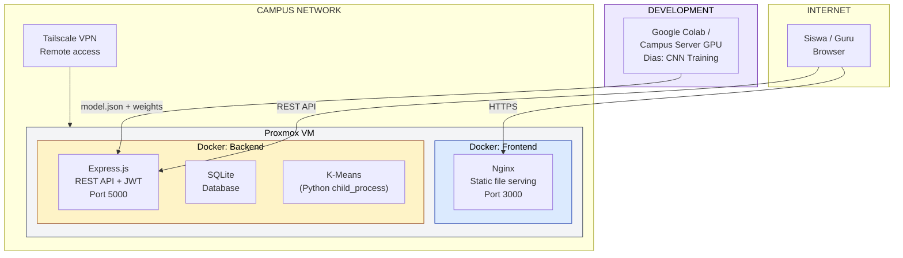

### Spesifikasi VM

| Parameter | Nilai |
|-----------|-------|
| **Hostname** | pa-hitl-deanodayes |
| **OS** | Ubuntu 24.04 LTS |
| **RAM** | 12 GB |
| **CPU** | 2 Core |
| **Disk** | 64 GB |
| **Platform** | Proxmox VE |

### Pipeline Deployment

1. **Development:** Can dan Dias masing-masing develop di laptop lokal dalam Docker containers
2. **Build:** Docker images di-push ke GHCR (GitHub Container Registry)
3. **Deploy:** Images di-pull ke campus Proxmox VM via Tailscale VPN
4. **Runtime:** Frontend (Nginx, Port 3000) dan Backend (Express.js, Port 5000) berjalan sebagai containers terpisah
5. **Training:** Dias melakukan CNN training dan eksperimen di campus server atau Google Colab, lalu model final diintegrasikan ke backend container

### Kenapa Docker?

Docker dipilih karena: (1) memastikan konsistensi environment antara development dan production, (2) memudahkan kolaborasi Can dan Dias yang bekerja pada bagian berbeda, (3) memungkinkan deployment yang reproduceable di campus server, dan (4) memisahkan frontend dan backend sebagai services yang independen.

### Kenapa Campus Server, Bukan Cloud?

Pilihan campus server (Proxmox VM) bukan cloud (AWS/GCP) didasarkan pada beberapa pertimbangan. Pertama, biaya — proyek PA tidak memiliki budget untuk cloud hosting berkelanjutan. Kedua, kebutuhan GPU — Dias memerlukan akses GPU/CPU server untuk training dan eksperimen model CNN, yang tidak efisien dilakukan di laptop. Ketiga, jaringan kampus — pengujian dilakukan di lingkungan kampus, sehingga latency ke server lokal minimal.

---

## 9. Kontrak Data Can–Dias

### Format Output AI (Dias → Can)

```json
{
  "predictions": [
    {"label": "ladder", "confidence": 0.62, "category": "solid"},
    {"label": "fence", "confidence": 0.58, "category": "solid"},
    {"label": "sword", "confidence": 0.03, "category": "danger"}
  ],
  "confidence_gap": 0.04,
  "model_version": "mobilenet_v2_q4"
}
```

### Format Interaction Event (Can → Server via REST API)

```json
{
  "session_id": "c19b-4a8f-...",
  "level": 2,
  "prompt_type": "category",
  "top1_label": "fence",
  "top1_confidence": 0.58,
  "confidence_gap": 0.04,
  "decision_type": "correct",
  "decision_latency_ms": 5230,
  "gameplay_result": "success",
  "timestamp": "2026-06-15T10:23:45.000Z"
}
```

### Category Mapping (Dias menyediakan, Can mengkonsumsi)

| Label | Category | Behavior in Game |
|-------|----------|-----------------|
| bridge, ladder, stairs, plank, key, fence | Solid | Stickman bisa berpijak/berinteraksi |
| sword, knife, spikes, fire | Danger | Stickman terluka/reset |
| cloud, flower, balloon, rainbow, sun, star | Decorative | No collision, visual only |

---

## 10. Struktur JSON Log

### Payload Lengkap (dikirim saat sesi berakhir)

```json
{
  "session_id": "c19b-4a8f-...",
  "timestamp_start": "2026-06-15T10:20:00.000Z",
  "timestamp_end": "2026-06-15T10:27:30.000Z",
  "total_time_sec": 450,
  "levels_completed": [1, 2],
  "metrics": {
    "total_attempts": 5,
    "revision_count": 2
  },
  "interactions": [
    {
      "level": 1,
      "prompt_type": "limited",
      "top1_label": "ladder",
      "top1_confidence": 0.94,
      "confidence_gap": 0.82,
      "decision_type": "accept",
      "decision_latency_ms": 2800,
      "gameplay_result": "success",
      "timestamp": "2026-06-15T10:21:15.000Z"
    },
    {
      "level": 2,
      "prompt_type": "category",
      "top1_label": "fence",
      "top1_confidence": 0.46,
      "confidence_gap": 0.05,
      "decision_type": "correct",
      "decision_latency_ms": 5230,
      "gameplay_result": "success",
      "timestamp": "2026-06-15T10:23:45.000Z"
    }
  ]
}
```

### Catatan Keamanan

> "Data ini disimpan MURNI untuk keperluan analisis kualitatif pasca-penelitian. Sistem frontend TIDAK memiliki fitur Online/Real-time Training guna memastikan model stabil dan tidak dirusak oleh pengguna."

> "Data override dari siswa TIDAK dikirim kembali ke server untuk fine-tuning model. Ini adalah inkonsistensi yang ditemukan di PPT slide 06 dan sudah diputuskan untuk DIHAPUS karena kontradiksi dengan batasan masalah."

---

## 11. Justifikasi Arsitektur

### Kenapa Browser-Based Inference untuk Klasifikasi?

1. **Privasi Anak (COPPA/GDPR-K):** Data kamera dan gambar siswa tidak pernah keluar dari perangkat. Ini adalah implementasi langsung dari **Privacy by Design** (GDPR Article 25) dan **Data Minimization** (GDPR Article 5(1)(c)). Yang dikirim ke server hanyalah metadata keputusan (JSON log), bukan gambar mentah.

2. **FERPA Compliance:** Karena tidak ada data visual siswa yang dikirim ke pihak ketiga untuk inferensi, persyaratan FERPA third-party disclosure tidak terpicu.

3. **Latensi Rendah:** Browser-based inference menghilangkan network round-trip untuk klasifikasi, menghasilkan prediksi dalam 15-100ms dibandingkan 200-500ms pada arsitektur server-client tradisional. Ini penting untuk menjaga flow permainan.

4. **Skalabilitas Inferensi:** Setiap client memproses sendiri, server tidak dibebani inferensi. Dengan 20 siswa simultan, server hanya menerima ~50KB data log per sesi — bukan 20 stream gambar untuk diklasifikasi.

### Kenapa Server-Side Services untuk Pendukung?

1. **Persistensi Data:** Interaction log perlu tersimpan lintas sesi dan bisa diakses oleh guru. Browser-local storage tidak cukup andal dan tidak mendukung akses multi-user.

2. **Analisis Clustering:** K-Means memerlukan seluruh dataset log dari semua siswa, bukan data satu sesi. Komputasi ini tidak bisa dilakukan di browser siswa karena membutuhkan akses ke database lengkap dan library Python (scikit-learn).

3. **Dashboard Guru:** Guru memerlukan akses terautentikasi (JWT) ke hasil analisis. Ini membutuhkan server-side authentication dan API endpoints yang tidak bisa disediakan murni dari client.

4. **Training Pipeline:** Dias membutuhkan akses ke campus server (GPU/CPU) untuk training dan eksperimen model CNN. Server menyediakan environment yang konsisten untuk development model.

5. **Model Serving:** File model TensorFlow.js (model.json + weights) disajikan sebagai aset statis dari backend container, memastikan version control dan konsistensi model yang digunakan semua siswa.

### Terminologi yang Diakui Akademik

| Istilah | Sumber | Konteks Penggunaan |
|---------|--------|-------------------|
| **Web AI** | Google (Jason Mayes, Web AI Summit 2024) | Istilah industri untuk ML di browser |
| **Client-Side Inference** | Microsoft WebNN; Google web.dev | Deskripsi spesifik: inferensi di browser |
| **Edge AI / Edge Inference** | Mirantis; arXiv 2501.03265 (2025) | Istilah industri dan akademik |
| **On-Device ML** | arXiv 2503.06027 (Comprehensive Survey, 2025) | Istilah akademik |
| **Browser-Based ML** | Li et al. (2022, PMC/NIH) | Istilah teknis spesifik |
| **Hybrid Architecture** | Umum (distributed systems) | Deskripsi arsitektur keseluruhan |

**Rekomendasi istilah untuk proposal:**
- Utama: **"Arsitektur Browser-Based Inference dengan Server-Side Services"** (deskriptif, jujur tentang peran kedua sisi)
- Untuk bagian inferensi: **"Client-Side Inference"** (akurat untuk bagian klasifikasi)
- Privasi: **"Privacy-by-Design Browser-Based Inference"** (GDPR-aligned, untuk data visual)

**Catatan penting:** Istilah "Fat Client–Thin Server" sebelumnya digunakan untuk menggambarkan arsitektur ini, namun istilah tersebut meremehkan peran server yang sebenarnya memiliki tanggung jawab substansial (logging, auth, K-Means, dashboard, model serving). Istilah "Hybrid Architecture" lebih akurat dan jujur.

### Pernyataan untuk Dosen

> "Kami mengadopsi arsitektur hybrid yang menggabungkan browser-based inference dan server-side services. Seluruh proses inferensi AI berjalan di browser siswa menggunakan TensorFlow.js, sehingga data kamera dan gambar siswa tidak pernah keluar dari perangkat mereka. Di sisi lain, server backend menangani layanan pendukung: penyimpanan log interaksi via REST API, autentikasi dashboard guru, analisis pola keputusan menggunakan K-Means clustering, dan penyediaan aset model. Pemisahan ini memastikan privasi data visual siswa terjaga sekaligus menyediakan infrastruktur yang diperlukan untuk analisis penelitian."

---

## 12. Referensi

1. Smilkov, D., Thorat, N., et al. (2019). "TensorFlow.js: Machine Learning for the Web and Beyond." *Proceedings of Machine Learning and Systems (MLSys 2019)*.
2. Mayes, J. (2024). "Web AI: Running ML Models Client-Side in the Browser." *Google Web AI Summit*.
3. Li, L. et al. (2022). "Front-end deep learning web apps development and deployment." *PMC/NIH*.
4. Jiang, S. et al. (2024). "Anatomizing Deep Learning Inference in Web Browsers." *ACM TOSEM*.
5. Ma, H. et al. (2019). "Moving Deep Learning into Web Browser: How Far Can We Go?" *WWW '19, ACM*.
6. IEEE IPCCC (2025). "Privacy-Preserving AI Inference in Edge Systems: Ethical and Architectural Tradeoffs."
7. Google web.dev. "The Client-Side AI Stack." https://web.dev/learn/ai/client-side
8. W3C. "Web Neural Network API (WebNN)." https://www.w3.org/TR/webnn
9. U.S. Department of Education (2023). "Artificial Intelligence and the Future of Teaching and Learning."
10. Wednesday Solutions (2026). "On-Device AI for Education Mobile Apps: FERPA Compliance."
11. CONCORDIA H2020 (2019). "Privacy by Design: Bringing ML towards the Edge."
12. Notulensi Bimbingan Bu Hesti & Pak TB — Sumber kebenaran tertinggi untuk keputusan arsitektur.
