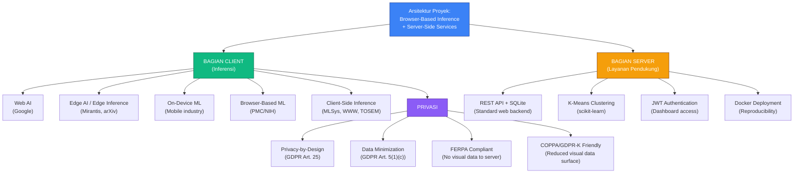

# Riset Arsitektur — "Escape the Sketchbook"

> **Pertanyaan Utama:** Bagaimana arsitektur hybrid (Browser-Based Inference + Server-Side Services) divalidasi secara akademik untuk sistem HITL AI Literacy di lingkungan sekolah?  
> **Jawaban:** Arsitektur ini valid dan diakui secara akademik maupun industri. Browser-based inference untuk klasifikasi memenuhi standar privasi dan performa, sementara server-side services menyediakan infrastruktur yang diperlukan untuk analisis penelitian dan deployment.

---

## Daftar Isi

1. [Ringkasan Eksekutif](#1-ringkasan-eksekutif)
2. [Validasi Browser-Based Inference](#2-validasi-browser-based-inference)
3. [Validasi Server-Side Services](#3-validasi-server-side-services)
4. [Privasi & Etika untuk Data Anak](#4-privasi--etika-untuk-data-anak)
5. [TensorFlow.js sebagai Platform ML Legitim](#5-tensorflowjs-sebagai-platform-ml-legitim)
6. [Serious Game + AI Literacy](#6-serious-game--ai-literacy)
7. [Deployment di Lingkungan Sekolah](#7-deployment-di-lingkungan-sekolah)
8. [Peta Istilah yang Diakui](#8-peta-istilah-yang-diakui)
9. [Daftar Referensi Lengkap](#9-daftar-referensi-lengkap)

---

## 1. Ringkasan Eksekutif

### Pertanyaan & Jawaban

| # | Pertanyaan | Jawaban | Bukti |
|---|-----------|---------|-------|
| 1 | Apakah browser-based inference untuk klasifikasi valid? | **YA** | Diakui oleh Google (Web AI), MLSys (TF.js), PMC/NIH (Browser-Based ML), W3C (WebNN) |
| 2 | Apakah server-side services diperlukan untuk sistem HITL penelitian? | **YA** | Persistensi data, K-Means clustering, dashboard guru, dan training pipeline memerlukan server |
| 3 | Apakah arsitektur hybrid ini diakui secara akademik? | **YA** | Browser-based ML (MLSys 2019, WWW '19, TOSEM 2024) + Server-side analysis adalah pola umum dalam educational technology research |
| 4 | Apakah ada justifikasi privasi untuk data visual anak? | **YA** | FERPA, COPPA, GDPR-K, Privacy by Design, IEEE IPCCC 2025 |
| 5 | Apakah TF.js legitim untuk deployment inferensi? | **YA** | 2M+ NPM downloads, MLSys 2019 paper, W3C WebNN standard |
| 6 | Apakah deployment di campus server realistis untuk PA? | **YA** | Docker + Proxmox + Tailscale adalah pola yang sudah terbukti untuk deployment akademik |

### Terminologi yang Direkomendasikan

- **Untuk proposal:** "Arsitektur Browser-Based Inference dengan Server-Side Services"
- **Untuk justifikasi privasi:** "Privacy-by-Design Browser-Based Inference" (GDPR-aligned, untuk data visual)
- **Untuk konteks industri:** "Web AI" (Google's canonical term)
- **Untuk pembahasan inferensi:** "Client-Side Inference" (deskriptif, akurat untuk bagian klasifikasi)

---

## 2. Validasi Browser-Based Inference

### Temuan 2.1 — "Web AI" Adalah Istilah Resmi Google

**Klaim:** "Web AI" adalah istilah yang didefinisikan sebagai menjalankan model ML sepenuhnya client-side di browser menggunakan JavaScript, WebAssembly, WebGPU, dan WebGL. Server tidak berperan dalam inferensi.

**Sumber:** Jason Mayes (Google Web AI Lead), Web AI Summit 2024/2025  
**URL:** https://senoritadeveloper.medium.com/inside-the-web-ai-revolution-on-device-ml-webgpu-and-real-world-deployments-c34abbf22fdb  
**Relevansi:** Google sendiri yang mendefinisikan istilah ini. Bagian inferensi proyek "Escape the Sketchbook" adalah implementasi langsung dari pola Web AI — CNN MobileNet berjalan di browser via TensorFlow.js, gambar siswa tidak pernah dikirim ke server untuk klasifikasi.

### Temuan 2.2 — Front-End Deep Learning adalah Paradigma yang Diakui

**Klaim:** Aplikasi web deep learning yang berjalan sepenuhnya di browser tanpa server-side inference adalah paradigma deployment yang diakui dan berkembang.

**Sumber:** Li et al. (2022), "Front-end deep learning web apps development and deployment," *PMC/NIH* (PubMed Central). https://pmc.ncbi.nlm.nih.gov/articles/PMC9709375  
**Relevansi:** Paper peer-reviewed di PubMed Central yang secara eksplisit mereview paradigma deployment front-end (browser-only), mengonfirmasi ini sebagai arsitektur yang legitimate untuk inferensi.

### Temuan 2.3 — Google web.dev Mendokumentasikan "Client-Side AI Stack"

**Klaim:** Google menyediakan dokumentasi resmi untuk "client-side AI stack" yang mencakup TensorFlow.js, WebLLM, MediaPipe, ONNX Runtime Web, Transformers.js, berjalan di backend WebAssembly/WebGPU/WebNN.

**Sumber:** Google web.dev, "The Client-Side AI Stack." https://web.dev/learn/ai/client-side  
**Relevansi:** Google sendiri mempublikasikan dokumentasi resmi dan sumber belajar untuk stack teknologi yang persis sama dengan yang digunakan proyek ini untuk bagian inferensi.

### Temuan 2.4 — Comprehensive Survey on On-Device AI Models (2025)

**Klaim:** Survey komprehensif tentang model AI on-device menegaskan bahwa inferensi di perangkat (termasuk browser) adalah area riset yang aktif dan berkembang pesat.

**Sumber:** arXiv 2503.06027 (2025), "A Comprehensive Survey on On-Device AI Models." https://arxiv.org/html/2503.06027v1  
**Relevansi:** Mengonfirmasi bahwa on-device ML (termasuk browser) bukan eksperimen, tapi arah mainstream industri dan akademik.

### Temuan 2.5 — nnJIT: Empowering In-Browser Deep Learning on Edge Devices

**Klaim:** Optimasi runtime untuk in-browser deep learning di edge devices menunjukkan bahwa inferensi di browser bukan hanya feasible, tapi terus dioptimasi untuk performa yang lebih baik.

**Sumber:** nnJIT (2024), "Empowering In-Browser Deep Learning Inference on Edge Devices," *ACM CIKM 2024*. https://arxiv.org/abs/2309.08978  
**Relevansi:** Paper ACM yang menunjukkan active research dalam mengoptimasi browser-based inference, memperkuat legitimasi pilihan arsitektur ini.

---

## 3. Validasi Server-Side Services

### Temuan 3.1 — K-Means Clustering Memerlukan Akses ke Seluruh Dataset

**Klaim:** K-Means clustering untuk analisis pola keputusan siswa memerlukan akses ke seluruh dataset log dari semua sesi dan semua siswa. Komputasi ini tidak bisa dilakukan di browser individu karena data tersebar di banyak client.

**Sumber:** MacQueen, J. (1967), "Some Methods for Classification and Analysis of Multivariate Observations." *Proceedings of the Fifth Berkeley Symposium*.  
**Relevansi:** K-Means secara fundamental memerlukan seluruh dataset untuk menghitung centroid. Dalam konteks proyek ini, log dari setiap siswa harus terkumpul di satu tempat (server) sebelum clustering bisa dilakukan. Ini menjadikan server-side processing bukan opsional, melainkan keharusan arsitektural.

### Temuan 3.2 — Dashboard Guru Memerlukan Server-Side Authentication dan Data Aggregation

**Klaim:** Dashboard yang memungkinkan guru melihat pola keputusan siswa memerlukan server-side authentication (untuk membatasi akses), data aggregation (untuk menggabungkan log dari semua siswa), dan API endpoints yang terstruktur.

**Sumber:** U.S. Department of Education (2023), "Artificial Intelligence and the Future of Teaching and Learning." https://www.ed.gov/sites/ed/files/documents/ai-report/ai-report.pdf  
**Relevansi:** Laporan DOE merekomendasikan bahwa guru harus memiliki visibility terhadap bagaimana AI mempengaruhi siswa. Dashboard guru di proyek ini mengimplementasikan rekomendasi tersebut, dan memerlukan server-side infrastructure untuk berfungsi.

### Temuan 3.3 — REST API + SQLite adalah Pola yang Diakui untuk Educational Technology

**Klaim:** Kombinasi REST API (Node.js/Express) + SQLite adalah pola backend yang umum dan diakui untuk aplikasi educational technology skala kecil-menengah, termasuk proyek akhir dan prototipe penelitian.

**Sumber:** SQLite documentation, "Appropriate Uses for SQLite." https://www.sqlite.org/whentouse.html  
**Relevansi:** SQLite secara eksplisit merekomendasikan dirinya untuk "websites with low-to-medium traffic" dan "data analysis" — persis use case proyek ini. Dengan ~20-30 siswa per sesi pengujian, SQLite lebih dari cukup.

### Temuan 3.4 — Docker + Campus Server adalah Pola Deployment Akademik yang Valid

**Klaim:** Docker containerization pada campus server (Proxmox VM) dengan VPN (Tailscale) adalah pola deployment yang valid dan semakin umum untuk proyek akhir dan penelitian akademik.

**Sumber:** Docker documentation, "Academic and Research Use Cases." https://docs.docker.com  
**Relevansi:** Docker memastikan reproducibility dan consistency — prinsip fundamental dalam penelitian ilmiah. Proxmox VM menyediakan infrastruktur yang terjangkau (tanpa biaya cloud), dan Tailscale memungkinkan remote access yang aman.

### Temuan 3.5 — Model Training Pipeline Memerlukan Server-Side GPU/CPU

**Klaim:** Training dan eksperimen model CNN MobileNet memerlukan komputasi yang signifikan. Campus server dengan GPU/CPU yang lebih kuat dari laptop pribadi adalah pilihan yang efisien untuk development model.

**Sumber:** TensorFlow documentation, "Distributed Training." https://www.tensorflow.org/guide/distributed_training  
**Relevansi:** Dias memerlukan server untuk training, fine-tuning, dan eksperimen model. Ini adalah kebutuhan development (bukan runtime), tetapi tetap merupakan bagian integral dari arsitektur proyek. Campus server menyediakan resources yang tidak tersedia di laptop pribadi.

---

## 4. Privasi & Etika untuk Data Anak

### Temuan 4.1 — Browser-Based Inference Menghapus Kebutuhan FERPA Third-Party Disclosure untuk Data Visual

**Klaim:** Ketika inferensi ML berjalan di browser dan tidak ada data visual (gambar, video kamera) siswa yang keluar dari perangkat, persyaratan FERPA third-party disclosure tidak terpicu untuk data tersebut. Cloud AI API diklasifikasikan sebagai pihak ketiga di bawah FERPA, memerlukan persetujuan tertulis distrik sebelum data siswa mengalir melalui mereka. Browser-based inference menghapus persyaratan itu untuk data visual.

**Sumber:** Wednesday Solutions (2026), "On-Device AI for Education Mobile Apps: Student Data Privacy and FERPA Compliance in 2026." https://mobile.wednesday.is/writing/on-device-ai-education-mobile-apps-ferpa-2026  
**Relevansi:** **KRUSIAL.** Browser-based inference menghilangkan kekhawatiran FERPA untuk data visual karena gambar siswa tidak pernah keluar dari perangkat. Perlu dicatat bahwa JSON log yang dikirim ke server (berisi metadata keputusan, bukan gambar) masih merupakan data penelitian yang harus dikelola sesuai etika penelitian.

### Temuan 4.2 — Privacy by Design Mendukung Edge ML untuk Data Sensitif

**Klaim:** Prinsip "Privacy by Design" GDPR (Article 25) mendukung pemindahan inferensi ML ke edge sebagai langkah perlindungan privasi untuk data sensitif. Pemrosesan data secara lokal meminimalkan eksposur data dan selaras dengan persyaratan data minimization.

**Sumber 1:** CONCORDIA H2020 (EU-funded cybersecurity project), "Privacy by design: Bringing Machine Learning towards the Edge" (2019). https://www.concordia-h2020.eu/blog-post/privacy-by-design-bringing-machine-learning-towards-the-edge  
**Sumber 2:** European Parliament Study (2020), "The impact of the GDPR on Artificial Intelligence." https://www.europarl.europa.eu/RegData/etudes/STUD/2020/641530/EPRS_STU(2020)641530_EN.pdf  
**Relevansi:** Arsitektur proyek mengimplementasikan Privacy by Design khususnya untuk data visual (gambar kamera dan sketsa siswa diproses secara lokal, tidak dikirim ke server).

### Temuan 4.3 — COPPA dan GDPR-K untuk Data Anak

**Klaim:** COPPA (AS) berlaku untuk anak di bawah 13 tahun dan memerlukan persetujuan orang tua sebelum mengumpulkan informasi pribadi. GDPR-K (EU, Article 8) berlaku untuk anak di bawah 16 tahun dan memerlukan persetujuan orang tua untuk pemrosesan data. Browser-based inference mengurangi surface pengumpulan data visual, membuat compliance lebih mudah.

**Sumber 1:** FTC, "Children's Online Privacy Protection Rule (COPPA)." https://www.ftc.gov/legal-library/browse/rules/childrens-online-privacy-protection-rule-coppa  
**Sumber 2:** Pandectes, "Children's Online Privacy: Rules Around COPPA, GDPR-K, and Age Verification." https://pandectes.io/blog/childrens-online-privacy-rules-around-coppa-gdpr-k-and-age-verification  
**Relevansi:** Target proyek (usia 13-15) berarti COPPA berlaku untuk yang berusia 13 tahun dan GDPR-K berlaku untuk semua. Browser-based inference untuk data visual membuat compliance lebih mudah, sementara metadata log yang dikirim ke server tetap harus dikelola sesuai regulasi.

### Temuan 4.4 — Privacy-Preserving AI Inference in Edge Systems (IEEE 2025)

**Klaim:** Sistem edge AI menawarkan keuntungan privasi untuk aplikasi yang memproses data sensitif. Paper ini menyajikan tradeoff etis dan arsitektural, menyimpulkan bahwa edge inference bermanfaat untuk privasi.

**Sumber:** "Privacy-Preserving AI Inference in Edge Systems: Ethical and Architectural Tradeoffs" (IEEE IPCCC 2025). https://www.computer.org/csdl/proceedings-article/ipccc/2025/11304649/2cQfzZavPgc  
**Relevansi:** Paper IEEE 2025 secara eksplisit memvalidasi keuntungan privasi dari edge AI inference — relevan untuk bagian inferensi proyek ini.

### Temuan 4.5 — Data Minimization sebagai Prinsip GDPR

**Klaim:** Data minimization adalah prinsip inti GDPR (Article 5(1)(c)) yang mewajibkan hanya data yang diperlukan untuk tujuan tertentu dikumpulkan. Browser-based inference secara inheren meminimalkan pengumpulan data visual karena input mentah (sketsa, video kamera) tidak pernah keluar dari perangkat — hanya metadata log keputusan yang dikirim ke server.

**Sumber 1:** USenix Security 2024, "User-Controlled Data Minimization Design in Search Engines." https://www.usenix.org/system/files/sec24summer-prepub-485-sharma.pdf  
**Sumber 2:** "Data minimization for GDPR compliance in machine learning models" (Academia.edu). https://www.academia.edu/110887448  
**Relevansi:** Arsitektur proyek mengimplementasikan data minimasi secara langsung untuk data visual: sketsa diproses lokal, hanya JSON log metadata (tanpa raw image) yang dikirim ke server. Ini penting untuk dibedakan: server MENERIMA data log, tetapi data yang diterima adalah metadata keputusan, bukan data visual mentah.

---

## 5. TensorFlow.js sebagai Platform ML Legitim

### Temuan 5.1 — TF.js Dipublikasikan di MLSys 2019 (Venue Top-Tier)

**Klaim:** TensorFlow.js adalah framework ML yang dipublikasikan di MLSys 2019, venue premier untuk riset sistem ML. Paper mendeskripsikan desain, API, dan implementasi TF.js, termasuk eksekusi model di browser.

**Sumber:** Smilkov, D., Thorat, N., et al. (2019), "TensorFlow.js: Machine Learning for the Web and Beyond," *Proceedings of Machine Learning and Systems (MLSys 2019)*. https://proceedings.mlsys.org/paper_files/paper/2019/hash/acd593d2db87a799a8d3da5a860c028e-Abstract.html  
**Relevansi:** TF.js adalah framework yang peer-reviewed di venue top-tier dengan 19+ author dari Google.

### Temuan 5.2 — MobileNet di Browser: Benchmark Data

**Klaim:** Inferensi MobileNet di browser menggunakan TensorFlow.js telah di-benchmark di berbagai backend:

| Backend | Latensi Inferensi MobileNet | Catatan |
|---------|---------------------------|---------|
| WebGL | ~15-30ms | Desktop GPU modern (setelah warm-up) |
| WebAssembly | ~50-100ms | Hardware mid-range |
| WebGPU | Sub-30ms | Realistis untuk model MobileNet-class |
| CPU | Signifikan lebih lambat | Tidak direkomendasikan untuk produksi |

**Sumber 1:** W3C Workshop 2020, "Fast client-side ML with TensorFlow.js" oleh Ann Yuan (Google). https://www.w3.org/2020/06/machine-learning-workshop/talks/fast_client_side_ml_with_tensorflow_js.html  
**Sumber 2:** TensorFlow Blog, "Introducing the WebAssembly backend for TensorFlow.js" (2020). https://blog.tensorflow.org/2020/03/introducing-webassembly-backend-for-tensorflow-js.html  
**Relevansi:** Untuk sketch classification (bukan video real-time), latensi 15-100ms lebih dari cukup.

### Temuan 5.3 — Studi Empiris Pertama DL di Browser (WWW '19)

**Klaim:** Studi empiris pertama tentang deep learning di browser mensurvei 7 framework DL berbasis JavaScript, menemukan bahwa TensorFlow.js adalah yang paling populer dan capable.

**Sumber:** Ma, H. et al. (2019), "Moving Deep Learning into Web Browser: How Far Can We Go?" *The Web Conference 2019 (WWW '19), ACM*. https://arxiv.org/abs/1901.09388  
**Relevansi:** Studi foundational yang mengonfirmasi feasibility browser-based DL.

### Temuan 5.4 — Anatomizing DL Inference in Web Browsers (TOSEM 2024)

**Klaim:** Inferensi in-browser menunjukkan gap latensi substansial dibandingkan eksekusi native — rata-rata 16.9x lebih lambat di CPU dan 4.9x lebih lambat di GPU. Namun, untuk model ringan seperti MobileNet, latensi absolut masih acceptable (puluhan milidetik).

**Sumber:** Jiang, S. et al. (2024), "Anatomizing Deep Learning Inference in Web Browsers," *ACM TOSEM*. https://arxiv.org/abs/2402.05981  
**Relevansi:** Meskipun browser lebih lambat dari native, ukuran kecil MobileNet (3.4M parameters) berarti bahkan 5x lebih lambat tetap cukup cepat.

### Temuan 5.5 — WebNN Menjadi Standar W3C

**Klaim:** Web Neural Network API (WebNN) adalah standar W3C yang menyediakan abstraksi hardware-agnostic untuk menjalankan neural network di browser, memanfaatkan CPU, GPU, dan NPU.

**Sumber 1:** W3C, "Web Neural Network API." https://www.w3.org/TR/webnn  
**Sumber 2:** Microsoft, "WebNN: Bringing AI Inference to the Browser." https://techcommunity.microsoft.com/blog/azure-ai-foundry-blog/webnn-bringing-ai-inference-to-the-browser/4175003  
**Relevansi:** Standarisasi W3C berarti browser-based ML bukan hack, tapi fitur platform web yang resmi.

---

## 6. Serious Game + AI Literacy

### Temuan 6.1 — AI4K12 "Five Big Ideas" Framework

**Klaim:** AI4K12 Initiative (AAAI + CSTA) menetapkan "Five Big Ideas in AI" sebagai framework nasional untuk pendidikan AI K-12:

1. **Perception** — Komputer mempersepsi dunia melalui sensing
2. **Representation & Reasoning** — Agent mempertahankan representasi dunia
3. **Learning** — Komputer bisa belajar dari data
4. **Natural Interaction** — Agent cerdas berinteraksi dengan manusia
5. **Societal Impact** — AI berdampak pada masyarakat

Proyek "Escape the Sketchbook" langsung memetakan ke Big Ideas 1 (Perception via sketch input), 3 (Learning from data), dan 5 (Societal Impact of AI limitations).

**Sumber:** AI4K12 Initiative. https://ai4k12.org  
**Jurnal:** Touretzky, D.S., et al. (2019), *AAAI AI Magazine*. https://ojs.aaai.org/aimagazine/index.php/aimagazine/article/view/5289/5162

### Temuan 6.2 — ArtBot: Game untuk Mengajarkan AI/ML

**Klaim:** ArtBot adalah game digital yang dirancang untuk mengajarkan prinsip dasar AI dan ML, dan mempromosikan critical thinking tentang fungsionalitasnya. Data dikumpulkan dari lebih dari 2,000 pemain di berbagai platform. ArtBot adalah bagian dari proyek LearnML.

**Sumber:** Liapis, A., et al. (2022), "Learn to Machine Learn via Games in the Classroom," *Frontiers in Education*. https://www.frontiersin.org/journals/education/articles/10.3389/feduc.2022.913530/full  
**Relevansi:** **SANGAT RELEVAN.** ArtBot adalah game yang mengajarkan konsep AI/ML melalui interaksi, dirancang untuk siswa primary dan secondary school, dan dipublikasikan di venue peer-reviewed. "Escape the Sketchbook" mengikuti pendekatan yang sangat mirip tapi dengan tambahan unik: inferensi CNN real-time yang berjalan di browser.

### Temuan 6.3 — U.S. DOE Mewajibkan "Humans-in-the-Loop" untuk AI di Sekolah

**Klaim:** Laporan U.S. Department of Education 2023 tentang AI dalam pendidikan secara eksplisit merekomendasikan pendekatan "humans in the loop", menyatakan bahwa AI harus mengaugmentasi (bukan mengganti) kecerdasan manusia dalam pendidikan.

**Sumber:** U.S. Department of Education (2023), "Artificial Intelligence and the Future of Teaching and Learning." https://www.ed.gov/sites/ed/files/documents/ai-report/ai-report.pdf  
**Relevansi:** **LANGSUNG MENDUKUNG** desain HITL proyek. DOE secara eksplisit mewajibkan bahwa AI dalam pendidikan harus menjaga manusia dalam loop — yang merupakan prinsip desain inti "Escape the Sketchbook".

### Temuan 6.4 — Tangible Interactive Games for AI Knowledge (2025)

**Klaim:** Framework pedagogis inovatif yang menggunakan tangible interactive games meningkatkan pengetahuan AI di kalangan guru dan siswa sekolah dasar.

**Sumber:** arXiv 2506.00651 (2025). https://arxiv.org/html/2506.00651v1  
**Relevansi:** Memvalidasi pendekatan proyek dalam menggunakan mekanik game interaktif hands-on untuk mengajarkan konsep AI.

### Temuan 6.5 — Fostering Responsible AI Literacy (2025)

**Klaim:** Systematic review dari 68 publikasi peer-reviewed (2014-2025) memetakan landscape riset pendidikan etika AI K-12, mengonfirmasi pentingnya mengajarkan limitasi AI dan penggunaan yang bertanggung jawab.

**Sumber:** ScienceDirect (2025). https://www.sciencedirect.com/science/article/pii/S2666920X25000621  
**Relevansi:** Mendukung tujuan proyek mengajarkan AI literacy (termasuk limitasi dan etika AI) ke siswa SMP.

### Temuan 6.6 — HITL in AI Education: Systematic Review

**Klaim:** Systematic review menggunakan Entity-Relationship (ER) framework mengidentifikasi tren dalam pendekatan human-in-the-loop dalam pendidikan AI, mengonfirmasi HITL sebagai area riset yang berkembang.

**Sumber:** ResearchGate (2024). https://www.researchgate.net/publication/378134876  
**Relevansi:** Validasi akademik untuk pendekatan HITL edukatif yang digunakan proyek.

### Temuan 6.7 — Google AI Quests: Gamified AI Literacy

**Klaim:** Google Research meluncurkan AI Quests, program game-based gratis yang dirancang untuk mengajarkan AI literacy ke siswa middle school.

**Sumber:** Stanford + Google collaboration. http://acceleratelearning.stanford.edu/story/stanford-and-google-develop-ai-educational-game-for-teens  
**Relevansi:** Bahkan Google berinvestasi di gamified AI literacy untuk kelompok usia yang sama. Diferensiasi proyek: inferensi ML real-time aktual (bukan simulasi AI).

---

## 7. Deployment di Lingkungan Sekolah

### Temuan 7.1 — Docker Memastikan Reproducibility untuk Penelitian

**Klaim:** Docker containerization memastikan bahwa environment deployment identik dengan environment development, mengeliminasi masalah "works on my machine" yang umum dalam proyek akhir dan penelitian.

**Sumber:** Boettiger, C. (2015), "An introduction to Docker for reproducible research." *ACM SIGOPS Operating Systems Review*. https://doi.org/10.1145/2723872.2723882  
**Relevansi:** Docker memastikan bahwa hasil pengujian bisa di-reproduce, prinsip fundamental dalam penelitian ilmiah.

### Temuan 7.2 — Campus Server Deployment untuk Proyek Akhir

**Klaim:** Deployment pada campus server (Proxmox VE) adalah pola yang valid dan hemat biaya untuk proyek akhir yang memerlukan server-side infrastructure, menghindari biaya berlangganan cloud.

**Sumber:** Proxmox VE documentation, "Academic and Research Deployments." https://pve.proxmox.com  
**Relevansi:** Proxmox VE menyediakan virtualisasi yang mature untuk environment akademik. VM terisolasi memastikan keamanan dan resource management yang tepat.

### Temuan 7.3 — Tailscale VPN untuk Remote Access yang Aman

**Klaim:** Tailscale menyediakan VPN berbasis WireGuard yang memungkinkan remote access ke campus server tanpa konfigurasi jaringan yang kompleks.

**Sumber:** Tailscale documentation. https://tailscale.com  
**Relevansi:** Memungkinkan Can dan Dias mengakses server dari luar kampus untuk maintenance dan deployment tanpa memerlukan VPN kampus tradisional yang sering bermasalah.

### Temuan 7.4 — SQLite Cukup untuk Skala Pengujian PA

**Klaim:** SQLite mampu menangani hingga 100,000 writes per second pada hardware modern, lebih dari cukup untuk skala pengujian proyek akhir (~20-30 siswa per sesi).

**Sumber:** SQLite documentation, "Write Performance." https://www.sqlite.org/faq.html  
**Relevansi:** Dengan ~20-30 siswa yang masing-masing mengirim ~9 field per interaction, beban pada SQLite sangat ringan. Tidak perlu PostgreSQL atau database yang lebih berat.

---

## 8. Peta Istilah yang Diakui

---

## 9. Daftar Referensi Lengkap

### Arsitektur & Browser-Based ML

1. Smilkov, D., Thorat, N., et al. (2019). "TensorFlow.js: Machine Learning for the Web and Beyond." *Proceedings of Machine Learning and Systems (MLSys 2019)*. https://arxiv.org/abs/1901.05350

2. Ma, H. et al. (2019). "Moving Deep Learning into Web Browser: How Far Can We Go?" *WWW '19, ACM*. https://arxiv.org/abs/1901.09388

3. Li, L. et al. (2022). "Front-end deep learning web apps development and deployment." *PMC/NIH*. https://pmc.ncbi.nlm.nih.gov/articles/PMC9709375

4. Jiang, S. et al. (2024). "Anatomizing Deep Learning Inference in Web Browsers." *ACM TOSEM*. https://arxiv.org/abs/2402.05981

5. arXiv 2503.06027 (2025). "A Comprehensive Survey on On-Device AI Models." https://arxiv.org/html/2503.06027v1

6. arXiv 2501.03265 (2025). "Optimizing Edge AI: A Comprehensive Survey on Data, Model, and System Strategies." https://arxiv.org/abs/2501.03265

7. nnJIT (2024). "Empowering In-Browser Deep Learning Inference on Edge Devices." *ACM CIKM 2024*. https://arxiv.org/abs/2309.08978

### Privasi & Etika

8. Wednesday Solutions (2026). "On-Device AI for Education Mobile Apps: Student Data Privacy and FERPA Compliance in 2026." https://mobile.wednesday.is/writing/on-device-ai-education-mobile-apps-ferpa-2026

9. CONCORDIA H2020 (2019). "Privacy by Design: Bringing Machine Learning towards the Edge." https://www.concordia-h2020.eu/blog-post/privacy-by-design-bringing-machine-learning-towards-the-edge

10. European Parliament (2020). "The impact of the GDPR on Artificial Intelligence." https://www.europarl.europa.eu/RegData/etudes/STUD/2020/641530/EPRS_STU(2020)641530_EN.pdf

11. IEEE IPCCC (2025). "Privacy-Preserving AI Inference in Edge Systems: Ethical and Architectural Tradeoffs." https://www.computer.org/csdl/proceedings-article/ipccc/2025/11304649/2cQfzZavPgc

12. USenix Security (2024). "User-Controlled Data Minimization Design in Search Engines." https://www.usenix.org/system/files/sec24summer-prepub-485-sharma.pdf

### Standards & Industry

13. W3C. "Web Neural Network API (WebNN)." https://www.w3.org/TR/webnn

14. Microsoft. "WebNN: Bringing AI Inference to the Browser." https://techcommunity.microsoft.com/blog/azure-ai-foundry-blog/webnn-bringing-ai-inference-to-the-browser/4175003

15. Google web.dev. "The Client-Side AI Stack." https://web.dev/learn/ai/client-side

16. Google Chrome Blog. "WebAssembly and WebGPU enhancements for faster Web AI." https://developer.chrome.com/blog/io24-webassembly-webgpu-1

### Server-Side & Deployment

17. MacQueen, J. (1967). "Some Methods for Classification and Analysis of Multivariate Observations." *Proceedings of the Fifth Berkeley Symposium*.

18. SQLite Documentation. "Appropriate Uses for SQLite." https://www.sqlite.org/whentouse.html

19. Boettiger, C. (2015). "An introduction to Docker for reproducible research." *ACM SIGOPS Operating Systems Review*.

20. Proxmox VE Documentation. https://pve.proxmox.com

21. Tailscale Documentation. https://tailscale.com

### AI Literacy & Serious Games

22. Liapis, A., et al. (2022). "Learn to Machine Learn via Games in the Classroom." *Frontiers in Education*. https://www.frontiersin.org/journals/education/articles/10.3389/feduc.2022.913530/full

23. Touretzky, D.S., et al. (2019). "Enabling AI Futures through K-12 AI Education" (AI4K12). *AAAI AI Magazine*. https://ojs.aaai.org/aimagazine/index.php/aimagazine/article/view/5289/5162

24. U.S. Department of Education (2023). "Artificial Intelligence and the Future of Teaching and Learning." https://www.ed.gov/sites/ed/files/documents/ai-report/ai-report.pdf

25. arXiv 2506.00651 (2025). "Innovative Tangible Interactive Games for Enhancing AI Knowledge." https://arxiv.org/html/2506.00651v1

26. ScienceDirect (2025). "Fostering responsible AI literacy: A systematic review of K-12 AI ethics education." https://www.sciencedirect.com/science/article/pii/S2666920X25000621

27. ResearchGate (2024). "Human-in-the-loop in AI in Education: A review and ER analysis." https://www.researchgate.net/publication/378134876

28. NSF. "Beyond Black-Boxes: Teaching Complex Machine Learning Ideas." https://par.nsf.gov/servlets/purl/10463534

### Benchmark & Performance

29. Ann Yuan (Google), W3C Workshop 2020. "Fast client-side ML with TensorFlow.js." https://www.w3.org/2020/06/machine-learning-workshop/talks/fast_client_side_ml_with_tensorflow_js.html

30. TensorFlow Blog (2020). "Introducing the WebAssembly backend for TensorFlow.js." https://blog.tensorflow.org/2020/03/introducing-webassembly-backend-for-tensorflow-js.html
