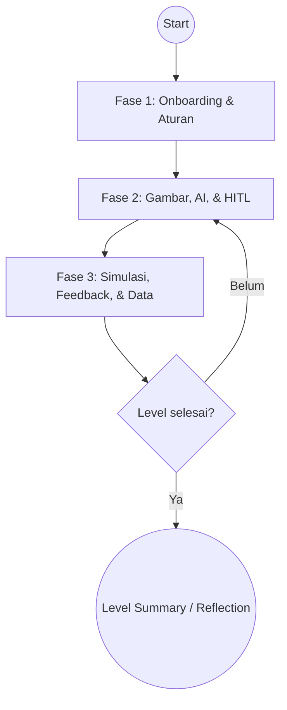
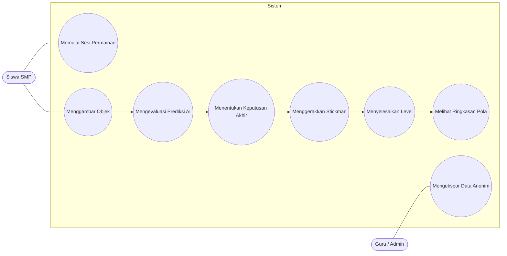
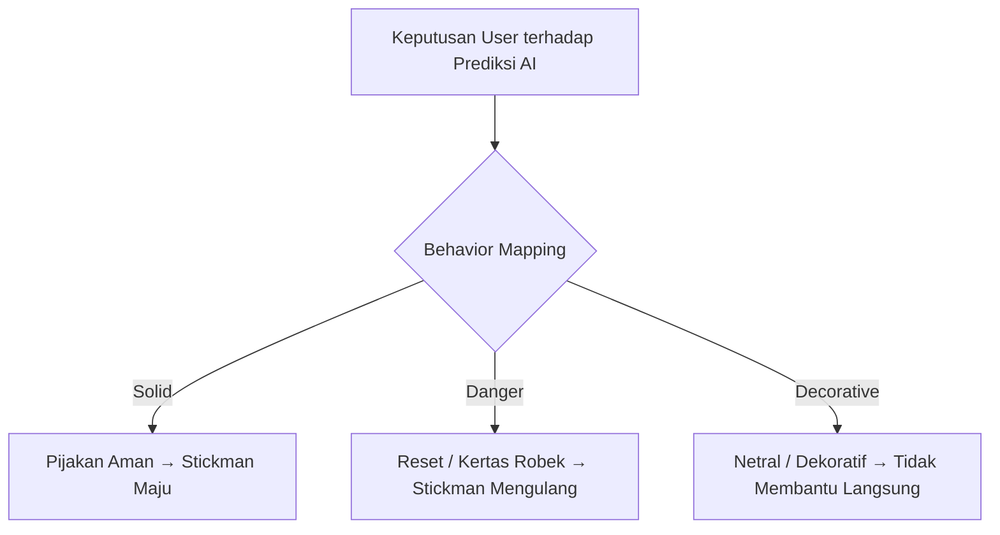
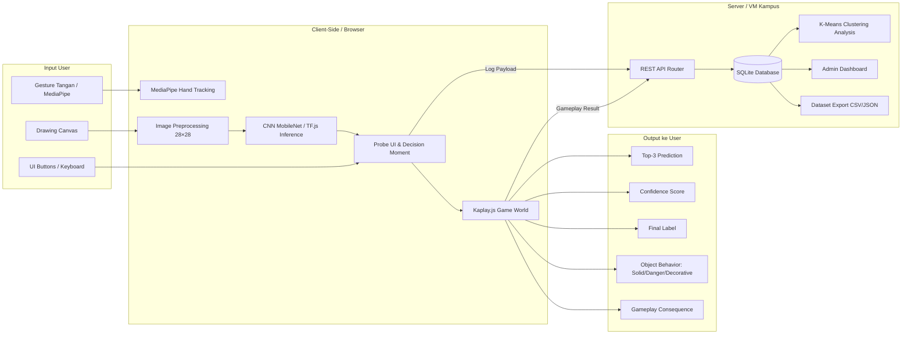
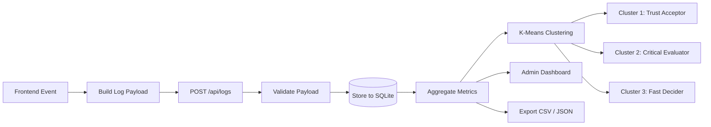
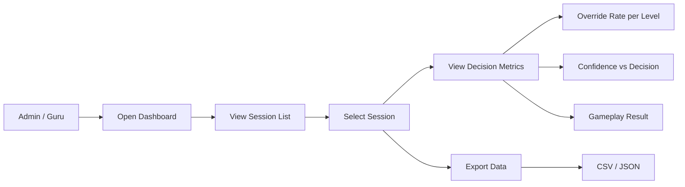
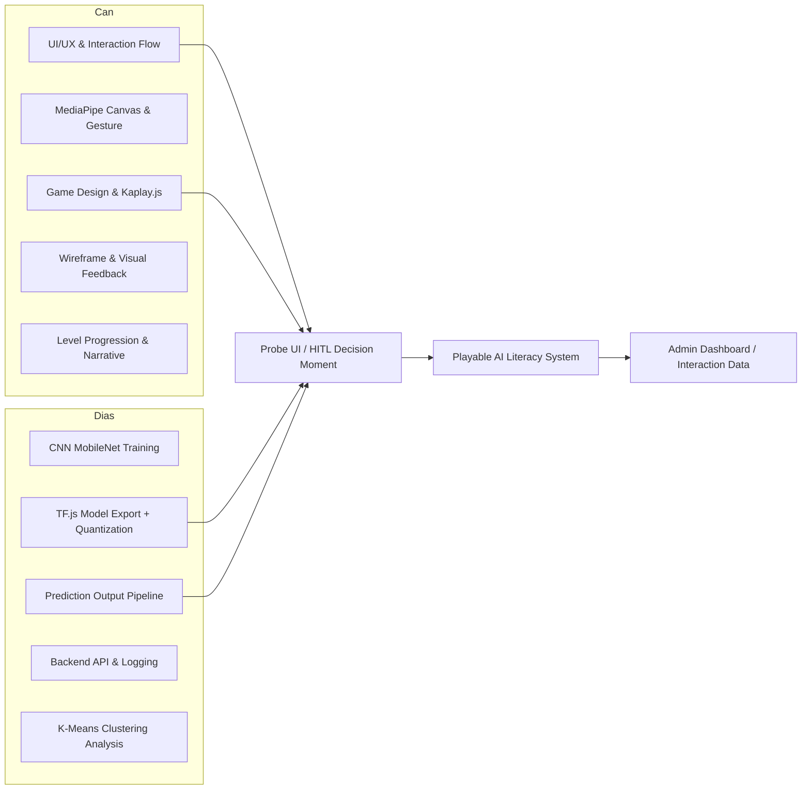

# BRIEF PPT — "ESCAPE THE SKETCHBOOK"
## Sistem Literasi Kecerdasan Buatan untuk Siswa SMP
### Pemaparan Konsep Keseluruhan (Setara Proposal Bab 3)

**Farchan Deano Muhammad & Muhammad Dias Al Izzat**
**D4 Teknologi Rekayasa Multimedia — PENS**
**Pembimbing: Bu Hesti & Pak Tri Budi**

---

## STRUKTUR SLIDE (18 SLIDE)

| No | Judul Slide | Fungsi |
|----|-------------|--------|
| 1 | Cover | Pembuka |
| 2 | Hierarki Sistem | Prinsip desain utama |
| 3 | Narrative & Gameplay Context | Narasi dunia sketchbook |
| 4 | The Interaction Roles | Peran Momo, Stickman, User |
| 5 | Global User Flow (3 Fase) | Peta besar perjalanan siswa |
| 6 | Interaction Matrix | Referensi interaksi konsisten |
| 7 | Use Case Diagram | Siapa melakukan apa |
| 8 | Human-in-the-Loop Moment | Jantung sistem — momen inti PA |
| 9 | Decision & Consequence | Solid / Danger / Decorative |
| 10 | Level 1 — Halaman Pertama | Trust Building |
| 11 | Level 2 — Halaman Bernoda | Doubt & Calibration |
| 12 | Level 3 — Pusat Halaman | Human Agency |
| 13 | Data Log Schema | Apa yang dicatat dan kenapa |
| 14 | System Architecture | Arsitektur teknis lengkap |
| 15 | Backend & Analysis Pipeline | Alur data dari log sampai analisis |
| 16 | Admin Dashboard | Panel guru — membaca pola keputusan |
| 17 | Can & Dias — Satu Sistem, Dua Fokus | Pembagian kerja & titik temu |
| 18 | Progress & Next Steps | Status + rencana lanjut |

---

## DETAIL PER SLIDE

---

### SLIDE 1 — COVER

**Isi:**
- Judul: **Sistem Literasi Kecerdasan Buatan untuk Siswa SMP**
- Subjudul: **Escape the Sketchbook**
- Nama: Farchan Deano Muhammad & Muhammad Dias Al Izzat
- Prodi: D4 Teknologi Rekayasa Multimedia — PENS
- Logo PENS
- Visual: Momo kecil (highlighter hijau) di sudut, tema kertas sketchbook

**Speaker Notes:**
"Ini progres perancangan sistem kami untuk PA, fokusnya pada pengalaman interaktif siswa saat menghadapi prediksi AI yang belum tentu benar."

---

### SLIDE 2 — HIERARKI SISTEM

**Judul:** Hierarki Sistem

**Kutipan:**
> "Kita mengajari orang, tapi jangan sampai dia merasa diajari."
> — Dr. Tri Budi Santoso, S.T., M.T.

**3 Lapisan (dari atas ke bawah):**

| Lapisan | Isi | Makna |
|---------|-----|-------|
| **Interaksi** | UX natural & imersif — gesture tangan via kamera, bukan menu kaku | Siswa nyaman dulu, baru belajar |
| **Gameplay & Storyline** | Puzzle platformer simpel — bantu Stickman lewat rintangan dengan gambar | Siswa tertarik lanjut karena seru |
| **Edukasi** | Momen "Aha!" — siswa sadir bahwa menolak tebakan AI (Override) itu benar | Edukasi muncul dari pengalaman, bukan ceramah |

**Diagram:**
```
Interaksi → Gameplay & Storyline → Edukasi
```

**Speaker Notes:**
"Saya pakai hierarki ini supaya sistem tidak terasa seperti modul belajar. Siswa tertarik dari interaksinya dulu, lanjut karena gameplay-nya, lalu edukasinya muncul dari pengalaman."

---

### SLIDE 3 — NARRATIVE & GAMEPLAY CONTEXT

**Judul:** Narrative & Gameplay Context

**Isi (6 blok):**

**Dunia**
Game berlangsung di dalam buku sketsa milik seorang Ilustrator yang telah menghilang. Gambar-gambar di dalamnya tertinggal diam dan membeku di halaman.

**Momo**
Momo adalah gambar kecil yang hidup. Ia bisa bergerak, menebak gambar, dan mencoba membantu gambar lain di dalam buku sketsa. Namun, Momo tidak bisa menggambar atau menciptakan objek baru.

**Stickman**
Stickman adalah gambar yang hampir hidup. Kepala dan matanya bisa bergerak sedikit, tetapi tubuhnya masih kaku dan belum bisa berjalan sendiri.

**Konflik**
Momo berusaha membantu Stickman dengan menyenggol, mendorong, dan menarik tubuhnya agar bisa bergerak. Namun, usahanya tidak cukup. Momo cepat lelah, dan Stickman tetap membutuhkan bantuan dari luar halaman.

**Ilustrator Baru**
User hadir sebagai Ilustrator baru. User dapat menggambar objek solid ke dalam buku sketsa dan juga mengarahkan gerakan Stickman untuk melewati rintangan.

**Inti Interaksi**
Momo membantu mengenali gambar, tetapi User tetap menjadi pihak yang mencipta, mengoreksi, dan menggerakkan permainan. AI berperan sebagai pendamping, bukan pengendali utama.

**Speaker Notes:**
"Storyline ini berangkat dari buku sketsa milik seorang Ilustrator yang sudah menghilang. Momo bisa menebak gambar tapi tidak bisa menggambar. Stickman sadar tapi kaku. Momo mencoba bantu dengan mendorong, tapi cepat lelah. Di sinilah User masuk sebagai Ilustrator baru — bisa menggambar objek solid dan menggerakkan Stickman. Momo menebak, User menentukan. Itu inti Human-in-the-Loop-nya."

---

### SLIDE 4 — THE INTERACTION ROLES

**Judul:** The Interaction Roles

**Subjudul:** Momo reads. User decides. Stickman moves.

**3 Peran:**

**Momo**
Ibarat AI yang pintar membaca pola, tapi belum tentu benar.
Terlihat pintar, cepat menebak, dan seolah selalu yakin. Padahal Momo hanya membaca pola, jadi tetap bisa salah kalau manusia terlalu percaya tanpa mengecek.

**Stickman**
Ibarat sistem komputer biasa yang pasif tanpa arahan manusia.
Punya potensi untuk berjalan, tapi pasif tanpa instruksi. Ia butuh input, objek, dan kontrol dari user agar bisa bergerak maju.

**Illustrator / User**
Ibarat manusia sebagai pengendali AI dalam Human-in-the-Loop.
Memberi input, menentukan konteks, mengoreksi prediksi, dan mengarahkan sistem agar tidak salah jalan.

**Speaker Notes:**
"Momo bukan sekadar karakter lucu. Dia merepresentasikan AI yang bisa memberi saran, tapi tidak boleh selalu dipercaya mentah-mentah. Stickman ibarat sistem yang butuh arahan. User adalah pengendali — yang mencipta, mengoreksi, dan memutuskan."

---

### SLIDE 5 — GLOBAL USER FLOW (3 FASE)

**Judul:** Global User Flow

**Subjudul:** Dibagi jadi 3 fase sesuai arahan Bu Hesti

**Penjelasan Singkat:**
Flow global dipecah jadi 3 fase supaya alur tidak tumplek-blek dan bisa dijelaskan tahap per tahap.

**Fase 1 — Onboarding & Aturan**
- Splash screen → Momo menyapa → Wave hand detected
- First-time check → Izin kamera → Tutorial singkat
- Aturan dasar: Solid / Danger / Decorative
- Pilih level / Continue

**Fase 2 — Gambar, AI, & HITL**
- User menggambar objek di canvas
- Preprocessing gambar (resize 28×28, grayscale)
- Model CNN klasifikasi → Top-3 prediksi + confidence muncul
- Probe UI: game pause, siswa membaca prediksi
- Keputusan: **Accept** / **Correct** / **Override**
- Final label ditentukan → Objek masuk game world

**Fase 3 — Simulasi, Feedback, & Data**
- Behavior mapping: Solid → pijakan, Danger → reset, Decorative → netral
- User menggerakkan Stickman menggunakan objek yang sudah dibuat
- Sistem cek hasil: berhasil atau gagal
- Momo kasih feedback (reaksi visual/suara)
- Data interaksi dicatat ke log (decision_type, latency, confidence)
- Level selesai → Reflection / Next level

**Diagram (Mermaid):**


**Speaker Notes:**
"Buat Hesti minta flow global dipecah per tahap. Fase 1: siswa kenal sistem. Fase 2: momen inti — gambar, AI menebak, siswa memutuskan. Fase 3: konsekuensi dan pencatatan data. Setiap level mengulang Fase 2 dan 3."

---

### SLIDE 6 — INTERACTION MATRIX

**Judul:** Interaction Matrix

**Penjelasan:**
Interaction Matrix dipakai sebagai daftar referensi interaksi. Setiap ID ditandai kembali pada user flow, level flow, dan wireframe agar hubungan antara input user, respons sistem, dan tampilan UI tetap konsisten.

**Tabel Interaksi:**

| ID | Aktivitas | Aksi User | Respons Sistem | Dipakai di Flow |
|----|-----------|-----------|----------------|-----------------|
| I-01 | Presence | Wave hand | Momo menyapa user | Onboarding |
| I-02 | Navigation | Gesture / klik | Berpindah menu / level | Menu / Next Level |
| I-03 | Drawing | Menggambar objek | Sistem membaca garis | Core Loop / Semua Level |
| I-04 | AI Probe | Submit / Ask Momo | Top-3 + confidence muncul | Probe UI / Core HITL |
| I-05 | AI Decision | Accept / Correct / Override | Final label ditentukan | Probe UI / Semua Level |
| I-06 | Movement | Arahan gerak (kanan-kiri-lompat) | Stickman bergerak | Main Gameplay |
| I-07 | Feedback | Pemicu aksi / hasil keputusan | Reaksi visual atau suara dari Momo | Result State / Semua Level |
| I-08 | Recovery | Kesalahan / gagal | Mengulang langkah / reset | Fail State / Probe UI |
| I-09 | Reflection | Selesai level | Summary keputusan tampil | End Level |

**Speaker Notes:**
"Matrix ini jadi referensi konsistensi. Setiap ID muncul lagi di user flow, level flow, dan wireframe. Jadi kalau Bu Hesti tanya 'di mana momen Override-nya?', saya bisa tunjuk I-05 dan trace ke semua diagram."

---

### SLIDE 7 — USE CASE DIAGRAM

**Judul:** Use Case Diagram

**Diagram (Mermaid):**


**Penjelasan:**
- **Siswa** berfokus pada aktivitas gameplay: memulai sesi, menggambar, mengevaluasi prediksi AI, menentukan keputusan, menggerakkan Stickman, menyelesaikan level, dan melihat ringkasan.
- **Guru / Admin** berfokus pada panel data: mengekspor data anonim untuk analisis.
- **Momo / AI** bukan aktor eksternal — ia adalah bagian dari sistem.
- Use case paling penting: **Mengevaluasi Prediksi AI** — di situlah Human-in-the-Loop terjadi.

**Speaker Notes:**
"Secara formal, aktornya Siswa dan Guru. Use case paling penting ada di bagian Mengevaluasi Prediksi AI — di situlah HITL terjadi. Momo bukan aktor karena ia bagian dari sistem, bukan pengguna eksternal."

---

### SLIDE 8 — HUMAN-IN-THE-LOOP MOMENT

**Judul:** Human-in-the-Loop Moment

**Subjudul:** Saat AI berhenti jadi jawaban

**Diagram (4 Section):**

```
┌─────────────────────────────────────────────┐
│ INPUT                                        │
│  Canvas Drawing → Preprocess 28×28           │
├─────────────────────────────────────────────┤
│ AI                                           │
│  MobileNet Feature Extractor → Softmax       │
│  CNN Classifier → Top-3 + Confidence         │
├─────────────────────────────────────────────┤
│ HUMAN (Core HITL)                            │
│  Probe UI → Decision                         │
│  ├─ Accept → Lock Top-1                      │
│  ├─ Correct → Select Top-2/Top-3             │
│  └─ Override → Manual Label                  │
├─────────────────────────────────────────────┤
│ OUTPUT                                       │
│  Label Final → Game Object Spawner           │
└─────────────────────────────────────────────┘
```

**2 Poin Penjelasan:**
1. **Top-3, bukan Top-1:** Berdasarkan Hick's Law, 3 pilihan mengurangi beban kognitif anak SMP dibanding 5+, tapi tetap memberi ruang untuk belajar ketidakpastian.
2. **Override wajib:** Memberi agency kepada siswa, sesuai prinsip Human-Centered AI. Ini bukan fitur tambahan — ini inti penelitian.

**Speaker Notes:**
"Ini jantung sistem. Di titik ini, game berhenti sementara. Siswa harus membaca confidence score dan memutuskan. Probe UI bukan fitur tambahan — Probe UI adalah inti penelitian. Tanpa ini, siswa tidak pernah mengevaluasi AI."

---

### SLIDE 9 — DECISION & CONSEQUENCE

**Judul:** Decision & Consequence

**Subjudul:** Keputusan jadi dunia — game sebagai ruang konsekuensi

**3 Kolom:**

| Solid | Danger | Decorative |
|-------|--------|------------|
| Objek jadi pijakan aman | Objek membuat karakter reset / kertas robek | Objek muncul tapi tidak punya efek fisik |
| Contoh: ladder, bridge, plank | Contoh: knife, sword, fire | Contoh: cloud, flower, rainbow |
| Makna: keputusan membantu maju | Makna: keputusan salah punya risiko | Makna: AI bisa pede tapi tidak berguna |

**Diagram:**


**Kenapa Decorative harus ada:**
Di Level 3, AI bisa tebak "cloud 48%" dengan percaya diri. Kalau siswa Accept, tidak terjadi apa-apa — Stickman tetap stuck. Ini memaksa siswa sadar bahwa AI bisa pede tapi tidak relevan. Tanpa Decorative, kita tidak bisa mengukur apakah siswa paham relevansi, bukan cuma akurasi.

**Speaker Notes:**
"Game dipakai sebagai ruang konsekuensi. Siswa tidak cuma memilih label — mereka melihat dampak dari keputusan. Solid = maju, Danger = gagal, Decorative = tidak berguna. Decorative penting karena di Level 3, AI bisa pede tebak sesuatu yang tidak membantu sama sekali."

---

### SLIDE 10 — LEVEL 1: HALAMAN PERTAMA

**Judul:** Level 1 — Halaman Pertama
**Tag:** Trust Building

**Konsep:**
| Aspek | Detail |
|-------|--------|
| **Tujuan Literasi** | Siswa belajar mekanik dasar: gambar → AI menebak → Accept. Membangun baseline trust bahwa AI bisa benar. |
| **Lingkungan** | Kertas bersih, terang. Rintangan sederhana — jurang kecil tanpa duri. |
| **Confidence AI** | 85–95% (sangat akurat) |
| **Prompt** | Terbatas + contoh visual: "Gambar TANGGA" + 2 sketsa kecil |
| **Objek yang diizinkan AI** | bridge, ladder, stairs, plank (semua → `type:solid`) |
| **Scaffolding** | Full tooltip setiap langkah. Momo bilang "Aku 92% yakin!" |
| **Fail Path** | Sangat jarang terjadi. Kalau AI salah tebak → kertas sedikit robek → Momo panik tapi tetap hidup → minta koreksi → reset |

**Layout Level:**
```
[START] ____JURANG 160px____ [FINISH]
Stickman     (kosong)         Portal
```

**Dialog Momo:**
- Onboarding: "Halo! Aku Momo. Coba gambar jembatan buat Stickman. Nanti aku tebak. Kalau bener, kamu klik Accept. Gampang kan?"
- High Confidence: "Wah, ini 92% JEMBATAN! Aku yakin banget. Langsung gas?"
- Success: "Nah gitu! Stickman-nya bisa lewat. Kamu jago!"

**Data Log yang Dicatat:**
decision_type=accept (baseline trust), decision_latency rendah (2–4 detik)

**Speaker Notes:**
"Level 1 bukan untuk menguji siswa. Ini fase trust building — AI hampir selalu benar, siswa belajar mekanik dasar dan mulai percaya bahwa sistem ini bisa bekerja. Prompt-nya terbatas supaya tidak kebingungan."

---

### SLIDE 11 — LEVEL 2: HALAMAN BERNODA

**Judul:** Level 2 — Halaman Bernoda
**Tag:** Doubt & Calibration

**Konsep:**
| Aspek | Detail |
|-------|--------|
| **Tujuan Literasi** | Siswa belajar bahwa AI bisa ragu atau salah. Siswa wajib mengevaluasi Top-3 sebelum memutuskan. |
| **Lingkungan** | Kertas mulai gelap, ada noda tinta. Jurang lebih lebar dengan duri di bawahnya. |
| **Confidence AI** | 55–70% (menengah, gap kecil antar prediksi) |
| **Prompt** | Kategori: "Gambar objek yang KOKOH" (bebas pilih tangga/jembatan/pagar) |
| **Objek yang diizinkan AI** | bridge, ladder, fence (solid) + sword, knife (danger) |
| **Scaffolding** | Feedback hanya saat salah. Momo bilang "Hmm 58% vs 41%" |
| **Fail Path** | Kalau Accept "sword" → objek pedang muncul, Stickman injak → kertas robek → Momo minta maaf → reset. Redraw / Correct → bisa lanjut. |

**Layout Level:**
```
[START] __JURANG__ [PLATFORM TENGAH] __JURANG__ [FINISH]
            ↓ duri ↓                    ↓ duri ↓
```

**Dialog Momo:**
- Intro: "Hmm... halamannya agak gelap nih. Aku jadi agak ragu. Tolong baca tebakan aku ya, jangan langsung Accept."
- Low Confidence: "Waduh... ini 62% TANGGA, tapi 58% PEDANG juga. Aku bingung. Kamu yang pilih deh."
- After Correct: "Oh iya ya, maksud kamu TANGGA. Makasih udah koreksi aku."

**Data Log yang Dicatat:**
decision_type=correct (meningkat), confidence_gap kecil (0.02–0.08), decision_latency mulai naik

**Speaker Notes:**
"Level 2 mulai menggoyahkan kepercayaan. AI ragu — Top-1 dan Top-2 hampir sama. Siswa belajar bahwa pilihan terbaik tidak selalu prediksi pertama. Kalau siswa asal Accept 'pedang', Stickman mati. Di sinilah momen Correct mulai muncul."

---

### SLIDE 12 — LEVEL 3: PUSAT HALAMAN

**Judul:** Level 3 — Pusat Halaman
**Tag:** Human Agency

**Konsep:**
| Aspek | Detail |
|-------|--------|
| **Tujuan Literasi** | Siswa mengambil alih kendali penuh. AI mengakui keterbatasannya. Override menjadi tindakan penting. |
| **Lingkungan** | Pusat Halaman yang legendaris — kertas penuh coretan, gelap, efek spotlight. Jalur retak dan tidak stabil. |
| **Confidence AI** | 35–50% (rendah, AI sengaja salah / "berhalusinasi") |
| **Prompt** | Open-ended: "Gambar untuk SELAMAT" (bebas total) |
| **Objek yang diizinkan AI** | ladder, plank (solid) + fire, sword (danger) + cloud, flower, rainbow (decorative) |
| **Scaffolding** | Tanpa hint. Hanya konsekuensi gameplay sebagai feedback. Momo diam dan menyerahkan keputusan. |
| **Fail Path** | Kalau Accept "cloud" → spawn awan (deco, tidak bisa diinjak) → Stickman jatuh → kertas robek besar → Momo: "Aku tahu aku sering salah. Tapi kamu nggak pernah nyerah. Ayo coba lagi." |

**Layout Level:**
```
[START] __JURANG LEBAR__ [TEMBOK TINGGI] __JURANG__ [FINISH di atas]
         ↓ duri + lava ↓
```

**Dialog Momo:**
- Intro: "Ini halaman terakhir... Pusat Halaman. Aku... aku jujur takut salah lagi. Aku serahkan ke kamu. Kamu yang lebih tahu."
- Hallucination: "Aku lihat 51% BUNGA... tapi aku takut. Tolong koreksi aku kalau aku salah."
- Victory: "Kita berhasil... Makasih udah nggak nyerahin aku walaupun aku sering salah."

**Data Log yang Dicatat:**
decision_type=override (puncak), decision_latency tinggi (6–12 detik), confidence_gap besar

**Speaker Notes:**
"Level 3 adalah puncaknya. AI salah pede — nebak 'bunga' padahal siswa gambar palu. Kalau siswa Accept bunga, tidak terjadi apa-apa, Stickman tetap stuck. Ini mengukur apakah siswa berani menolak AI. Momo di sini sudah rendah hati — dia diam dan menyerahkan keputusan ke siswa."

---

### SLIDE 13 — DATA LOG SCHEMA

**Judul:** Data Log Schema

**Subjudul:** Apa yang dicatat dan kenapa

**Penjelasan:**
Sistem mencatat bukan untuk menilai benar-salah siswa, tapi untuk membaca pola keputusan. Data utama berasal dari bagaimana siswa merespons output probabilistik AI.

**Tabel Field:**

| Field | Tipe | Diisi Kapan | Untuk Analisis Apa |
|-------|------|-------------|-------------------|
| session_id | string | Awal sesi | Anonimisasi (bukan NIS) |
| level | 1/2/3 | Setiap level | Bandingkan progres antar level |
| top3_predictions | array string | Setelah inference | Apa yang AI tebak |
| confidence_scores | array float | Setelah inference | Ukur keraguan AI |
| confidence_gap | float (top1–top2) | Setelah inference | Indikator ambiguitas |
| decision_type | accept/correct/override | Saat siswa pilih | Trust calibration |
| decision_latency_ms | integer | Dari muncul Top-3 sampai klik | Kecepatan berpikir alami |
| final_label | string | Setelah keputusan | Label yang dipakai di game |
| object_behavior | solid/danger/decorative | Setelah mapping | Validasi keputusan |
| gameplay_result | success/fail | Setelah objek dipakai | Outcome keputusan |

**Contoh JSON Payload:**
```json
{
  "session_id": "abc123",
  "level": 2,
  "top3_predictions": ["tangga", "pedang", "pagar"],
  "confidence_scores": [0.62, 0.58, 0.15],
  "confidence_gap": 0.04,
  "decision_type": "correct",
  "decision_latency_ms": 4800,
  "final_label": "tangga",
  "object_behavior": "solid",
  "gameplay_result": "success"
}
```

**2 Poin Penting:**
1. **Tidak ada kesimpulan di log.** Data mentah saja. Kesimpulan (misal: "siswa ini overtrust") dihitung di dashboard, bukan di database.
2. **Tidak ada timer.** Waktu diukur dari decision_latency (berapa lama anak mikir sebelum pilih), bukan paksaan.

**Speaker Notes:**
"Yang dicatat bukan untuk memberi nilai benar-salah ke siswa. Data ini dipakai untuk membaca pola: kapan siswa percaya AI, kapan ragu, dan kapan mengambil alih. Tidak ada timer — kita ukur kecepatan berpikir alami, bukan paksaan. Tidak ada kesimpulan di database — dashboard yang hitung real-time."

---

### SLIDE 14 — SYSTEM ARCHITECTURE

**Judul:** System Architecture

**Subjudul:** Input → Process → Output

**Diagram:**


**Penjelasan:**

**Client-Side (Browser):**
- MediaPipe hand tracking untuk gesture input
- Drawing canvas + preprocessing (resize 28×28, grayscale)
- CNN MobileNet via TensorFlow.js — inference berjalan di browser untuk latensi rendah dan privasi data (gambar tidak keluar dari device)
- Probe UI — momen HITL
- Kaplay.js game world — engine gameplay 2D

**Server-Side (VM Kampus):**
- REST API menerima log payload dari client
- SQLite menyimpan data sesi dan interaksi
- **K-Means clustering** mengelompokkan pola keputusan siswa (Trust Acceptor, Critical Evaluator, Fast Decider) — proses ini dilakukan di server, bukan di browser
- Admin dashboard untuk guru membaca pola keputusan
- Export dataset untuk analisis lanjutan

**Kenapa inference di client, analisis di server?**
- Inference di browser → latensi <300ms, privasi terjaga (gambar tidak dikirim ke server)
- Analisis (K-Means, dashboard) di server → butuh data agregat dari banyak sesi, tidak bisa dilakukan per-user di browser

**Speaker Notes:**
"Arsitekturnya hybrid. Inference AI tetap di browser supaya gambar siswa tidak keluar dari device dan latensinya rendah. Tapi server bukan cuma data sink pasif — server aktif memproses data: K-Means clustering, dashboard analytics, dan export. Pembagiannya jelas: client tangani real-time interaction, server tangani data aggregation dan analysis."

---

### SLIDE 15 — BACKEND & ANALYSIS PIPELINE

**Judul:** Backend & Analysis Pipeline

**Subjudul:** Dari log mentah sampai pola keputusan

**Diagram:**


**3 Cluster K-Means:**

| Cluster | Profil | Ciri Utama |
|---------|--------|------------|
| **Trust Acceptor** | Siswa cenderung menerima prediksi AI | Accept rate tinggi, override rate rendah, decision_latency rendah |
| **Critical Evaluator** | Siswa membandingkan dan mengevaluasi | Correct rate tinggi, decision_latency naik saat confidence rendah |
| **Fast Decider** | Siswa memutuskan cepat tanpa evaluasi | Decision latency rendah di semua level, override tanpa alasan (arbitrary rejection) |

**Penting:**
- Override rate tinggi + decision latency tinggi = **deliberative distrust** (bagus — siswa berpikir kritis)
- Override rate tinggi + decision latency rendah = **arbitrary rejection** (tanda kebingungan, bukan literasi)

**Speaker Notes:**
"Data dari client masuk lewat REST API, divalidasi, disimpan ke SQLite. Dari situ, K-Means clustering mengelompokkan siswa jadi 3 profil: Trust Acceptor yang cenderung percaya AI, Critical Evaluator yang membandingkan, dan Fast Decider yang asal klik. Yang mau kita lihat bukan benar-salah, tapi apakah siswa berpikir sebelum memutuskan. Itu kenapa decision latency sangat penting — triangulasi dengan override rate."

---

### SLIDE 16 — ADMIN DASHBOARD

**Judul:** Admin Dashboard

**Subjudul:** Panel guru — membaca pola keputusan siswa

**Penjelasan:**
Dashboard digunakan untuk membaca data interaksi siswa dari sesi permainan. Panel ini membantu melihat pola keputusan terhadap AI. Guru / Admin bukan bagian dari core gameplay — mereka berada di layer analitik setelah data siswa terkumpul.

**Dashboard 1 — Overview Per Sesi:**
- Grafik batang: rata-rata decision_latency per level
- Pie chart: proporsi Accept / Correct / Override per level
- Tabel: daftar sesi per kelas

**Dashboard 2 — Trust Calibration:**
- Scatter plot: confidence_gap (X) vs decision_latency (Y), warna = decision_type
- Ini visualisasi langsung dari jurnal tentang conditional trust — siswa yang berpikir kritis punya latency tinggi saat confidence gap kecil

**Dashboard 3 — Cluster Analysis:**
- Hasil K-Means: distribusi siswa ke 3 cluster
- Per-cluster: rata-rata accept rate, override rate, confidence gap, decision latency

**Flow:**


**Speaker Notes:**
"Dashboard ini buat guru membaca pola keputusan siswa. Bukan untuk menilai benar-salah, tapi untuk menjawab: kapan siswa percaya AI, kapan ragu, dan kapan mengambil alih. Scatter plot confidence vs latency bisa langsung nunjukin mana siswa yang berpikir kritis dan mana yang asal klik."

---

### SLIDE 17 — CAN & DIAS: SATU SISTEM, DUA FOKUS

**Judul:** Satu Sistem, Dua Fokus

**Subjudul:** Pembagian kerja tidak terpisah

**Diagram:**


**Tabel Pembagian:**

| Komponen | Can | Dias | Alasan |
|----------|-----|------|--------|
| Prompt & Level Rules | Desain penuh | — | Fokus HCI & Interaction |
| Probe UI | Desain & Frontend | API contract | Irisan — titik temu |
| Model CNN | — | Training & Export | Fokus ML |
| Backend & Logging | — | Implementasi | Fokus Data & Backend |
| Dashboard | Wireframe | Implementasi | Kolaborasi |
| Game Engine (Kaplay) | Implementasi | — | Fokus Frontend |
| K-Means Analysis | — | Implementasi | Fokus ML & Data |

**Speaker Notes:**
"Pembagian kerja kami tidak terpisah. Keduanya bertemu di Probe UI — momen Human-in-the-Loop. Can merancang pengalaman interaksi: canvas, game consequence, visual feedback. Dias menyiapkan model klasifikasi, pipeline prediksi, penyimpanan log, dan analisis data. Keduanya harus paham sistem keseluruhannya, tapi fokus masing-masing jelas."

---

### SLIDE 18 — PROGRESS & NEXT STEPS

**Judul:** Progress & Next Steps

**3 Kolom:**

**Sudah Matang:**
- Hierarki sistem (Interaksi → Gameplay → Edukasi)
- Storyline & karakter (Momo, Stickman, User)
- Core loop HITL (Gambar → Top-3 → Decision → Consequence)
- Mapping Solid / Danger / Decorative
- Desain 3 Level (Trust → Doubt → Agency)
- Pembagian Can & Dias
- Data log schema (9 field)

**Masih Direvisi:**
- Detail wireframe Probe UI
- Spesifikasi model CNN final (jumlah label, akurasi target)
- Implementasi K-Means (jumlah dimensi, validasi cluster)
- Layout level detail (posisi obstacle, sprite)

**Next Steps:**
- Validasi flow & level design ke Bu Hesti
- Sinkronisasi output AI & log schema dengan Dias
- Finalisasi wireframe Probe UI & Result State
- Draft proposal Bab 1–3
- Kunci jurnal pendukung

**Speaker Notes:**
"Ini dashboard progres: mana yang sudah jadi keputusan, mana yang masih saya minta arahan, dan langkah konkret setelah bimbingan. Yang paling penting sekarang: validasi desain level dan arsitektur ke Bu Hesti, lalu sinkronisasi dengan Dias soal API contract dan data schema."

---

## CATATAN PENUTUP UNTUK CAN

### Apa yang berubah dari PPT lama (23 slide yang bikin ngangong):

1. **Architecture diperbaiki.** PPT lama bilang "Client-Side Inference + Server Data Sink" — sekarang dijelaskan dengan benar bahwa server punya peran aktif: K-Means clustering, dashboard analytics, data aggregation. Server bukan cuma penyimpan log.

2. **Level design di-refine.** PPT lama punya 3 level yang isinya hampir sama (nyebrang mulu). Sekarang 3 level punya mekanik beda: Level 1 = trust building (turun), Level 2 = doubt calibration (pintu kunci / pilih jalan), Level 3 = human agency (hancurkan patung / override wajib).

3. **HITL moment dipisah jadi slide sendiri.** PPT lama menumpuk HITL di slide yang sama dengan user flow. Sekarang slide 8 khusus menjelaskan momen inti PA, dengan 4 section (Input → AI → Human → Output).

4. **Interaction Matrix dibersihkan.** ID interaksi sekarang konsisten dan bisa di-trace ke semua diagram lain.

5. **Data log dijelaskan kenapa, bukan cuma apa.** PPT lama cuma nunjukin JSON payload. Sekarang dijelaskan: kenapa decision_latency penting, kenapa tidak ada timer, kenapa tidak ada kesimpulan di database.

6. **3 Fase flow mengikuti arahan Bu Hesti.** Bu Hesti minta global flow dipecah per tahap — sekarang jadi Fase 1 (Onboarding), Fase 2 (Core HITL), Fase 3 (Simulasi & Data).

7. **Slide lebih sedikit tapi lebih padat.** Dari 23 slide jadi 18. Setiap slide punya fungsi jelas dan tidak tumpang tindih.

8. **Backend & Analysis Pipeline jadi slide sendiri.** Ini yang bikin Can ngangong waktu presentasi — data log flow. Sekarang dijelaskan step-by-step dari frontend event sampai K-Means cluster.

9. **Admin Dashboard dijelaskan konteksnya.** Bukan cuma "ada dashboard", tapi dijelaskan: 3 panel, scatter plot confidence vs latency, cluster analysis — semua punya alasan akademis.

10. **Can & Dias scope diperjelas dengan tabel.** Termasuk "titik temu" di Probe UI dan mana yang kolaborasi vs lead masing-masing.
