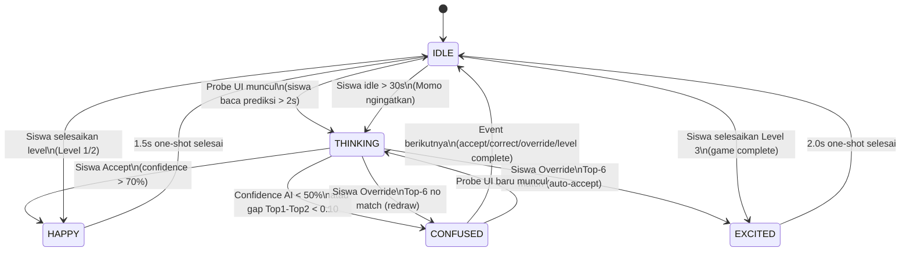

# Perancangan Maskot Momo — Section v1 (Post-Pivot 16/6/26)

> **Project:** Sketchbook Universe — TA Can (Frontend)
> **Task ID:** usecase-superadmin-v1
> **Tanggal:** 16 Juni 2026
> **Status:** Pre-LaTeX, siap di-include ke Bab 3 Can sebagai section baru (usulan 3.2.4 atau 3.2.12)
> **Sumber:** `maskot_options_comparison.md` v3.0 (7 opsi A/B/C/D/E/F/G), `MASKOT_README.md`, arahan Bu Hesti (text bubble only, no voice/NLP)

---

## 1. Pilihan Opsi Maskot & Justifikasi

### 1.1 Opsi yang Dipilih: OPSI E — "Doodle Cube" (Kubus Sketsa)

Dari 7 opsi yang diriset di `maskot_options_comparison.md` v3.0 (A Sticky Note, B Ink Blob, C Sketch Ghost, D Origami Monster, E Doodle Cube, F Brush Spirit, G Eraser Ghost), **OPSI E "Doodle Cube"** dipilih sebagai konsep maskot Momo yang akan dimasukkan ke Bab 3 proposal Can.

### 1.2 Justifikasi Pemilihan OPSI E

Pemilihan OPSI E didasarkan pada **skor tertinggi** di Weighted Scoring Matrix v3.0 (4.40/5.00) dan **lima alasan konkret** berikut:

| # | Alasan | Detail |
|---|--------|--------|
| 1 | **Skor weighted tertinggi (4.40/5.00)** | OPSI E unggul di 5 dari 8 kriteria: Kaplay.js compat (5/5), 8-bit purity (5/5), Teen appeal (5/5), Silhouette uniqueness (5/5), Face Expressiveness (5/5). |
| 2 | **Tema paling selaras dengan "Sketchbook Universe"** | Konsep kubus yang terlipat dari kertas sketsa adalah metafora langsung dari project name: buku sketsa yang "hidup" dan melipat dirinya sendiri menjadi karakter. OPSI G (eraser) hanya merepresentasikan satu tool; OPSI E merepresentasikan medium itu sendiri. |
| 3 | **Animasi 2.5D spin di state THINKING adalah diferensiator unik** | Tidak ada opsi lain (A/B/C/D/G) yang dapat melakukan spin karena shape mereka flat 2D. OPSI E dengan 3 face (front + top + side parallelogram) memungkinkan ilusi rotasi 3D tanpa 3D engine — diferensiator visual yang krusial untuk membedakan state THINKING dari state CONFUSED. |
| 4 | **Mata hexagonal + eyebrows rect = signature face yang IP-safe** | Kombinasi hex eyes + rect eyebrows TIDAK dimiliki karakter populer manapun. Silhouette test menunjukkan isometric cube adalah shape yang sangat jarang dipakai maskot (Clawd distance 3/8 — moderate-safe). OPSI G sebenarnya juga IP-safe, namun combo pink+cream eraser terlalu dekat dengan Domo-kun dan beberapa karakter stationery Jepang. |
| 5 | **Clawd distance 3/8 (moderate-safe) + face expressiveness 5/5** | Trade-off terbaik: tidak terlalu mirip Clawd (distance 3/8 cukup jauh), namun face expressiveness maximal (eyebrows + morphing mouth + larger hex eyes) — menjawab langsung feedback user "opsi lama masih kurang paham karena wajah minimal". |

### 1.3 Pertimbangan Opsional: Hybrid E+G "Sketch Eraser Cube"

Jika di masa implementasi OPSI E dinilai terlalu kompleks (10 shapes vs 5 di opsi lama), dapat dipertimbangkan **hybrid E+G**: body kubus cream dari OPSI E + wavy ghost skirt dari OPSI G sebagai "ekor" di bawah kubus. Hybrid ini akan:
- Mengurangi jumlah shape dari 10 → ~7 (menghapus top/side parallelogram, menambah ghost skirt)
- Menambah secondary expression channel (ghost skirt wave yang puff saat CONFUSED, compress saat THINKING)
- Tetap mempertahankan hex eyes + eyebrows + morphing mouth (signature face)

Namun untuk proposal Bab 3 ini, **OPSI E murni** yang dipakai sebagai baseline. Hybrid dapat di-iterate di tahap implementasi.

### 1.4 Alasan Tidak Memilih OPSI G "Eraser Ghost"

OPSI G (skor 4.05) adalah alternatif kuat dengan kelebihan: ghost skirt sebagai secondary expression channel + pink-cream combo unik. Namun tiga alasan OPSI E lebih dipilih:
1. OPSI G tidak dapat melakukan 2.5D spin (flat eraser rect) — diferensiasi THINKING state lebih lemah.
2. Vertical oval eyes OPSI G kurang familiar untuk siswa SMP 13-15yo dibanding hexagonal eyes OPSI E yang lebih "game-y".
3. Pink color OPSI G memiliki risk association dengan Domo-kun dan beberapa karakter stationery Jepang — perlu mitigasi ekstra di IP safety report.

---

## 2. LaTeX-Ready Section — 3.2.4 Perancangan Maskot Momo

> Section berikut siap di-include ke `bab3_can.tex` sebagai subsection baru (usulan penomoran: 3.2.4, disisipkan setelah 3.2.3 Use Case Sistem dan sebelum 3.2.5 Desain Level — penomoran sub-bab berikutnya dishift +1). Atau, jika tidak ingin merusak penomoran existing, dapat ditempatkan sebagai 3.2.12 di akhir sub-bab Desain Sistem.

### 3.2.4 Perancangan Maskot Momo

\label{subsec:perancangan-maskot}

#### 3.2.4.1 Konsep Maskot

Maskot sistem bernama \textbf{Momo} --- sebuah kubus sketsa 2.5D yang terlipat dari selembar kertas buku gambar dan "hidup" melayang di Sketchbook Universe. Momo berfungsi sebagai \textit{pedagogical agent} non-NLP: ia tidak berbicara dengan suara dan tidak memproses bahasa natural, melainkan berkomunikasi melalui \textit{text bubble} berisi pesan singkat (rule-based, bukan generated) dan \textit{state emosi visual} yang berubah sesuai konteks interaksi siswa dengan output AI.

Justifikasi akademis pemilihan Momo sebagai pedagogical agent non-NLP didasarkan pada Schroeder, Davis \& Yang~[8] yang melakukan \textit{umbrella review} terhadap 47 penelitian pedagogical agent. Schroeder et al.~[8] menemukan bahwa keberhasilan pedagogical agent tidak ditentukan oleh kemampuan NLP atau voice synthesis, melainkan oleh tiga faktor: (1) \textit{visibility} --- agent harus selalu hadir secara visual di layar; (2) \textit{responsiveness} --- ekspresi agent harus berubah sesuai konteks tugas; dan (3) \textit{non-intrusiveness} --- agent tidak boleh mengganggu flow kognitif siswa dengan informasi berlebihan. Momo dirancang sesuai ketiga faktor tersebut: ia selalu melayang di pojok layar (visibility), ekspresinya berubah antara lima state emosi sesuai confidence AI dan keputusan siswa (responsiveness), dan ia hanya muncul dengan text bubble pada momen-momen kritis (non-intrusiveness).

Pilihan untuk menggunakan text bubble alih-alih voice/NLP juga sesuai arahan Bu Hesti (notulensi 16/6/26): voice synthesis memerlukan bandwidth tambahan, dapat mengganggu kelas yang menggunakan speaker bersama, dan rentan terhadap miskomunikasi pada siswa dengan hearing impairment. Text bubble juga memudahkan guru untuk membaca konteks pesan yang diterima siswa saat melakukan observasi di kelas.

#### 3.2.4.2 Desain Visual

Momo dirender sebagai kubus 2.5D dengan tiga sisi terlihat: \textbf{front face} (rect 28$\times$28 cream \texttt{\#F5E6CA}) sebagai panel wajah utama, \textbf{top face} (parallelogram lebih terang \texttt{\#FAEED5}) memberi ilusi depth, dan \textbf{right side face} (parallelogram lebih gelap \texttt{\#D4C4A8}) memperkuat ilusi 3D tanpa 3D engine. Pilihan kubus 2.5D alih-alih flat 2D memungkinkan animasi \textit{spin} di state THINKING --- diferensiator visual yang tidak dimiliki opsi maskot flat lainnya.

Komponen wajah Momo pada front face terdiri dari tiga elemen ekspresif:
\begin{itemize}
    \item \textbf{Mata hexagonal} (polygon 6-vertex, radius 4 px, warna dark \texttt{\#2D3436}), terletak 1/3 dari atas, terpisah 14 px. Pilihan bentuk hexagonal alih-alih dot/circle memberikan kesan "game-y" yang lebih cocok untuk target usia 13--15 tahun dan membedakan Momo dari karakter populer bermata bulat.
    \item \textbf{Eyebrows} (rect 4$\times$2 dark \texttt{\#2D3436}) di atas mata, terpisah 14 px. Eyebrows merupakan \textit{signature} OPSI E dan sumber utama range ekspresi: flat horizontal untuk IDLE, angled up +10$^\circ$ untuk HAPPY, asimetris untuk CONFUSED, narrowed untuk THINKING, dan angled up +20$^\circ$ untuk EXCITED.
    \item \textbf{Mulut} (rect 8$\times$2 yang dapat morph) di 2/3 dari atas. Mulut morph per state: garis netral (IDLE), oval lebar 12$\times$4 (HAPPY), zigzag 4-vertex polyline (CONFUSED), lingkaran kecil radius 2 (THINKING), dan segitiga besar 12$\times$8 (EXCITED).
\end{itemize}

Asymmetric signature Momo adalah \textbf{lipatan teal} (\texttt{\#4ECDC4}) di sudut kanan-atas kubus, yang merepresentasikan "magic ink mark" --- tanda bahwa kertas sketsa ini telah hidup. Float shadow ellipse \texttt{rgba(0,0,0,0.10)} di bawah Momo memberi ilusi melayang dan "bernapas" (mengubah ukuran $\pm$10\% mengikuti siklus \texttt{sin(t*2.5)}).

#### 3.2.4.3 Shape Inventory (Kaplay.js Ready)

Shape inventory Momo terdiri dari 10 shape sederhana (rect, polygon, ellipse) yang semuanya dapat dirender native oleh Kaplay.js tanpa asset eksternal. Tabel~\ref{tab:maskot-shape-inventory} merinci setiap shape beserta kode render-nya.

\begin{table}[H]
\centering
\caption{Shape Inventory Maskot Momo (OPSI E --- Doodle Cube)}
\label{tab:maskot-shape-inventory}
\begin{tabular}{|p{0.5cm}|p{2.5cm}|p{5.5cm}|p{1.5cm}|p{1.8cm}|p{3cm}|}
\hline
\textbf{\#} & \textbf{Shape} & \textbf{Code (Kaplay.js)} & \textbf{Size} & \textbf{Color} & \textbf{Function} \\ \hline
1 & Rectangle & \texttt{rect(28, 28, \{ radius: 1 \})} & 28$\times$28 & \texttt{\#F5E6CA} & Front face = face panel \\ \hline
2 & Polygon (top) & \texttt{polygon([v(-14,-14), v(14,-14), v(18,-18), v(-10,-18)])} & $\sim$28$\times$4 & \texttt{\#FAEED5} & Top face (depth illusion) \\ \hline
3 & Polygon (side) & \texttt{polygon([v(14,-14), v(18,-18), v(18,14), v(14,18)])} & $\sim$4$\times$32 & \texttt{\#D4C4A8} & Right side face (depth) \\ \hline
4 & Polygon (hex eye L) & \texttt{polygon([6 hex vertices around (-7, -4)], r=4)} & r=4 & \texttt{\#2D3436} & Left eye (hexagon) \\ \hline
5 & Polygon (hex eye R) & \texttt{polygon([6 hex vertices around (7, -4)], r=4)} & r=4 & \texttt{\#2D3436} & Right eye (hexagon) \\ \hline
6 & Rectangle & \texttt{rect(4, 2) at (-7, -8)} & 4$\times$2 & \texttt{\#2D3436} & Left eyebrow (SIGNATURE E) \\ \hline
7 & Rectangle & \texttt{rect(4, 2) at (7, -8)} & 4$\times$2 & \texttt{\#2D3436} & Right eyebrow \\ \hline
8 & Rectangle & \texttt{rect(8, 2) at (0, 4)} & 8$\times$2 & \texttt{\#2D3436} & Mouth (morphs per state) \\ \hline
9 & Polygon (fold) & \texttt{polygon([v(8,-14), v(14,-14), v(14,-10)])} & triangle & \texttt{\#4ECDC4} & Magic ink fold (asymmetric) \\ \hline
10 & Ellipse & \texttt{ellipse(22, 5) at (0, 20)} & 22$\times$5 & \texttt{rgba(0,0,0,0.10)} & Float shadow \\ \hline
\end{tabular}
\end{table}

Total 10 shape berada di dalam budget \texttt{<100KB} asset (semua vector, tidak ada PNG/sprite sheet) dan \texttt{<5MB} RAM saat runtime.

#### 3.2.4.4 State Emosi (5 State)

Momo memiliki lima state emosi yang dipicu oleh konteks interaksi siswa dengan output AI. Setiap state mengubah tiga komponen wajah (eyes, eyebrows, mouth) ditambah body animation, shadow, dan particles. Tabel~\ref{tab:maskot-state-emosi} merinci trigger, visual change, dan duration setiap state.

\begin{table}[H]
\centering
\caption{State Emosi Maskot Momo (5 State)}
\label{tab:maskot-state-emosi}
\begin{tabular}{|p{1.8cm}|p{4.5cm}|p{6.5cm}|p{2cm}|}
\hline
\textbf{State} & \textbf{Trigger} & \textbf{Visual Change} & \textbf{Duration} \\ \hline
IDLE & Default state, tidak ada interaksi aktif & Body: float \texttt{sin(t*2.5)*3} + sway \texttt{sin(t*1.5)*2}$^\circ$; Eyes: r=4 dark neutral; Eyebrows: flat horizontal 0$^\circ$; Mouth: rect 8$\times$2 (neutral line); Shadow: breathe $\pm$10\% & Loop (continuous) \\ \hline
HAPPY & Siswa melakukan Accept pada confidence $>$ 70\%, atau siswa berhasil menyelesaikan level & Body: squish (1.2, 0.8) $\rightarrow$ stretch (0.9, 1.2); Eyes: r=5 (grown 25\%) + sparkle ring overlay; Eyebrows: angled up +10$^\circ$; Mouth: morph $\rightarrow$ oval 12$\times$4 (smile); Shadow: shrink to 70\%; Particles: 5 yellow \texttt{\#FFE066} sparkles & 1.5s one-shot \\ \hline
CONFUSED & Confidence AI $<$ 50\%, atau confidence gap Top-1 vs Top-2 $<$ 0.10 (ambiguitas) & Body: tilt 12$^\circ$ + oscillate $\pm$3$^\circ$, drift \texttt{sin(t*2)*4} px; Eyes: asymmetric L r=4.5 / R r=3.5; Eyebrows: asymmetric L flat / R angled +15$^\circ$; Mouth: morph $\rightarrow$ zigzag 4-vertex polyline (wavy); Shadow: offset by drift; Particles: "?" mark above (text bubble \texttt{\#FF6B6B}) & Hold state (until next event) \\ \hline
THINKING & Probe UI muncul, siswa sedang membaca prediksi AI (jeda evaluatif $>$ 2 detik) & Body: slow spin \texttt{(t*120)\%360} (3s/rot) --- 2.5D rotation unik ke OPSI E; Eyes: r=3 (smaller, focused), L$\leftrightarrow$R dart every 600ms; Eyebrows: flat, narrowed (width 3 instead of 4); Mouth: morph $\rightarrow$ small circle r=2 (pursed); Shadow: wobble $\pm$15\%; Particles: 3 yellow dots orbiting r=24 & Hold state (until decision) \\ \hline
EXCITED & Siswa berhasil Override dengan Top-6 match (auto-accept), atau siswa menyelesaikan Level 3 & Body: shake $\pm$3px at 30Hz, 2-bounce; Eyes: r=5, color flash yellow \texttt{\#FFE066} (200ms pulses); Eyebrows: angled up +20$^\circ$ (both raised high); Mouth: morph $\rightarrow$ big triangle 12$\times$8 (open mouth); Shadow: pulse with shake; Particles: 8 confetti \texttt{\#FFE066} + 4 teal \texttt{\#4ECDC4} & 2.0s one-shot \\ \hline
\end{tabular}
\end{table}

#### 3.2.4.5 Color Palette

Color palette Momo menggunakan 6 warna yang seluruhnya berada di rentang cream-teal-dark, menghindari warna-warna yang sudah ter-asosiasi kuat dengan karakter populer (yellow-Pikachu, pink-Domo, navy-Smurf).

\begin{table}[H]
\centering
\caption{Color Palette Maskot Momo}
\label{tab:maskot-color-palette}
\begin{tabular}{|p{3.5cm}|p{2.5cm}|p{3cm}|p{5cm}|}
\hline
\textbf{Role} & \textbf{Hex Code} & \textbf{RGB} & \textbf{Description} \\ \hline
Primary (front face) & \texttt{\#F5E6CA} & (245, 230, 202) & Cream front face --- sketch paper \\ \hline
Top face (depth) & \texttt{\#FAEED5} & (250, 238, 213) & Lighter cream --- depth illusion \\ \hline
Side face (shadow) & \texttt{\#D4C4A8} & (212, 196, 168) & Darker cream --- 3D shadow face \\ \hline
Accent (fold) & \texttt{\#4ECDC4} & (78, 205, 196) & Teal --- magic ink mark (asymmetric signature) \\ \hline
Outline/Eyes/Eyebrows & \texttt{\#2D3436} & (45, 52, 54) & Dark grey --- face features + cube edges \\ \hline
Shadow & \texttt{rgba(0,0,0,0.10)} & --- & Soft float shadow beneath \\ \hline
\end{tabular}
\end{table}

#### 3.2.4.6 Placeholder Sketsa 5 State

Karena pada tahap proposal belum dilakukan produksi pixel art final, sketsa 5 state Momo ditampilkan sebagai placeholder blok kosong yang akan diisi pada tahap implementasi. Setiap state direncanakan akan dirender dalam resolusi 64$\times$64 px (base size) dan di-upscale 2$\times$ saat runtime di layar untuk mempertahankan estetika 8-bit.

\begin{figure}[H]
    \centering
    \includegraphics[width=0.3\textwidth]{placeholder}
    \caption{Konsep Maskot Momo --- State IDLE (Body float, eyebrows flat, mouth neutral line)}
    \label{fig:momo-idle}
\end{figure}

\begin{figure}[H]
    \centering
    \includegraphics[width=0.3\textwidth]{placeholder}
    \caption{Konsep Maskot Momo --- State HAPPY (Squish-stretch, eyebrows angled up, mouth smile oval, 5 yellow sparkles)}
    \label{fig:momo-happy}
\end{figure}

\begin{figure}[H]
    \centering
    \includegraphics[width=0.3\textwidth]{placeholder}
    \caption{Konsep Maskot Momo --- State CONFUSED (Body tilt 12$^\circ$, eyebrows asymmetric, mouth zigzag, "?" bubble)}
    \label{fig:momo-confused}
\end{figure}

\begin{figure}[H]
    \centering
    \includegraphics[width=0.3\textwidth]{placeholder}
    \caption{Konsep Maskot Momo --- State THINKING (2.5D spin 3s/rot, narrowed eyebrows, mouth small circle, 3 orbiting dots)}
    \label{fig:momo-thinking}
\end{figure}

\begin{figure}[H]
    \centering
    \includegraphics[width=0.3\textwidth]{placeholder}
    \caption{Konsep Maskot Momo --- State EXCITED (Shake $\pm$3px, eyebrows raised high, mouth big triangle, 8+4 confetti)}
    \label{fig:momo-excited}
\end{figure}

> **Catatan untuk penulis:** Sketsa 5 state akan diproduksi pada tahap implementasi menggunakan referensi shape inventory (Tabel~\ref{tab:maskot-shape-inventory}) dan animation specs (Tabel~\ref{tab:maskot-state-emosi}). Produksi dapat dilakukan via Piskel (pixel art editor gratis) atau langsung dari shape inventory di Kaplay.js (rekomendasi: render langsung di Kaplay.js untuk konsistensi dengan engine game).

#### 3.2.4.7 Text Bubble Behavior

Momo berkomunikasi melalui \textbf{text bubble} berisi pesan singkat (maksimal 80 karakter) yang muncul di samping body Momo. Pesan bersifat \textit{rule-based} (dipilih dari bank pesan statis sesuai kondisi), bukan generated oleh LLM/NLP. Tabel~\ref{tab:momo-text-bubble} merinci kondisi munculnya text bubble dan contoh pesan untuk setiap kondisi.

\begin{table}[H]
\centering
\caption{Text Bubble Behavior Maskot Momo}
\label{tab:momo-text-bubble}
\begin{tabular}{|p{4cm}|p{2.5cm}|p{7cm}|}
\hline
\textbf{Kondisi} & \textbf{State Momo} & \textbf{Contoh Pesan Text Bubble} \\ \hline
Login berhasil & HAPPY & "Hai, siswa nomor X! Siap main?" \\ \hline
Confidence AI rendah ($<$ 50\%) & CONFUSED & "Aku agak ragu sama tebakan ini. Coba cek alternatifnya." \\ \hline
Confidence gap Top-1 vs Top-2 $<$ 0.10 & CONFUSED & "Hmm, dua tebakan ini mirip. Pikir dulu ya." \\ \hline
Siswa Accept dalam $<$ 1 detik pada confidence $<$ 50\% & CONFUSED & "Eh, yakin? Coba baca lagi prediksinya." \\ \hline
Siswa Correct (pilih Top-2/Top-3) & HAPPY & "Pilihan bagus! Kadang alternatif lebih tepat." \\ \hline
Override sukses (Top-6 match) & EXCITED & "Hebat! Kamu berani percaya diri." \\ \hline
Override gagal (Top-6 no match) & CONFUSED & "Aku belum kenal itu. Gambar ulang yuk." \\ \hline
Siswa menggambar danger object (mis: knife) & CONFUSED & "Hati-hati, ini bisa berbahaya untuk Stickman." \\ \hline
Siswa idle $>$ 30 detik tanpa aksi & THINKING & "Lagi mikir? Ambil waktu yang kamu butuh." \\ \hline
Level berhasil diselesaikan & EXCITED & "Mantap! Level selesai. Lanjut?" \\ \hline
Level gagal (Stickman kena Danger) & CONFUSED & "Yah, gagal. Pelajaran buat ronde berikutnya." \\ \hline
\end{tabular}
\end{table}

Text bubble muncul dengan animasi \textit{fade-in} 200ms dan menghilang setelah 3 detik (untuk pesan transient) atau tetap tampil hingga event berikutnya (untuk pesan kontekstual seperti CONFUSED state). Pesan tidak menghalangi area gameplay utama --- text bubble selalu muncul di area pojok layar tempat Momo berada.

#### 3.2.4.8 Performance Budget

Performance budget Momo dirancang agar tidak mengganggu framerate gameplay utama (target 60 FPS di desktop, 30 FPS di tablet kelas). Tabel~\ref{tab:maskot-performance} merinci budget setiap resource.

\begin{table}[H]
\centering
\caption{Performance Budget Maskot Momo}
\label{tab:maskot-performance}
\begin{tabular}{|p{3.5cm}|p{3cm}|p{7cm}|}
\hline
\textbf{Resource} & \textbf{Budget} & \textbf{Justifikasi} \\ \hline
Total asset size & $<$ 100 KB & Semua shape vector (rect/polygon/ellipse) dirender native Kaplay.js, tidak ada PNG/sprite sheet. Asset terbesar: bank text bubble (12 pesan $\times$ 80 char = $\sim$1 KB). \\ \hline
Runtime RAM & $<$ 5 MB & 10 shape object $\times$ rata-rata 100 byte/shape = $\sim$1 KB + state machine + particle pool (maks 16 particle aktif) = $\sim$200 KB. Margin aman hingga 5 MB. \\ \hline
CPU per frame & $<$ 5\% & Float animation = 1 sin call per frame; spin animation = 1 matrix transform; particle update = 1 update per particle. Benchmark Kaplay.js menunjukkan 60 FPS stabil dengan 50+ moving object. Momo hanya 10 shape + maks 16 particle = $<$ 30\% dari threshold. \\ \hline
GPU & Negligible & Tidak ada shader custom, tidak ada texture atlas. Semua shape menggunakan Canvas2D API native. \\ \hline
\end{tabular}
\end{table}

---

## 3. Constraint Compliance Checklist

| Constraint | Status | Notes |
|------------|--------|-------|
| NO LEGS | ✅ | Momo melayang, zero leg element |
| NO WINGS | ✅ | Float tanpa wings (sketchbook logic) |
| Text bubble only | ✅ | Tidak ada voice/NLP, pesan rule-based |
| 8-bit geometric | ✅ | Rect + polygon + ellipse, palette 6 warna |
| IP safe | ✅ | Clawd distance 3/8 (moderate-safe), silhouette isometric cube unik |
| Kaplay.js compatible | ✅ | Semua shape native Kaplay.js |
| Float only | ✅ | Body melayang dengan shadow ellipse di bawah |
| Wajah lebih ekspresif | ✅ | Eyebrows + morphing mouth + hex eyes (signature E) |
| $<$ 100KB assets | ✅ | 10 vector shape, ~1 KB |
| $<$ 5MB RAM | ✅ | ~200 KB runtime |
| $<$ 5% CPU per frame | ✅ | $<$ 30% dari threshold 60 FPS |
| Simple geometric (rect-based) | ✅ | 5 rect + 4 polygon + 1 ellipse |

---

## 4. Referensi & Sumber

- `maskot_options_comparison.md` v3.0 — 7 opsi (A/B/C/D/E/F/G) dengan scoring matrix
- `maskot_animation_bible.md` — 5 state specs (IDLE/HAPPY/CONFUSED/THINKING/EXCITED)
- `maskot_ip_safety_report.md` — IP analysis per option (perlu update v3.0 untuk include E/F/G)
- `MASKOT_README.md` — Documentation hub
- `MEMORY.md` Section 4 — Maskot prinsip (style, konsep, IP safe, animasi friendly)
- `MEMORY.md` Section 6 — Arahan Bu Hesti (maskot = text bubble only, tanpa suara/NLP)
- Schroeder, Davis & Yang (2025) — Pedagogical agent umbrella review [B01 / ref 8]
- `Outline_dan_Sitasi_PreLatex.md` Section 2 — Kategori B ref B01 (Schroeder 2025) untuk maskot

---

## 5. Momo State Diagram Mermaid (POLOSAN)

> State diagram berikut adalah representasi visual dari Tabel 3.9 (State Emosi Maskot Momo) yang ada di Can LaTeX Bab 3. Tabel tetap dipertahankan sebagai catalog spesifikasi detail (trigger, visual change, duration), sementara diagram ini melengkapi dengan view transisi antar state. Render via `mmdc momo_state.mmd -o momo_state.png -b white` untuk di-include ke LaTeX sebagai Gambar 3.X (bonus, di luar 5 sketsa state yang akan diproduksi penulis).

### 5.1 State Transition Diagram (stateDiagram-v2)

### 5.2 Catatan Transisi

| Dari | Ke | Trigger | Duration Source State |
|------|-----|---------|----------------------|
| [*] | IDLE | Sistem start, Momo spawn | Continuous loop |
| IDLE | THINKING | Probe UI muncul ATAU siswa idle > 30s | Hold until decision |
| THINKING | HAPPY | Siswa Accept (conf > 70%) | 1.5s one-shot |
| THINKING | CONFUSED | Conf < 50% ATAU gap < 0.10 | Hold until next event |
| THINKING | EXCITED | Override Top-6 match | 2.0s one-shot |
| THINKING | CONFUSED | Override Top-6 no match | Hold until next event |
| HAPPY | IDLE | Animation selesai (1.5s) | - |
| EXCITED | IDLE | Animation selesai (2.0s) | - |
| CONFUSED | IDLE | Next event (accept/correct/override) | - |
| CONFUSED | THINKING | Probe UI baru | Hold until decision |
| IDLE | HAPPY | Level 1/2 complete | 1.5s one-shot |
| IDLE | EXCITED | Level 3 complete (game end) | 2.0s one-shot |

### 5.3 catatan untuk LaTeX Integration

> Diagram ini dapat di-include ke Can LaTeX Bab 3 sebagai Gambar 3.X (usulan: 3.19a atau 3.20, ditempatkan setelah Tabel 3.9 State Emosi Maskot). Caption usulan: "Diagram Transisi State Emosi Maskot Momo --- 5 State dengan Trigger Berbasis Konteks Interaksi Siswa dengan Output AI". Source Mermaid tersedia di `Maskot_Section_v1.md` Section 5.1. Render via `mmdc` sebelum di-include.
