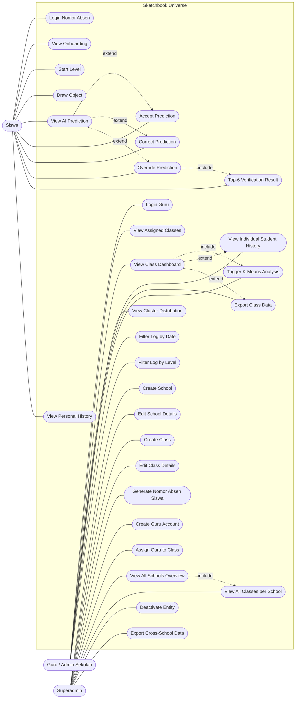
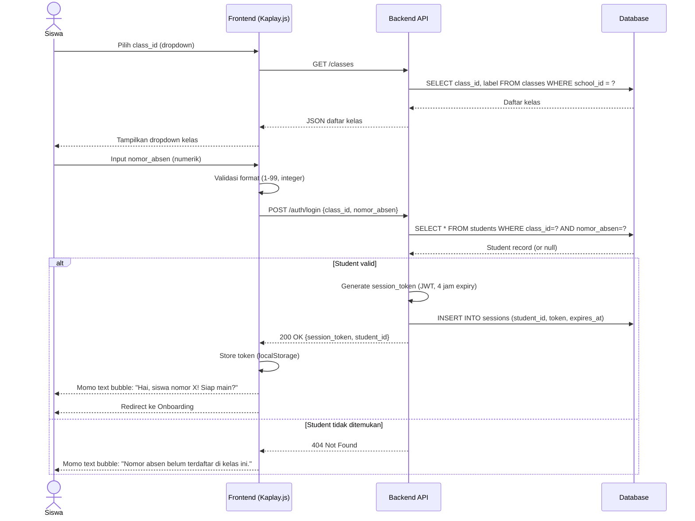
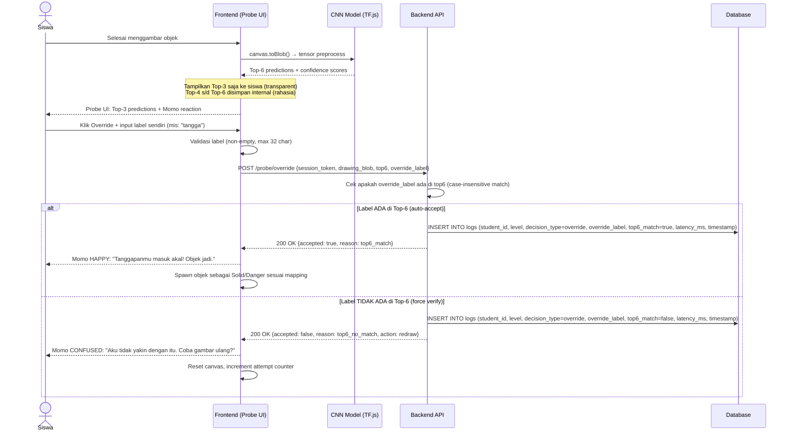
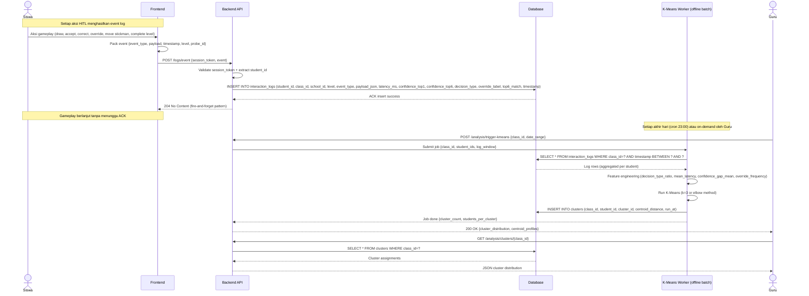

# Use Case Sistem Sketchbook Universe — Versi 1 (Post-Pivot 16/6/26)

> **Project:** Sketchbook Universe — TA Can (Frontend)
> **Task ID:** usecase-superadmin-v1
> **Tanggal:** 16 Juni 2026
> **Status:** Pre-LaTeX, siap di-include ke Bab 3 Can (section 3.2.3)
> **Pivot Source:** MEMORY.md Section 10 — PIVOT #1 (Login gesture MediaPipe → nomor absen + superadmin)

---

## 1. Konteks & Pivot 16/6/26

### 1.1 Apa yang Berubah

Sebelum pivot 16/6/26, sistem hanya mengenal **dua aktor**: Siswa (login via gesture MediaPipe finger counting) dan Admin/Guru (lihat dashboard). Setelah diskusi Can & Dias 16/6/26, login gesture **dideprecate** dan diganti dengan **nomor absen** yang di-generate oleh **aktor baru: Superadmin**.

### 1.2 Hierarki User Baru

```
Superadmin  (top-level, manages multiple schools)
  └── Sekolah  (managed by superadmin)
       └── Kelas  (managed by superadmin / assigned to guru)
            └── Siswa  (login via class_id + nomor_absen, no password)
```

### 1.3 Alasan Penambahan Superadmin

1. **Multi-school deployment**: Sistem dirancang agar dapat diadopsi oleh beberapa sekolah sekaligus. Tanpa superadmin, tidak ada aktor yang dapat membuat entitas sekolah baru.
2. **Class management**: Pengalokasian nomor absen siswa per kelas memerlukan aktor di atas level guru, karena guru hanya boleh melihat kelas yang di-assign kepadanya.
3. **Guru account provisioning**: Akun guru tidak boleh self-register (alasan keamanan & data integrity); superadmin bertanggung jawab membuat dan menugaskan akun guru ke kelas tertentu.
4. **Data separation per school**: Superadmin memastikan data log antar sekolah terpisah (no cross-school leakage) — prinsip isolasi data sesuai UU PDP No. 27/2022.

---

## 2. Tabel Aktor

| ID | Aktor | Deskripsi | Scope Akses |
|----|-------|-----------|-------------|
| A1 | **Superadmin** | Aktor top-level yang mengelola multi-sekolah. Membuat entitas sekolah, kelas, akun guru, dan meng-generate slot nomor absen siswa per kelas. Memiliki akses penuh terhadap seluruh data lintas sekolah. | Cross-school (all schools, all classes, all guru, all siswa log) |
| A2 | **Guru / Admin Sekolah** | Aktor tingkat sekolah. Hanya dapat melihat kelas yang di-assign oleh superadmin. Mengakses dashboard analitik (decision distribution, confidence calibration, K-Means cluster) untuk kelas yang menjadi tanggung jawabnya. | Single-school, assigned classes only |
| A3 | **Siswa** | Aktor end-user. Login menggunakan class_id (dipilih dari dropdown) + nomor_absen (input numerik). Tidak memiliki password — autentikasi ringan karena ruang lingkup penggunaan terbatas pada kelas tertentu di bawah supervisi guru. | Personal data only (own gameplay log, own level history) |

> **Catatan:** Aktor AI/CNN (Momo) **tidak ditampilkan** sebagai aktor eksternal pada use case diagram karena ia merupakan bagian internal sistem (boundary sistem), bukan pengguna eksternal.

---

## 3. Tabel Use Case (UC-01 s/d UC-30)

> Prioritas: **Tinggi** = wajib untuk MVP proposal; **Sedang** = penting tapi dapat fase 2; **Rendah** = nice-to-have.

### 3.1 Use Case Superadmin (UC-01 s/d UC-11)

| ID | Nama Use Case | Aktor | Deskripsi | Prioritas |
|----|---------------|-------|-----------|-----------|
| UC-01 | Create School | Superadmin | Membuat entitas sekolah baru (nama sekolah, alamat, jenjang). Setiap sekolah memiliki school_id unik yang menjadi prefix penamaan kelas. | Tinggi |
| UC-02 | Edit School Details | Superadmin | Mengubah metadata sekolah (nama, alamat, kontak). Tidak mengubah school_id untuk menjaga referential integrity data log. | Sedang |
| UC-03 | Create Class | Superadmin | Membuat kelas baru di bawah sekolah tertentu (mis: "7A", "8B"). Setiap kelas memiliki class_id unik yang dipakai siswa saat login. | Tinggi |
| UC-04 | Edit Class Details | Superadmin | Mengubah nama kelas atau memindahkan kelas ke sekolah lain (kasus langka). | Rendah |
| UC-05 | Generate Nomor Absen Siswa | Superadmin | Menentukan jumlah slot nomor absen per kelas (mis: 40 slot → nomor 1--40). Sistem membuat 40 entitas siswa "kosong" yang siap diisi ketika siswa pertama kali login dengan nomor tersebut. | Tinggi |
| UC-06 | Create Guru Account | Superadmin | Membuat akun guru (username, password, nama lengkap, sekolah induk). Akun guru tidak dapat self-register demi keamanan. | Tinggi |
| UC-07 | Assign Guru to Class | Superadmin | Menugaskan satu guru ke satu atau beberapa kelas. Satu kelas dapat ditugaskan ke maksimal 2 guru (co-teaching). | Tinggi |
| UC-08 | View All Schools Overview | Superadmin | Melihat daftar seluruh sekolah dengan ringkasan: jumlah kelas, jumlah guru, jumlah siswa aktif, total sesi permainan. | Sedang |
| UC-09 | View All Classes per School | Superadmin | Drill-down ke sekolah tertentu untuk melihat daftar kelas beserta guru yang ditugaskan dan jumlah siswa per kelas. | Sedang |
| UC-10 | Deactivate School/Class/Guru | Superadmin | Menonaktifkan (soft delete) entitas tanpa menghapus data log historis. Entitas yang dinonaktifkan tidak dapat login, tetapi datanya tetap dapat diekspor untuk analisis. | Sedang |
| UC-11 | Export Cross-School Data | Superadmin | Mengekspor data log lintas sekolah dalam format CSV/JSON untuk analisis komparatif antar sekolah (riset lanjutan, bukan fitur rutin guru). | Rendah |

### 3.2 Use Case Guru / Admin Sekolah (UC-12 s/d UC-20)

| ID | Nama Use Case | Aktor | Deskripsi | Prioritas |
|----|---------------|-------|-----------|-----------|
| UC-12 | Login (Guru) | Guru | Login menggunakan username + password yang dibuat superadmin. Sesi guru memiliki expiry 8 jam (satu hari kerja sekolah). | Tinggi |
| UC-13 | View Assigned Classes | Guru | Melihat daftar kelas yang ditugaskan kepadanya oleh superadmin. Hanya kelas dalam daftar ini yang dapat di-drill-down. | Tinggi |
| UC-14 | View Class Dashboard | Guru | Melihat dashboard analitik untuk satu kelas: ringkasan sesi permainan, distribusi decision type (Accept/Correct/Override), rata-rata decision latency, confidence calibration chart. | Tinggi |
| UC-15 | View Individual Student History | Guru | Drill-down ke satu siswa (berdasarkan nomor absen) untuk melihat histori sesi permainan: level yang dimainkan, decision type per probe, timestamp, override label. | Tinggi |
| UC-16 | Export Class Data | Guru | Mengekspor data log satu kelas dalam format CSV/JSON. Ekspor dapat difilter berdasarkan rentang tanggal dan/atau level. | Sedang |
| UC-17 | Trigger K-Means Cluster Analysis | Guru | Memicu backend menjalankan K-Means clustering terhadap data log kelas (offline batch process). Hasil: pengelompokan siswa berdasarkan pola perilaku (mis: "automation bias prone", "calibrated evaluator", "overconfident override"). | Sedang |
| UC-18 | View Cluster Distribution | Guru | Melihat distribusi siswa per cluster hasil K-Means. Visualisasi: bar chart jumlah siswa per cluster + centroid profile per cluster. | Sedang |
| UC-19 | Filter Log by Date Range | Guru | Memfilter tampilan dashboard berdasarkan rentang tanggal (mis: hanya minggu tertentu, hanya bulan tertentu). Filter diterapkan ke seluruh metric di dashboard. | Sedang |
| UC-20 | Filter Log by Level | Guru | Memfilter tampilan dashboard berdasarkan level (Level 1 / Level 2 / Level 3) untuk melihat perbedaan perilaku siswa antar level. | Rendah |

### 3.3 Use Case Siswa (UC-21 s/d UC-30)

| ID | Nama Use Case | Aktor | Deskripsi | Prioritas |
|----|---------------|-------|-----------|-----------|
| UC-21 | Login (Nomor Absen) | Siswa | Login dengan memilih class_id dari dropdown lalu menginput nomor absen. Momo menampilkan text bubble konfirmasi ("Hai, siswa nomor 12!"). Tidak ada password. | Tinggi |
| UC-22 | View Onboarding | Siswa | Melihat layar onboarding: splash screen, perkenalan Momo (text bubble), tutorial general (1 layar overview aturan objek Solid/Danger, bukan step-by-step per mekanik). | Tinggi |
| UC-23 | Start Level | Siswa | Memilih level yang akan dimainkan (Level 1/2/3). Hanya level yang sudah di-unlock yang dapat dipilih. Level 1 unlocked by default; Level 2 unlocked setelah Level 1 selesai; Level 3 unlocked setelah Level 2 selesai. | Tinggi |
| UC-24 | Draw Object | Siswa | Menggambar objek di canvas menggunakan input pointer. Tersedia tombol UI: resize (perbesar/perkecil), rotate (90° increment), erase. Timer ditampilkan (count-up, bukan countdown — post-pivot 16/6/26 Decision #3). | Tinggi |
| UC-25 | View AI Prediction | Siswa | Melihat Top-3 prediksi AI beserta confidence score pada Probe UI. Momo menampilkan reaction sesuai state emosi (IDLE/HAPPY/CONFUSED/THINKING/EXCITED) berdasarkan confidence dan gap antar Top-3. | Tinggi |
| UC-26 | Accept AI Prediction | Siswa | Menerima prediksi Top-1 dari AI. Sistem mencatat decision_type=accept, decision_latency, confidence_gap ke data log. Objek masuk game world dengan perilaku sesuai mapping (Solid/Danger). | Tinggi |
| UC-27 | Correct AI Prediction | Siswa | Memilih alternatif Top-2 atau Top-3 dari prediksi AI. Tersedia mulai Level 2. Sistem mencatat decision_type=correct, label_pilihan, confidence_gap. | Tinggi |
| UC-28 | Override AI Prediction | Siswa | Menolak seluruh prediksi Top-3 dan menginput label sendiri. **Trigger Top-6 Check (post-pivot 16/6/26 PIVOT #2):** backend memeriksa apakah label override ada di Top-6 prediksi (rahasia, tidak ditampilkan ke siswa). | Tinggi |
| UC-29 | View Top-6 Verification Result | Siswa | Melihat hasil Top-6 check: (a) jika label override ADA di Top-6 → AUTO-ACCEPT, objek masuk game world; (b) jika TIDAK ADA → sistem meminta re-draw atau verifikasi guru (define di fase implementasi). | Tinggi |
| UC-30 | View Personal History | Siswa | Melihat histori permainan sendiri: level yang sudah diselesaikan, decision type per level, total sesi. Siswa tidak dapat melihat data siswa lain. | Sedang |

### 3.4 Use Case Hubungan (Include / Extend)

| Hubungan | Tipe | Penjelasan |
|----------|------|------------|
| UC-26 (Accept) ⟵ *extend* | extend dari UC-25 (View AI Prediction) | Accept adalah aksi lanjutan setelah siswa melihat prediksi |
| UC-27 (Correct) ⟵ *extend* | extend dari UC-25 (View AI Prediction) | Correct adalah aksi lanjutan setelah siswa melihat prediksi |
| UC-28 (Override) ⟵ *extend* | extend dari UC-25 (View AI Prediction) | Override adalah aksi lanjutan setelah siswa melihat prediksi |
| UC-29 (Top-6 Verification) ⟵ *include* | include dari UC-28 (Override) | Top-6 check WAJIB dijalankan setiap kali siswa melakukan Override |
| UC-14 (View Class Dashboard) ⟵ *include* | include dari UC-17 (Trigger K-Means) | K-Means dijalankan dari dalam dashboard, hasilnya ditampilkan di dashboard |
| UC-15 (View Individual Student History) ⟵ *extend* | extend dari UC-14 (View Class Dashboard) | Drill-down ke siswa individual adalah opsi dari dashboard |
| UC-16 (Export Class Data) ⟵ *extend* | extend dari UC-14 (View Class Dashboard) | Ekspor adalah opsi tambahan dari dashboard |
| UC-09 (View All Classes per School) ⟵ *include* | include dari UC-08 (View All Schools Overview) | Drill-down ke kelas dilakukan dari overview sekolah |

---

## 4. Use Case Diagram (Mermaid — POLOSAN)

> Diagram di bawah menggunakan flowchart Mermaid tanpa style/classDef. Aktor direpresentasikan sebagai node rounded, use case sebagai node ellipse, system boundary sebagai subgraph. Diagram ini siap di-render ke PNG via `mmdc`.



> **Catatan rendering:** Garis solid (`---`) = asociasi aktor-usecase. Garis putus-putus (`-.->`) = relasi include/extend. Tidak ada classDef/style/fill color sesuai constraint "Mermaid POLOSAN".

---

## 5. Sequence Diagrams Mermaid (POLOSAN)

### 5.1 Login Flow — Siswa (Nomor Absen + Top-6 Check Tidak Berlaku di Login)



### 5.2 Override + Top-6 Check Flow (Post-Pivot PIVOT #2)



### 5.3 Data Logging Flow (Frontend → Backend → DB → K-Means Offline)



---

## 6. LaTeX-Ready Section (3.2.3 Use Case Sistem)

> Section berikut siap di-include ke `bab3_can.tex` sebagai pengganti subsection 3.2.3 (Use Case Sistem) yang lama. Subsection lama hanya berisi 2 aktor (Siswa + Admin/Guru); versi ini berisi 3 aktor (Siswa + Guru/Admin Sekolah + Superadmin) sesuai PIVOT #1 16/6/26.

### 3.2.3 Use Case Sistem

\label{subsec:use-case}

Use case diagram memetakan aktor eksternal dan tujuan utama sistem. Post-pivot diskusi 16/6/26, terdapat **tiga aktor utama**: Siswa, Guru/Admin Sekolah, dan Superadmin. Aktor Superadmin merupakan aktor baru yang ditambahkan untuk mendukung deployment multi-sekolah dan pengelolaan nomor absen siswa per kelas. Aktor AI/CNN (Momo) tidak ditampilkan sebagai aktor eksternal karena ia merupakan bagian internal dari sistem, bukan pengguna eksternal.

#### 3.2.3.1 Aktor dan Use Case

Tiga aktor eksternal sistem beserta scope aksesnya diuraikan pada Tabel~\ref{tab:aktor-sistem}.

\begin{table}[H]
\centering
\caption{Aktor Sistem dan Scope Akses}
\label{tab:aktor-sistem}
\begin{tabular}{|p{1cm}|p{3cm}|p{7cm}|p{3.5cm}|}
\hline
\textbf{ID} & \textbf{Aktor} & \textbf{Deskripsi} & \textbf{Scope Akses} \\ \hline
A1 & Superadmin & Aktor top-level yang mengelola multi-sekolah, kelas, akun guru, dan slot nomor absen siswa. & Cross-school (semua sekolah, kelas, guru, dan log siswa) \\ \hline
A2 & Guru / Admin Sekolah & Aktor tingkat sekolah. Hanya dapat melihat kelas yang di-assign oleh superadmin. Mengakses dashboard analitik. & Single-school, kelas yang di-assign \\ \hline
A3 & Siswa & Aktor end-user. Login menggunakan class\_id + nomor\_absen. Tidak memiliki password. & Personal data only \\ \hline
\end{tabular}
\end{table}

#### 3.2.3.2 Use Case Siswa

Aktor Siswa dapat melakukan use case berikut: Login Nomor Absen (UC-21), View Onboarding (UC-22), Start Level (UC-23), Draw Object dengan tombol Resize/Rotate dan timer (UC-24), View AI Prediction Top-3 (UC-25), Accept Prediction (UC-26), Correct Prediction (UC-27), Override Prediction dengan Top-6 Check (UC-28), View Top-6 Verification Result (UC-29), dan View Personal History (UC-30).

Use case Accept, Correct, dan Override merupakan titik \textit{extend} dari use case View AI Prediction, karena ketiganya adalah aksi lanjutan yang muncul setelah siswa melihat prediksi AI. Use case View Top-6 Verification Result merupakan titik \textit{include} dari use case Override, karena Top-6 check WAJIB dijalankan setiap kali siswa melakukan Override (sesuai PIVOT \#2 16/6/26 yang menggantikan Override Budget dengan Top-6 Check mechanism).

#### 3.2.3.3 Use Case Guru / Admin Sekolah

Aktor Guru dapat melakukan use case berikut: Login Guru (UC-12), View Assigned Classes (UC-13), View Class Dashboard (UC-14), View Individual Student History (UC-15), Export Class Data (UC-16), Trigger K-Means Cluster Analysis (UC-17), View Cluster Distribution (UC-18), Filter Log by Date Range (UC-19), dan Filter Log by Level (UC-20).

Use case Trigger K-Means Cluster Analysis merupakan titik \textit{include} dari use case View Class Dashboard, karena K-Means dijalankan dari dalam dashboard dan hasilnya ditampilkan kembali di dashboard. Use case View Individual Student History dan Export Class Data merupakan titik \textit{extend} dari View Class Dashboard, karena keduanya adalah opsi drill-down yang tidak selalu dilakukan.

#### 3.2.3.4 Use Case Superadmin (BARU)

Aktor Superadmin --- aktor baru post-pivot 16/6/26 --- dapat melakukan use case berikut: Create School (UC-01), Edit School Details (UC-02), Create Class (UC-03), Edit Class Details (UC-04), Generate Nomor Absen Siswa (UC-05), Create Guru Account (UC-06), Assign Guru to Class (UC-07), View All Schools Overview (UC-08), View All Classes per School (UC-09), Deactivate Entity (UC-10), dan Export Cross-School Data (UC-11).

Use case View All Classes per School merupakan titik \textit{include} dari use case View All Schools Overview, karena drill-down ke kelas dilakukan dari overview sekolah. Penambahan aktor Superadmin memungkinkan sistem di-deploy ke multiple sekolah tanpa intervensi developer, sekaligus memastikan isolasi data antar sekolah sesuai prinsip UU PDP No. 27/2022.

Tabel lengkap 30 use case (UC-01 s/d UC-30) dengan kolom ID, Nama Use Case, Aktor, Deskripsi, dan Prioritas ditunjukkan pada Tabel~\ref{tab:use-case-lengkap}.

\begin{table}[H]
\centering
\caption{Daftar Lengkap Use Case Sistem (UC-01 s/d UC-30)}
\label{tab:use-case-lengkap}
\begin{tabular}{|p{1cm}|p{3.5cm}|p{2.5cm}|p{6cm}|p{1.5cm}|}
\hline
\textbf{ID} & \textbf{Nama Use Case} & \textbf{Aktor} & \textbf{Deskripsi} & \textbf{Prioritas} \\ \hline
UC-01 & Create School & Superadmin & Membuat entitas sekolah baru & Tinggi \\ \hline
UC-02 & Edit School Details & Superadmin & Mengubah metadata sekolah & Sedang \\ \hline
UC-03 & Create Class & Superadmin & Membuat kelas baru di bawah sekolah & Tinggi \\ \hline
UC-04 & Edit Class Details & Superadmin & Mengubah nama kelas atau memindahkan kelas & Rendah \\ \hline
UC-05 & Generate Nomor Absen Siswa & Superadmin & Membuat N slot nomor absen per kelas & Tinggi \\ \hline
UC-06 & Create Guru Account & Superadmin & Membuat akun guru (no self-register) & Tinggi \\ \hline
UC-07 & Assign Guru to Class & Superadmin & Menugaskan guru ke kelas (maks 2 guru/kelas) & Tinggi \\ \hline
UC-08 & View All Schools Overview & Superadmin & Daftar sekolah + ringkasan & Sedang \\ \hline
UC-09 & View All Classes per School & Superadmin & Drill-down ke kelas per sekolah & Sedang \\ \hline
UC-10 & Deactivate Entity & Superadmin & Soft-delete sekolah/kelas/guru & Sedang \\ \hline
UC-11 & Export Cross-School Data & Superadmin & Ekspor CSV/JSON lintas sekolah & Rendah \\ \hline
UC-12 & Login Guru & Guru & Login username + password & Tinggi \\ \hline
UC-13 & View Assigned Classes & Guru & Daftar kelas yang ditugaskan & Tinggi \\ \hline
UC-14 & View Class Dashboard & Guru & Dashboard analitik per kelas & Tinggi \\ \hline
UC-15 & View Individual Student History & Guru & Drill-down ke siswa individual & Tinggi \\ \hline
UC-16 & Export Class Data & Guru & Ekspor CSV/JSON per kelas & Sedang \\ \hline
UC-17 & Trigger K-Means Analysis & Guru & Submit job K-Means clustering & Sedang \\ \hline
UC-18 & View Cluster Distribution & Guru & Bar chart distribusi cluster & Sedang \\ \hline
UC-19 & Filter Log by Date Range & Guru & Filter dashboard berdasarkan tanggal & Sedang \\ \hline
UC-20 & Filter Log by Level & Guru & Filter dashboard per level & Rendah \\ \hline
UC-21 & Login Nomor Absen & Siswa & Login class\_id + nomor\_absen, no password & Tinggi \\ \hline
UC-22 & View Onboarding & Siswa & Splash + Momo intro + tutorial general & Tinggi \\ \hline
UC-23 & Start Level & Siswa & Pilih level yang akan dimainkan & Tinggi \\ \hline
UC-24 & Draw Object & Siswa & Gambar di canvas + resize/rotate/timer & Tinggi \\ \hline
UC-25 & View AI Prediction & Siswa & Lihat Top-3 prediksi + Momo reaction & Tinggi \\ \hline
UC-26 & Accept Prediction & Siswa & Terima Top-1 & Tinggi \\ \hline
UC-27 & Correct Prediction & Siswa & Pilih Top-2 atau Top-3 & Tinggi \\ \hline
UC-28 & Override Prediction & Siswa & Input label sendiri, trigger Top-6 check & Tinggi \\ \hline
UC-29 & Top-6 Verification Result & Siswa & Lihat hasil Top-6 check & Tinggi \\ \hline
UC-30 & View Personal History & Siswa & Histori permainan sendiri & Sedang \\ \hline
\end{tabular}
\end{table}

#### 3.2.3.5 Use Case Diagram

Use case diagram dengan tiga aktor (Siswa, Guru/Admin Sekolah, Superadmin) dan 30 use case ditunjukkan pada Gambar~\ref{fig:use-case-v2}. Diagram menggunakan notasi standar UML: aktor direpresentasikan sebagai stickman, use case sebagai ellipse, dan relasi include/extend sebagai garis putus-putus berpanah.

\begin{figure}[H]
    \centering
    \includegraphics[width=\textwidth]{placeholder}
    \caption{Use Case Diagram --- Aktor Siswa, Guru/Admin Sekolah, dan Superadmin (Post-Pivot 16/6/26)}
    \label{fig:use-case-v2}
\end{figure}

> **Catatan untuk penulis:** Diagram Mermaid source tersedia di file \texttt{Use\_Case\_Superadmin\_v1.md} Section 4. Render ke PNG via \texttt{mmdc input.mmd -o use\_case\_v2.png -b transparent} sebelum di-include ke LaTeX.

---

## 7. Statistik Ringkas

| Aktor | Jumlah Use Case | Range ID | Prioritas Tinggi | Prioritas Sedang | Prioritas Rendah |
|-------|-----------------|----------|------------------|------------------|------------------|
| Superadmin | 11 | UC-01 s/d UC-11 | 6 | 4 | 1 |
| Guru / Admin Sekolah | 9 | UC-12 s/d UC-20 | 4 | 4 | 1 |
| Siswa | 10 | UC-21 s/d UC-30 | 9 | 1 | 0 |
| **Total** | **30** | **UC-01 s/d UC-30** | **19** | **9** | **2** |

---

## 8. Referensi & Sumber

- `MEMORY.md` Section 10 — PIVOT #1 (Login gesture → nomor absen + superadmin)
- `MEMORY.md` Section 10 — PIVOT #2 (Override Budget → Top-6 Check)
- `Outline_dan_Sitasi_PreLatex.md` Section 8 — Outline Bab 3 Can (3.2.3 Use Case Sistem, marked 🔴 CHANGED)
- `bab3_can.tex` existing (lines 85--100) — Use Case section lama (2 aktor: Siswa + Admin/Guru)
- UU PDP No. 27/2022 — dasar isolasi data antar sekolah
- A04 (Mosqueira-Rey et al. 2023), A05 (Memarian & Doleck 2025) — dasar teoretis HITL untuk use case Accept/Correct/Override
