# User Flow Placement — Section v1 (Post-Pivot 16/6/26)

> **Project:** Sketchbook Universe — TA Can (Frontend)
> **Task ID:** usecase-superadmin-v1
> **Tanggal:** 16 Juni 2026
> **Status:** Pre-LaTeX, siap di-include ke Bab 3 Can (section 3.2.2 Alur Pengguna)
> **Catatan Khusus:** Penulis (Can) akan melengkapi diagram alur pengguna sendiri pada tahap implementasi. Dokumen ini hanya menyediakan **placement + kerangka textual + sequence diagram key flows**.

---

## 1. Catatan Penulis (Bersifat Sementara)

> **Alur pengguna akan dilengkapi oleh penulis (Can) pada tahap implementasi.** Dokumen ini menyediakan kerangka alur secara textual, placeholder untuk diagram alur pengguna, dan tiga sequence diagram Mermaid untuk key flows (Login, Override + Top-6 Check, Data Logging). Diagram alur pengguna lengkap dengan visual flowchart akan diproduksi oleh penulis menggunakan tool seperti Figma atau draw.io setelah playtest awal dilakukan.

---

## 2. Kerangka Alur Pengguna (Textual)

Alur pengguna Sketchbook Universe dirancang secara **linear** dengan sembilan fase utama. Linearitas dipilih berdasarkan prinsip \textit{Child--Computer Interaction} (CCI)~[2] yang menekankan bahwa interaksi untuk anak usia 12--15 tahun harus sederhana dan dapat diprediksi. Alur linear juga memastikan progresi scaffolding~[6][7] terjadi secara terprediksi: siswa selalu mengalami trust building sebelum ambiguitas, dan ambiguitas sebelum situasi yang membutuhkan override.

Sembilan fase alur pengguna:

1. **Login** — Siswa memilih class\_id dari dropdown lalu menginput nomor absen. Momo menyambut dengan text bubble "Hai, siswa nomor X!". Tidak ada password (post-pivot 16/6/26 PIVOT \#1).
2. **Onboarding** — Splash screen + perkenalan Momo + tutorial general (1 layar overview aturan objek Solid/Danger, bukan step-by-step per mekanik — sesuai arahan Bu Hesti).
3. **Level Select** — Siswa memilih level yang akan dimainkan (Level 1 unlocked by default; Level 2 unlocked setelah Level 1 selesai; Level 3 unlocked setelah Level 2 selesai).
4. **Tutorial (per level)** — Brief singkat level: objective, batasan (erase allowed/tidak, drawing attempts), Momo emotion baseline level tersebut.
5. **Main Gameplay** — Siswa menggambar objek di canvas dengan tombol UI resize/rotate (post-pivot Decision \#4) dan timer count-up (post-pivot Decision \#3).
6. **Probe UI** — Saat siswa selesai menggambar, gameplay \textit{pause} dan Probe UI muncul: menampilkan Top-3 prediksi AI + confidence score + Momo reaction. Siswa memilih Accept / Correct (Level 2+) / Override (Level 2+, Level 3 satu-satunya opsi koreksi).
7. **Top-6 Verification (jika Override)** — Backend memeriksa apakah label override ada di Top-6 prediksi (rahasia). Jika ADA → AUTO-ACCEPT, objek masuk game world. Jika TIDAK ADA → sistem minta re-draw (post-pivot PIVOT \#2).
8. **Result & Feedback** — Objek masuk game world dengan perilaku sesuai mapping (Solid/Danger). Stickman bergerak. Momo menampilkan state emosi sesuai outcome (HAPPY jika sukses, CONFUSED jika gagal). Tidak ada skor/leaderboard --- konsekuensi gameplay adalah feedback (sesuai prinsip \textit{Narrative as Feedback}).
9. **Next Level / Retry** — Jika sukses, siswa dapat lanjut ke level berikutnya atau replay. Jika gagal, siswa dapat retry level yang sama. Level Summary di akhir setiap level menampilkan refleksi Momo tentang keputusan yang diambil siswa selama level.

```
Login → Onboarding → Level Select → Tutorial → Main Gameplay
                                              ↓
                                              Probe UI
                                              ↓
                                       [Override?]
                                        ├── No → Result & Feedback → Next Level
                                        └── Yes → Top-6 Verification
                                                  ├── Match → Result & Feedback (sukses)
                                                  └── No Match → Redraw → Main Gameplay
```

---

## 3. Placeholder untuk User Flow Diagram

Diagram alur pengguna lengkap akan diproduksi oleh penulis pada tahap implementasi. Placeholder untuk diagram ditampilkan di bawah, dengan caption yang sudah disiapkan untuk LaTeX.

\begin{figure}[H]
    \centering
    \includegraphics[width=\textwidth]{placeholder}
    \caption{Alur Pengguna Sistem Sketchbook Universe --- 9 Fase Linear (Login, Onboarding, Level Select, Tutorial, Main Gameplay, Probe UI, Top-6 Verification, Result \& Feedback, Next Level)}
    \label{fig:alur-pengguna-global}
\end{figure}

> **Catatan untuk penulis:** Diagram alur pengguna akan dibuat oleh Can menggunakan Figma/draw.io setelah playtest awal. Shape flowchart mengikuti arahan Bu Hesti: Input=parallelogram, Proses=rectangle, Decision=diamond. Font diperbesar. Tidak ada warna dekoratif (hanya hitam-putih atau maksimal 2 warna untuk membedakan scope).

---

## 4. Sequence Diagrams Mermaid (POLOSAN) — Key Flows

Tiga sequence diagram berikut merinci key flows sistem yang menjadi titik kritis interaksi aktor-frontend-backend-database. Diagram menggunakan Mermaid \texttt{sequenceDiagram} tanpa styling (POLOSAN, no classDef, no fill color).

### 4.1 Login Flow (Siswa → Frontend → Backend → Database)

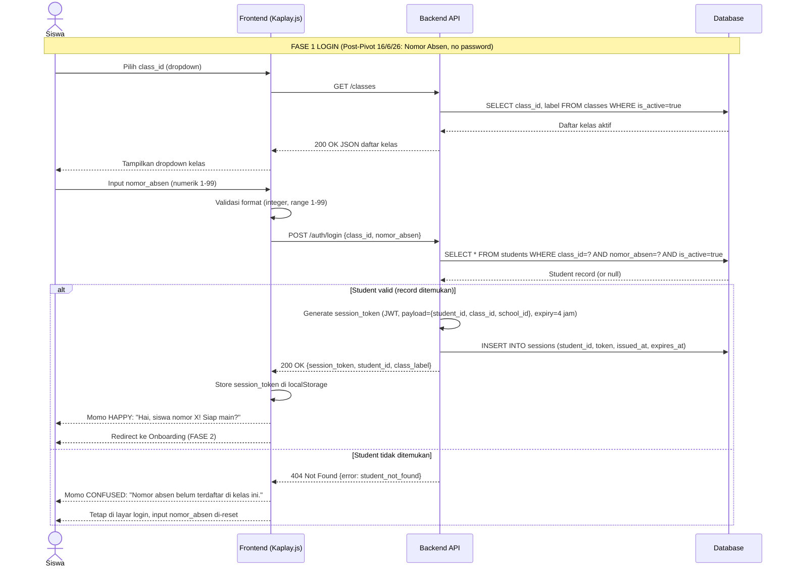

### 4.2 Override + Top-6 Check Flow (Post-Pivot PIVOT #2)

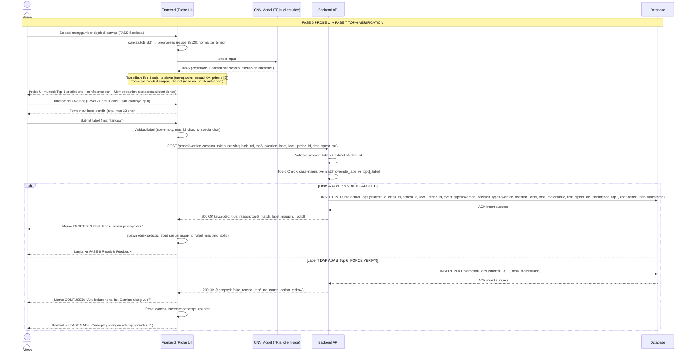

### 4.3 Data Logging Flow (Frontend → Backend → DB → K-Means Offline Batch)

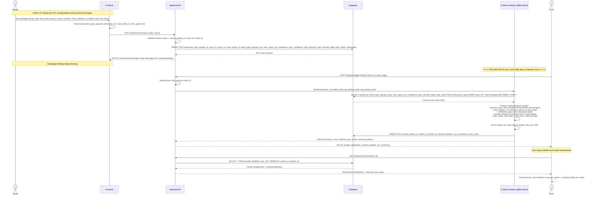

---

## 5. LaTeX-Ready Section — 3.2.2 Alur Pengguna

> Section berikut siap di-include ke `bab3_can.tex` sebagai pengganti atau ekspansi dari subsection 3.2.2 (Alur Pengguna) yang lama. Subsection lama hanya berisi alur global siswa tanpa pembedaan per aktor; versi ini membedakan alur per aktor (Siswa, Guru, Superadmin) sesuai PIVOT #1 16/6/26 yang menambahkan aktor Superadmin.

### 3.2.2 Alur Pengguna

\label{subsec:alur-pengguna}

Alur pengguna dirancang secara linear dengan sembilan fase utama: Login, Onboarding, Level Select, Tutorial, Main Gameplay, Probe UI, Top-6 Verification (jika Override), Result \& Feedback, dan Next Level. Linearitas alur didasarkan pada prinsip \textit{Child--Computer Interaction} (CCI)~[2] yang menekankan bahwa interaksi untuk anak usia 12--15 tahun harus sederhana dan dapat diprediksi, serta prinsip scaffolding~[6][7] yang mensyaratkan progresi trust building $\rightarrow$ ambiguitas $\rightarrow$ override terjadi secara terprediksi.

\begin{figure}[H]
    \centering
    \includegraphics[width=\textwidth]{placeholder}
    \caption{Alur Pengguna Sistem Sketchbook Universe --- 9 Fase Linear}
    \label{fig:alur-pengguna-global}
\end{figure}

> \textbf{Catatan penulis:} Diagram alur pengguna lengkap (Gambar~\ref{fig:alur-pengguna-global}) akan dilengkapi oleh penulis pada tahap implementasi setelah playtest awal. Kerangka alur secara textual sudah final dan dijelaskan pada sub-bab ini.

#### 3.2.2.1 Alur Pengguna Siswa

Alur pengguna Siswa mengikuti sembilan fase linear yang dijelaskan di atas. Tiga titik kritis pada alur Siswa adalah: (1) Login dengan nomor absen --- menggantikan gesture MediaPipe yang dideprecate post-pivot 16/6/26; (2) Probe UI sebagai titik jeda evaluatif sesuai prinsip XAI~[3] dan HITL~[4]; dan (3) Top-6 Verification yang menggantikan Override Budget post-pivot 16/6/26 (PIVOT \#2) --- mekanisme anti-cheat yang lebih elegant karena tidak membatasi jumlah override, melainkan memverifikasi kewajaran label override terhadap Top-6 prediksi AI.

> \textbf{Catatan penulis:} Diagram alur pengguna Siswa lengkap (flowchart per fase dengan decision branch) akan dilengkapi oleh penulis pada tahap implementasi.

\begin{figure}[H]
    \centering
    \includegraphics[width=\textwidth]{placeholder}
    \caption{Alur Pengguna Siswa --- 9 Fase dengan Decision Branch (Override Top-6 Check)}
    \label{fig:alur-pengguna-siswa}
\end{figure}

#### 3.2.2.2 Alur Pengguna Guru / Admin Sekolah

Alur pengguna Guru bersifat non-gameplay dan berfokus pada analisis data. Lima fase alur Guru: (1) Login dengan username + password yang dibuat superadmin; (2) View Assigned Classes --- melihat daftar kelas yang ditugaskan; (3) View Class Dashboard --- melihat dashboard analitik per kelas (decision distribution, confidence calibration, decision latency); (4) Drill-down opsional --- View Individual Student History atau Trigger K-Means Cluster Analysis; (5) Export Class Data (opsional, untuk analisis eksternal di Excel/SPSS).

> \textbf{Catatan penulis:} Diagram alur pengguna Guru lengkap akan dilengkapi oleh penulis pada tahap implementasi.

\begin{figure}[H]
    \centering
    \includegraphics[width=\textwidth]{placeholder}
    \caption{Alur Pengguna Guru / Admin Sekolah --- 5 Fase Analitik}
    \label{fig:alur-pengguna-guru}
\end{figure}

#### 3.2.2.3 Alur Pengguna Superadmin (BARU)

Alur pengguna Superadmin --- aktor baru post-pivot 16/6/26 --- berfokus pada provisioning dan management entitas. Tujuh fase alur Superadmin: (1) Login superadmin (credentials yang dibuat saat deployment, bukan dari sistem); (2) View All Schools Overview --- melihat daftar sekolah yang sudah terdaftar; (3) Create School (jika sekolah baru) --- input nama sekolah, alamat, jenjang; (4) Create Class --- input nama kelas di bawah sekolah tertentu; (5) Generate Nomor Absen Siswa --- tentukan jumlah slot (mis: 40) dan sistem membuat 40 entitas siswa kosong; (6) Create Guru Account + Assign Guru to Class --- buat akun guru dan tugaskan ke kelas; (7) View All Classes per School (monitoring) --- drill-down ke kelas untuk verifikasi assignment.

> \textbf{Catatan penulis:} Diagram alur pengguna Superadmin lengkap akan dilengkapi oleh penulis pada tahap implementasi.

\begin{figure}[H]
    \centering
    \includegraphics[width=\textwidth]{placeholder}
    \caption{Alur Pengguna Superadmin --- 7 Fase Provisioning Multi-Sekolah}
    \label{fig:alur-pengguna-superadmin}
\end{figure}

#### 3.2.2.4 Sequence Diagram Key Flows

Tiga sequence diagram key flows sistem ditunjukkan pada Gambar~\ref{fig:seq-login}, Gambar~\ref{fig:seq-override}, dan Gambar~\ref{fig:seq-logging}. Diagram-diagram ini merinci interaksi antar komponen (Siswa, Frontend, Backend, Database, K-Means Worker) pada tiga titik kritis: Login, Override + Top-6 Check, dan Data Logging.

\begin{figure}[H]
    \centering
    \includegraphics[width=\textwidth]{placeholder}
    \caption{Sequence Diagram --- Login Flow (Siswa $\rightarrow$ Frontend $\rightarrow$ Backend $\rightarrow$ Database)}
    \label{fig:seq-login}
\end{figure}

\begin{figure}[H]
    \centering
    \includegraphics[width=\textwidth]{placeholder}
    \caption{Sequence Diagram --- Override + Top-6 Check Flow (Post-Pivot PIVOT \#2 16/6/26)}
    \label{fig:seq-override}
\end{figure}

\begin{figure}[H]
    \centering
    \includegraphics[width=\textwidth]{placeholder}
    \caption{Sequence Diagram --- Data Logging Flow (Frontend $\rightarrow$ Backend $\rightarrow$ Database $\rightarrow$ K-Means Offline Batch)}
    \label{fig:seq-logging}
\end{figure}

> \textbf{Catatan penulis:} Source Mermaid untuk ketiga sequence diagram tersedia di file \texttt{User\_Flow\_Placement\_v1.md} Section 4. Render ke PNG via \texttt{mmdc input.mmd -o output.png -b white} sebelum di-include ke LaTeX.

---

## 6. Referensi & Sumber

- `MEMORY.md` Section 10 — PIVOT #1 (Login gesture → nomor absen + superadmin)
- `MEMORY.md` Section 10 — PIVOT #2 (Override Budget → Top-6 Check)
- `MEMORY.md` Section 10 — DECISION #3 (Timer spontaneous)
- `MEMORY.md` Section 10 — DECISION #4 (Resize & Rotate buttons)
- `Outline_dan_Sitasi_PreLatex.md` Section 8 — Outline Bab 3 Can (3.2.2 Alur Pengguna)
- `bab3_can.tex` existing (lines 66--82) — Alur Pengguna section lama (Onboarding + Core Gameplay Loop + Level Summary, 3 fase)
- A02 (Casal-Otero et al. 2022) — CCI K-12, dasar alur linear
- A04 (Mosqueira-Rey et al. 2023) — HITL, dasar Probe UI sebagai jeda
- A05 (Memarian & Doleck 2025) — HITL roles, dasar Accept/Correct/Override
- A06 (Videnovik et al. 2023) — Game-based learning, dasar consequence-driven feedback
- A07 (Chan, Wan & King 2024) — Flow Theory, dasar progresi skill > challenge → challenge > skill

---

## 7. Mermaid Diagrams v2 — Placeholder Replacements (POLOSAN)

> **Tujuan:** Section ini menyediakan 9 diagram Mermaid (POLOSAN — tanpa `classDef`, tanpa `style`, tanpa `fill`, tanpa emoji, tanpa hex color code) sebagai pengganti placeholder `\placeholderfig{...}` di `draf_proposal_can_v0.0.0.tex`. Setiap diagram dikaitkan dengan nomor Gambar pada LaTeX Can (Gambar 3.1, 3.4–3.7, 3.11–3.14). Konvensi shape: stadium `([text])` untuk Start/End, parallelogram `[/text/]` untuk Input/Output, rectangle `[text]` untuk Process, diamond `{text?}` untuk Decision. Semua label berbahasa Indonesia.

### 7.1 Waterfall SDLC (Gambar 3.1 — Metode Pengembangan)

Diagram alur metode pengembangan Waterfall SDLC 5 tahap berurutan dengan dua feedback loop (defect found dari Verification ke Design, dan playtest feedback dari Maintenance ke Requirements).

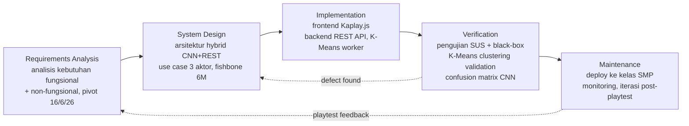

> Render via `mmdc 7-1-waterfall-sdlc.mmd -o 7-1-waterfall-sdlc.png -b white` untuk di-include ke LaTeX.

### 7.2 User Flow Global 9 Fase (Gambar 3.4 — Alur Pengguna Global)

Diagram alur pengguna global 9 fase linear dengan satu decision diamond utama (Override?) dan sub-decision (Match?) untuk Top-6 Verification.

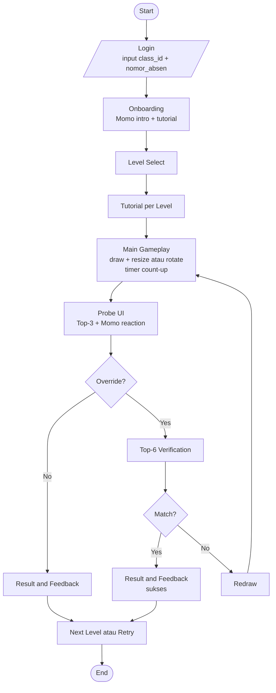

> Render via `mmdc 7-2-user-flow-global.mmd -o 7-2-user-flow-global.png -b white` untuk di-include ke LaTeX.

### 7.3 User Flow Siswa (Gambar 3.5 — Alur Pengguna Siswa dengan Decision Branch Override Top-6 Check)

Diagram alur pengguna Siswa secara granular: login via nomor absen, onboarding, level select, main gameplay dengan tombol Resize/Rotate/Erase, Probe UI, dan tiga branch keputusan (Accept, Correct, Override dengan Top-6 Check).

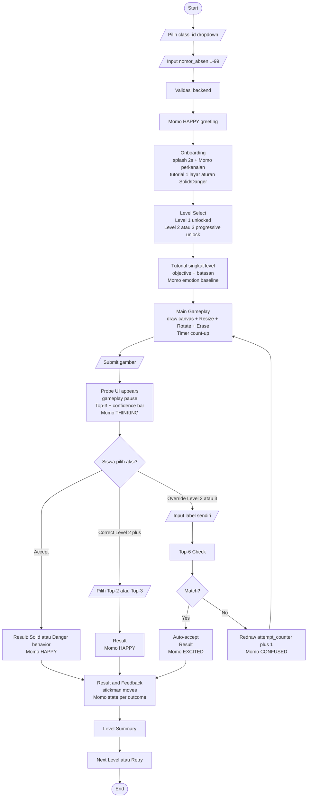

> Render via `mmdc 7-3-user-flow-siswa.mmd -o 7-3-user-flow-siswa.png -b white` untuk di-include ke LaTeX.

### 7.4 User Flow Guru / Admin Sekolah (Gambar 3.6 — 5 Fase Analitik)

Diagram alur pengguna Guru/Admin Sekolah: login dengan kredensial dari superadmin, view assigned classes, view class dashboard dengan tiga chart analitik, drill-down opsional (Individual Student History atau K-Means Cluster Analysis), dan export CSV.

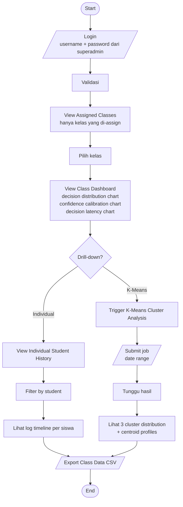

> Render via `mmdc 7-4-user-flow-guru.mmd -o 7-4-user-flow-guru.png -b white` untuk di-include ke LaTeX.

### 7.5 User Flow Superadmin (Gambar 3.7 — 7 Fase Provisioning Multi-Sekolah)

Diagram alur pengguna Superadmin (aktor baru post-pivot 16/6/26 PIVOT #1): login dengan kredensial deployment, view all schools overview, dua decision (sekolah baru? kelas baru?), generate nomor absen siswa, create guru account, assign guru to class, monitoring.

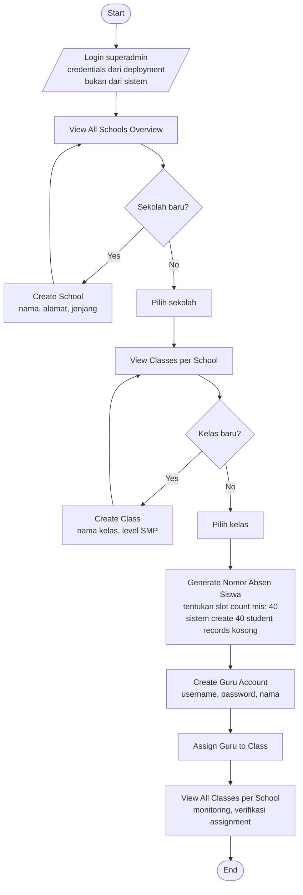

> Render via `mmdc 7-5-user-flow-superadmin.mmd -o 7-5-user-flow-superadmin.png -b white` untuk di-include ke LaTeX.

### 7.6 User Flow Level 1 — Guided Recognition (Gambar 3.11 — Trust Building)

Diagram alur pengguna Level 1: fokus trust building siswa terhadap AI. Siswa hanya bisa Accept (tidak ada Correct/Override button di Level 1). Momo selalu HAPPY untuk membangun trust awal.

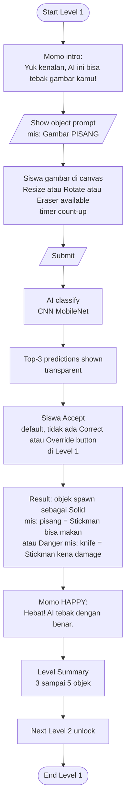

> Render via `mmdc 7-6-user-flow-level-1.mmd -o 7-6-user-flow-level-1.png -b white` untuk di-include ke LaTeX.

### 7.7 User Flow Level 2 — Ambiguous Choice (Gambar 3.12 — Doubt & Calibration)

Diagram alur pengguna Level 2: fokus doubt dan calibration. Confidence gap sengaja kurang dari 0.10 (ambiguitas). Siswa bisa Accept, Correct, atau Override. Override memicu Top-6 Check.

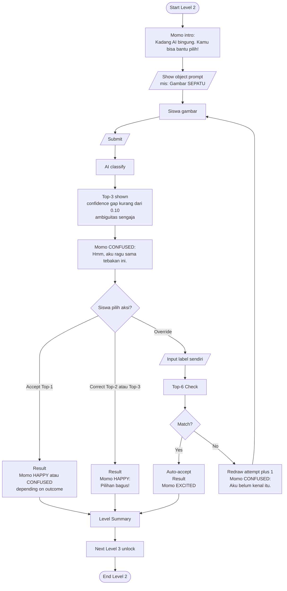

> Render via `mmdc 7-7-user-flow-level-2.mmd -o 7-7-user-flow-level-2.png -b white` untuk di-include ke LaTeX.

### 7.8 User Flow Level 3 — Risk & Override (Gambar 3.13 — Human Agency)

Diagram alur pengguna Level 3: fokus human agency. Siswa FORCED to override (tidak ada Accept/Correct button). AI sengaja miss-classify. Momo EXCITED saat siswa berhasil override dengan label yang ada di Top-6 rahasia.

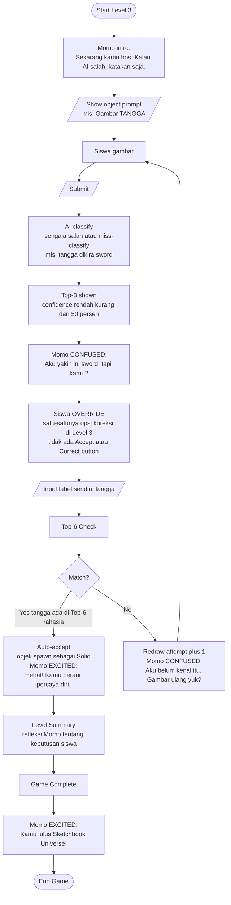

> Render via `mmdc 7-8-user-flow-level-3.mmd -o 7-8-user-flow-level-3.png -b white` untuk di-include ke LaTeX.

### 7.9 Top-6 Check Flow Diagram (Gambar 3.14 — Mekanisme Anti-Cheat Post-Pivot PIVOT #2 16/6/26)

Diagram alur mekanisme Top-6 Check: siswa submit override label → frontend validasi → POST ke backend → backend validate session → Top-6 case-insensitive match → dua branch (MATCH: auto-accept dan spawn Solid; NO MATCH: redraw dengan attempt_counter+1). Log insertion ke `interaction_logs` di kedua branch.

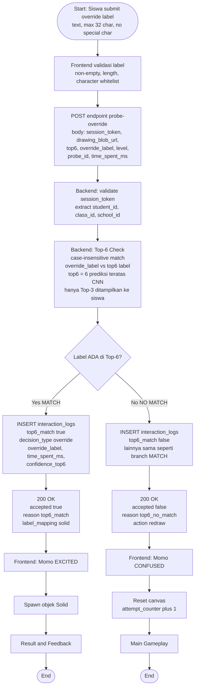

> Render via `mmdc 7-9-top-6-check.mmd -o 7-9-top-6-check.png -b white` untuk di-include ke LaTeX.

---

> **Catatan akhir Section 7:** Semua 9 diagram di atas sudah POLOSAN (tidak ada `classDef`, `style`, `fill`, `stroke`, `color`, `linkStyle`, `css`, `%%{init: ...}%%`, emoji, atau hex color code). Setiap diagram dapat di-render langsung via Mermaid CLI (`mmdc`) ke PNG dengan background putih (`-b white`), lalu di-include ke `draf_proposal_can_v0.0.0.tex` sebagai pengganti placeholder `\placeholderfig{...}` yang bersesuaian (Gambar 3.1, 3.4, 3.5, 3.6, 3.7, 3.11, 3.12, 3.13, 3.14). Section 4 (Sequence Diagrams Mermaid) tidak diubah dan tetap menjadi rujukan untuk sequence diagram key flows.
