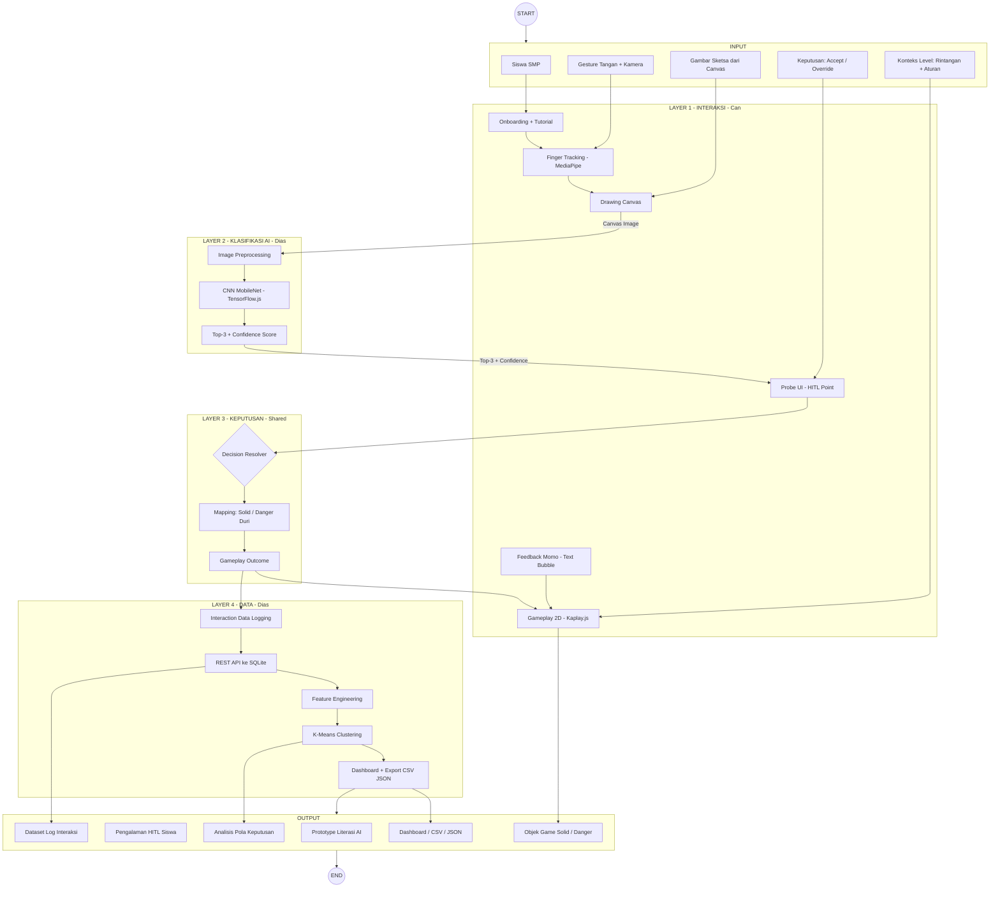
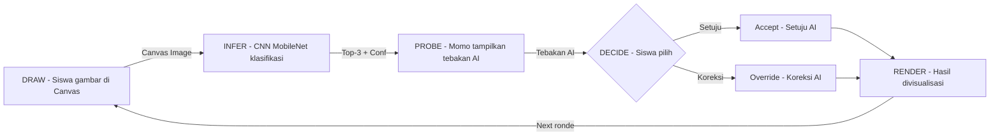
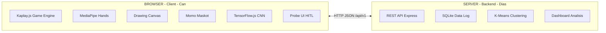
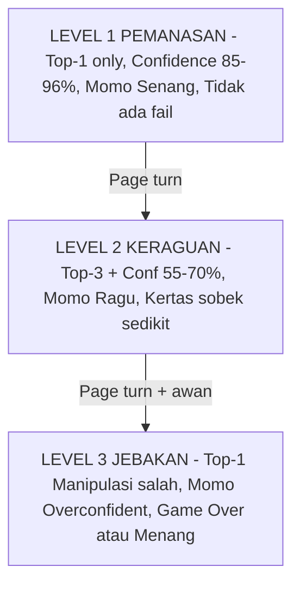

# Desain Sistem Global — Mermaid Diagram
# Sketchbook Universe — Simulasi Interaktif Literasi AI

> **Catatan:** Diagram ini disederhanakan berdasarkan:
> 1. Gambar referensi dari Can (16/6/26)
> 2. Notulensi Bu Hesti 16/6/26
> 3. SATU diagram global, warna per scope, shape flowchart standar
>
> **Perubahan dari versi lama:**
> - Dekoratif DIHAPUS — hanya Solid + Danger
> - Login WAJIB gesture-based
> - Tidak ada kata "from"
> - Warna konsisten per scope

---

## Diagram 1 — Global IPO

---

## Diagram 2 — Game Loop

---

## Diagram 3 — Arsitektur Hybrid

---

## Diagram 4 — 3 Level Progression

